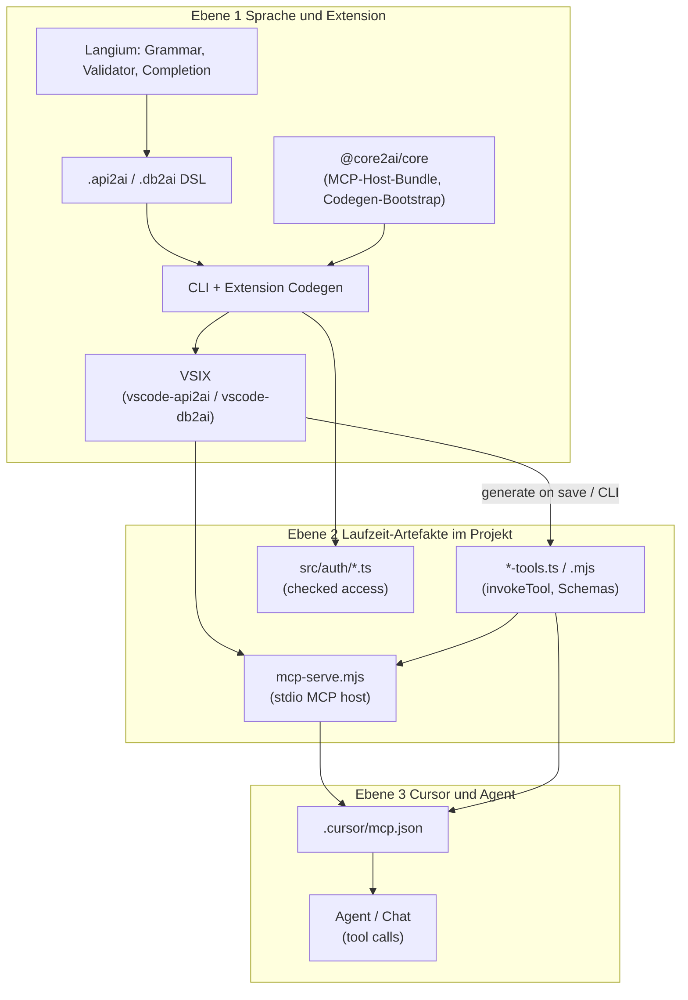

# Abschluss: Follow-ups → Doku → Release v2

## Stand (Mai 2026)

**Release v1 erledigt:** `@core2ai/core` **v0.0.5**, api2ai/db2ai Pin + **VSIX 0.0.3** auf GitHub, Skill [`guided-release/SKILL.md`](../.cursor/skills/guided-release/SKILL.md), `release:vsix` = Publish getesteter VSIX.

**Als Nächstes (Reihenfolge):**

| Phase | Inhalt                                                                                 |
| ----- | -------------------------------------------------------------------------------------- |
| **A** | TS-Follow-ups (Generator-Fix + optional IDE tsconfig)                                  |
| **B** | Architektur-Doku `docs/01–04` + Hub + Cheatsheet                                       |
| **C** | **Guided release v2** — soll glatt durchlaufen (evtl. nur VSIX-Bump, kein Library-Tag) |

---

## Phase A — TS-Follow-ups (Generator + IDE)

| Follow-up                                  | Repo                                          | `use-local`? |
| ------------------------------------------ | --------------------------------------------- | ------------ |
| **A1** Generator `parts: string[]`         | **api2ai** (`invoke-render.ts`); db2ai prüfen | **Nein**     |
| **A3** IDE `tsconfig.generated` (optional) | api2ai/db2ai demos                            | **Nein**     |

**A2 (Toolchain-Version in Extension/Header) — gestrichen.** Thema nicht ausgegoren (Pin vs local, kein zuverlässiger core2ai-Indikator ohne Bump). Backlog.

**`core2ai:use-local` nur wenn** du aktiv in **`core2ai/packages/`** entwickelst. Für A1/A3 reicht **Pin 0.0.5** (`use-pin`).

### A1 — Generator-Fix (`never[]`)

Strict-TypeScript: `const parts = []` → `never[]` in der IDE. Fix in `invoke-render.ts`, dann `generate:all`, `check:generated`.

### A3 — IDE (optional)

Nur wenn nach A1 Cursor in `generated/tools/` noch rot: `demos/tsconfig.json` → Reference auf `tsconfig.generated.json`.

**Ende Phase A:** api2ai/db2ai grün (`check`, `check:generated`).

---

## Phase B — Architektur-Doku

Unverändertes **Ebenenmodell** (Referenz für das Schreiben) — siehe Abschnitt „Ebenenmodell“ unten.

Lieferumfang:

1. `docs/01-three-layers-overview.md`
2. `docs/02-layer1-dsl-extension-core2ai.md`
3. `docs/03-layer2-mcp-server-and-tools.md`
4. `docs/04-layer3-cursor-and-agent.md`
5. `docs/consumer-build-cheatsheet.md`
6. `docs/README.md` (Hub-TOC)
7. Root-READMEs api2ai/db2ai/core2ai → Links auf Hub

Sprache: EN für `01–04` + Cheatsheet (wie READMEs); Workflows später optional DE.

---

## Phase C — Guided release v2

**Ziel:** Skill einmal **ohne Recovery-Pfade** (Pin+Version in CP5, VSIX publish-only).

Erwartung CP1: **Kein Library-Release** (nur Extension/Generator-Follow-ups) → direkt Consumer-Pin-Check oder Skip zu VSIX-Bump **0.0.4**.

Falls doch **core2ai** `packages/` geändert: normal CP2–3 (neuer Tag z. B. v0.0.6).

Checkliste vor Start: alle Repos **clean**, `use-pin` (nicht `use-local`), Skill + Script in core2ai committed.

---

## Backlog (nicht vor release v2)

- `docs/workflows/01–03.md` aus Skill (optional)
- Weitere Workflows (daily, fresh-clone, …)
- Formaler Verify-Lauf als eigene Phase — durch v1 + v2 abgedeckt

---

## Referenz: Ebenenmodell (für Phase B)

**Wichtig:** Das unterscheidet sich vom alten Deckel-Plan (core2ai / Consumer / generated). Die Architektur-Doku folgt **deinem** Modell.

### Übersicht



| Ebene | Was du meinst                                                                                | Ergebnis / Artefakt                                              |
| ----- | -------------------------------------------------------------------------------------------- | ---------------------------------------------------------------- |
| **1** | Langium, DSL, Code Generator; **core2ai** als geteilte Bibliothek; **Release** der Extension | **VSIX** (installierbare api2ai/db2ai-Extension)                 |
| **2** | Was die VSIX (bzw. CLI im Monorepo) aus der DSL erzeugt                                      | **MCP-Server** (`mcp-serve.mjs`) + **MCP-Tools** (`*-tools.mjs`) |
| **3** | Einbindung in Cursor, Test mit dem Agent                                                     | Konfigurierte MCP-Server, Tool-Aufrufe im Chat                   |

### Ebene 1 — Langium, DSL, Code Generator → VSIX

**Repos (Geschwister):**

| Repo                   | Rolle in Ebene 1                                                                                                                  |
| ---------------------- | --------------------------------------------------------------------------------------------------------------------------------- |
| **api2ai** / **db2ai** | Langium-Grammar (`.langium`), Validator, Completion, **Generator** (`packages/cli`), **VS Code Extension** (`packages/extension`) |
| **core2ai**            | Geteilte Teile: MCP-Host (`mcp-host`), Generate-Validierung, Auth-Stub-Bootstrap, Pin-Skripte — **keine** eigene DSL              |

**Zusammenspiel core2ai ↔ Siblings:**

- api2ai/db2ai **pinnen** `@core2ai/core` per Git-Tag (`core2ai:use-pin`) für reproduzierbare Builds.
- Während Entwicklung: `core2ai:use-local` (sibling `../core2ai`).
- Nach Änderung an **mcp-host** oder **codegen** in core2ai: Library-Release (Tag) → Consumer `use-pin` → `bundle:mcp-runtime` → `generate:all`.
- **Zwei Release-Arten** (in Doku trennen, nicht vermischen):
    1. **@core2ai/core Library-Release** — Git-Tag auf **core2ai**, Pin in api2ai/db2ai (Workflow `01-core2ai-library-release.md`).
    2. **VSIX-Release** — Extension-Version in `packages/extension/package.json`, lokal bauen/testen, `release:vsix` → GitHub prerelease (Workflow `03-vsix-github-release.md`).

**Output Ebene 1 für Endnutzer:** installierbare **VSIX** (oder Extension Development Host im Monorepo).

**Doku-Datei:** [`docs/02-layer1-dsl-extension-core2ai.md`](docs/02-layer1-dsl-extension-core2ai.md)

Inhalt grob:

- Langium-Pipeline (`langium:generate` → generated grammar)
- DSL-Dateien, OpenAPI vs SQL
- Generator + Extension (save → generate)
- Wo **core2ai** eingehängt wird (bundle, validation, stubs)
- Monorepo vs „Create demo workspace“ aus VSIX
- Wie man VSIX baut (`extension:vsix -w packages/extension`)

---

### Ebene 2 — VSIX erzeugt MCP-Server und MCP-Tools

**Fokus:** Was nach `generate` im **Projekt-Workspace** liegt (z. B. `packages/extension/demos/generated/`).

**Doku-Reihenfolge innerhalb Ebene 2** (wie von dir vorgeschlagen):

1. **Zuerst:** Wie **MCP-Server** und **Tools** zur Laufzeit zusammenspielen (ein Tool-Call: stdio → host → `invokeTool` → HTTP/SQL).
2. **Dann:** Wie die **VSIX/Extension** das erzeugt (Grammar → AST → Validator → Generator).

**Artefakte:**

| Artefakt   | Pfad (typisch)                | Rolle                                                  |
| ---------- | ----------------------------- | ------------------------------------------------------ |
| Tool-Modul | `generated/tools/*-tools.mjs` | `invokeTool`, Input-Schema, OpenAPI/SQL-Aufruf         |
| MCP-Host   | `generated/cli/mcp-serve.mjs` | stdio, lädt Tool-Modul, `--base-url-env`, `--auth-env` |
| Auth-Stubs | `src/auth/*.ts`               | checked access, `check*Parameters`                     |

**Doku-Datei:** [`docs/03-layer2-mcp-server-and-tools.md`](docs/03-layer2-mcp-server-and-tools.md)

Inhalt grob:

- Ablaufdiagramm Tool-Call (ohne Cursor)
- Grob Grammatik/Validator (was wird wann geprüft)
- Generate-Pipeline (`parse` / `validate` / `generate`)
- `bundle:mcp-runtime` und Kopie in `generated/cli/`
- api2ai vs db2ai Unterschiede (OpenAPI-Pfade vs SQL/env)

---

### Ebene 3 — Integration in Cursor und Test mit dem Agent

**Fokus:** Konfiguration und Nutzung — nicht Generator-Quellcode.

- `.cursor/mcp.json` (Server-Einträge, `env`, args zu `mcp-serve.mjs` + tools path)
- Server aktivieren, Agent wählt Tools
- Manuell testen: Demos-README-Prompts, `test:smoke`, `test:e2e`
- Optional: Extension Command „Create demo workspace“

**Doku-Datei:** [`docs/04-layer3-cursor-and-agent.md`](docs/04-layer3-cursor-and-agent.md)

Kann am Anfang den **Runtime-Flow** aus Ebene 2 kurz wiederholen (Cursor-Sicht: „was passiert wenn der Agent ein Tool aufruft?“), dann Setup-Schritte.

---

### Hub und Übersicht

| Datei                                                                    | Inhalt                                                |
| ------------------------------------------------------------------------ | ----------------------------------------------------- |
| [`docs/README.md`](docs/README.md)                                       | Hub: Links 01–04, workflows/, Daily commands (kurz)   |
| [`docs/01-three-layers-overview.md`](docs/01-three-layers-overview.md)   | Dein 3-Ebenen-Modell + Diagramm + „welche Repo wofür“ |
| [`docs/consumer-build-cheatsheet.md`](docs/consumer-build-cheatsheet.md) | „Ich ändere X → Y“ mit Verweis auf Ebene + Workflow   |

Alte Deckel-Zuordnung (`01-three-layers` = Pin, `02-mcp-stdio` separat) wird **ersetzt** durch obige 01–04.

---

## Was vom alten Plan noch gilt

| Thema                | Status                                                    |
| -------------------- | --------------------------------------------------------- |
| Ebenenmodell 01–04   | **Phase B** — unverändert gültig                          |
| Guided-release Skill | **Referenz** für Phase C; Workflow-MDs optional (Backlog) |
| Release v1           | **Erledigt** — nicht wiederholen                          |

## Pläne

- **Aktiv:** [`abschluss_doku_release.plan.md`](abschluss_doku_release.plan.md)
- **Historisch:** [`docs_und_aufraeumen_deckel.plan.md`](docs_und_aufraeumen_deckel.plan.md) — bei Bedarf manuell löschen (kein `done/`-Ordner)

---

## Referenz: Follow-up A1 — Generator-Fix + Typecheck/IDE (`github-tools` `never[]`)

**Auslöser:** `api2ai/packages/extension/demos/generated/tools/github-tools.ts` (~Z. 309) — IDE: `parts.push(String(element))` → `string` not assignable to `never` wegen `const parts = []` in `appendSerializedQueryParams` (OpenAPI query-array-Serialisierung).

**Ursache:** Template in **`api2ai/packages/cli/src/generator/invoke-render.ts`** (query-array-Zweig) erzeugt untypisiertes `const parts = []` → unter strict inference `never[]`.

**Änderung:**

```ts
const parts: string[] = [];
```

**Danach (Reihenfolge):**

1. **api2ai:** `npm run build` → `npm run generate:all` → `npm run check:generated`
2. **db2ai:** gleiches Template prüfen (`packages/cli/src/generator/invoke-render.ts` — ggf. identisch anpassen) → `generate:all` → `check:generated`
3. Regenerierte `generated/tools/*` committen (kein Hand-Patch in generated)

Regel: [codegen-generated-quality.mdc](../.cursor/rules/codegen-generated-quality.mdc) in api2ai/db2ai.

**Warum Gates nicht blockiert haben:** `npm run typecheck:generated` war exit 0 — vor allem **IDE** (orphan file). pre-commit/pre-push laufen `check:generated`.

**A3 optional:** `packages/extension/demos/tsconfig.json` → `references` → `tsconfig.generated.json`.

### Akzeptanz A1

- [ ] Generator-Fix in **invoke-render.ts**, beide Consumer regeneriert
- [ ] `check:generated` grün in api2ai + db2ai
- [ ] `github-tools.ts` in Cursor ohne `never[]`-Fehler

---

## Backlog: Toolchain-Version sichtbar (ehem. A2)

Nicht umsetzen — Pin/local/core2ai-Stand nicht zuverlässig ohne Bump ablesbar. Später: Statusleiste, Header-Kommentar in generated, oder MCP-Metadaten — wenn Anforderung klarer ist.

---

## Erfolg (gesamt)

- [x] Release v1: v0.0.5 + VSIX 0.0.3 + Skill
- [x] Phase A: TS-Follow-ups (A1, ggf. A3)
- [x] Phase B: `docs/01–04` + Hub
- [ ] Phase C: guided release v2 glatt
