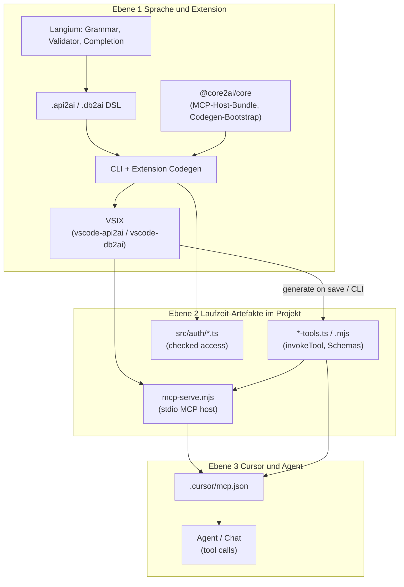

# Abschluss: Verify, Architektur (3 Ebenen), Release-Doku, Release

## Ebenenmodell (verbindlich für die Doku)

**Wichtig:** Das unterscheidet sich vom alten Deckel-Plan (core2ai / Consumer / generated). Die Architektur-Doku folgt **deinem** Modell.

### Übersicht

| Ebene | Was du meinst                                                                                | Ergebnis / Artefakt                                              |
| ----- | -------------------------------------------------------------------------------------------- | ---------------------------------------------------------------- |
| **1** | Langium, DSL, Code Generator; **core2ai** als geteilte Bibliothek; **Release** der Extension | **VSIX** (installierbare api2ai/db2ai-Extension)                 |
| **2** | Was die VSIX (bzw. CLI im Monorepo) aus der DSL erzeugt                                      | **MCP-Server** (`mcp-serve.mjs`) + **MCP-Tools** (`*-tools.mjs`) |
| **3** | Einbindung in Cursor, Test mit dem Agent                                                     | Konfigurierte MCP-Server, Tool-Aufrufe im Chat                   |

### Ebene 1 — Langium, DSL, Code Generator → VSIX

**Repos (Geschwister):**

| Repo                   | Rolle in Ebene 1                                                                                                                  |
| ---------------------- | --------------------------------------------------------------------------------------------------------------------------------- |
| **api2ai** / **db2ai** | Langium-Grammar (`.langium`), Validator, Completion, **Generator** (`packages/cli`), **VS Code Extension** (`packages/extension`) |
| **core2ai**            | Geteilte Teile: MCP-Host (`mcp-host`), Generate-Validierung, Auth-Stub-Bootstrap, Pin-Skripte — **keine** eigene DSL              |

**Zusammenspiel core2ai ↔ Siblings:**

- api2ai/db2ai **pinnen** `@core2ai/core` per Git-Tag (`core2ai:use-pin`) für reproduzierbare Builds.
- Während Entwicklung: `core2ai:use-local` (sibling `../core2ai`).
- Nach Änderung an **mcp-host** oder **codegen** in core2ai: Library-Release (Tag) → Consumer `use-pin` → `bundle:mcp-runtime` → `generate:all`.
- **Zwei Release-Arten** (in Doku trennen, nicht vermischen):
    1. **@core2ai/core Library-Release** — Git-Tag auf **core2ai**, Pin in api2ai/db2ai (Workflow `01-core2ai-library-release.md`).
    2. **VSIX-Release** — Extension-Version in `packages/extension/package.json`, `release:vsix` / GitHub prerelease (Workflow `03-vsix-github-release.md`).

**Output Ebene 1 für Endnutzer:** installierbare **VSIX** (oder Extension Development Host im Monorepo).

**Doku-Datei:** [`docs/02-layer1-dsl-extension-core2ai.md`](docs/02-layer1-dsl-extension-core2ai.md)

Inhalt grob:

- Langium-Pipeline (`langium:generate` → generated grammar)
- DSL-Dateien, OpenAPI vs SQL
- Generator + Extension (save → generate)
- Wo **core2ai** eingehängt wird (bundle, validation, stubs)
- Monorepo vs „Create demo workspace“ aus VSIX
- Wie man VSIX baut (`extension:vsix -w packages/extension`)

---

### Ebene 2 — VSIX erzeugt MCP-Server und MCP-Tools

**Fokus:** Was nach `generate` im **Projekt-Workspace** liegt (z. B. `packages/extension/demos/generated/`).

**Doku-Reihenfolge innerhalb Ebene 2** (wie von dir vorgeschlagen):

1. **Zuerst:** Wie **MCP-Server** und **Tools** zur Laufzeit zusammenspielen (ein Tool-Call: stdio → host → `invokeTool` → HTTP/SQL).
2. **Dann:** Wie die **VSIX/Extension** das erzeugt (Grammar → AST → Validator → Generator).

**Artefakte:**

| Artefakt   | Pfad (typisch)                | Rolle                                                  |
| ---------- | ----------------------------- | ------------------------------------------------------ |
| Tool-Modul | `generated/tools/*-tools.mjs` | `invokeTool`, Input-Schema, OpenAPI/SQL-Aufruf         |
| MCP-Host   | `generated/cli/mcp-serve.mjs` | stdio, lädt Tool-Modul, `--base-url-env`, `--auth-env` |
| Auth-Stubs | `src/auth/*.ts`               | checked access, `check*Parameters`                     |

**Doku-Datei:** [`docs/03-layer2-mcp-server-and-tools.md`](docs/03-layer2-mcp-server-and-tools.md)

Inhalt grob:

- Ablaufdiagramm Tool-Call (ohne Cursor)
- Grob Grammatik/Validator (was wird wann geprüft)
- Generate-Pipeline (`parse` / `validate` / `generate`)
- `bundle:mcp-runtime` und Kopie in `generated/cli/`
- api2ai vs db2ai Unterschiede (OpenAPI-Pfade vs SQL/env)

---

### Ebene 3 — Integration in Cursor und Test mit dem Agent

**Fokus:** Konfiguration und Nutzung — nicht Generator-Quellcode.

- `.cursor/mcp.json` (Server-Einträge, `env`, args zu `mcp-serve.mjs` + tools path)
- Server aktivieren, Agent wählt Tools
- Manuell testen: Demos-README-Prompts, `test:smoke`, `test:e2e`
- Optional: Extension Command „Create demo workspace“

**Doku-Datei:** [`docs/04-layer3-cursor-and-agent.md`](docs/04-layer3-cursor-and-agent.md)

Kann am Anfang den **Runtime-Flow** aus Ebene 2 kurz wiederholen (Cursor-Sicht: „was passiert wenn der Agent ein Tool aufruft?“), dann Setup-Schritte.

---

### Hub und Übersicht

| Datei                                                                    | Inhalt                                                |
| ------------------------------------------------------------------------ | ----------------------------------------------------- |
| [`docs/README.md`](docs/README.md)                                       | Hub: Links 01–04, workflows/, Daily commands (kurz)   |
| [`docs/01-three-layers-overview.md`](docs/01-three-layers-overview.md)   | Dein 3-Ebenen-Modell + Diagramm + „welche Repo wofür“ |
| [`docs/consumer-build-cheatsheet.md`](docs/consumer-build-cheatsheet.md) | „Ich ändere X → Y“ mit Verweis auf Ebene + Workflow   |

Alte Deckel-Zuordnung (`01-three-layers` = Pin, `02-mcp-stdio` separat) wird **ersetzt** durch obige 01–04.

---

## Was vom alten Deckel-Plan noch gilt

| Todo       | Status / Anpassung                                                                                       |
| ---------- | -------------------------------------------------------------------------------------------------------- |
| verify-all | Unverändert — vor Release-Dry-Run                                                                        |
| docs-wire  | README verlinken auf `docs/01` (Ebenen-Übersicht), nicht auf veraltetes Modell                           |
| release    | **Zwei** dokumentierte Abläufe: core2ai-Library (Tag/Pin) **und** optional VSIX; echter Lauf **am Ende** |

## Pläne

- **Aktiv:** [`abschluss_doku_release.plan.md`](abschluss_doku_release.plan.md)
- **Historisch:** [`docs_und_aufraeumen_deckel.plan.md`](docs_und_aufraeumen_deckel.plan.md) — bei Bedarf manuell löschen (kein `done/`-Ordner)

---

## Reihenfolge

### Phase 1 — Verify (auto + manuell)

Unverändert: `build` / `check` / `test` in core2ai, api2ai, db2ai; `generate:all`, `check:generated`; api2ai `test:e2e`; db2ai `test:e2e` (Docker).

Manuell: Extension Save, `test:smoke`, ein MCP-Server in Cursor — das ist **Ebene-3-Verifikation**.

---

### Phase 2 — Architektur-Doku (dein Modell)

Reihenfolge beim Schreiben:

1. **01** — Übersicht + Diagramm (dieser Abschnitt ausformulieren)
2. **02** — Ebene 1 (Langium, core2ai, Siblings, VSIX-Build)
3. **03** — Ebene 2 (zuerst Runtime Server↔Tools, dann Erzeugung durch Generator)
4. **04** — Ebene 3 (Cursor, mcp.json, Agent, Tests)
5. **cheatsheet** + Hub-TOC

Sprache: READMEs EN; Architektur/Workflows **DE oder EN** — einmal festlegen (Vorschlag: DE für Workflows, EN für `docs/01–04` wie READMEs).

---

### Phase 3 — Release-Workflows per Dry-Run dokumentieren

**Dry-Run** (bis vor Tag/Push): zwei Checklisten ableiten:

| Workflow                                  | Inhalt                                                                       |
| ----------------------------------------- | ---------------------------------------------------------------------------- |
| `workflows/01-core2ai-library-release.md` | Tag `@core2ai/core`, `use-pin`, bundle, generate — **Ebene-1-Infrastruktur** |
| `workflows/02-vsix-build-local-test.md`   | VSIX lokal, Extension Host, Demos                                            |
| `workflows/03-vsix-github-release.md`     | `release:vsix` — **Ebene-1-Endprodukt** für Nutzer                           |

Skill [`guided-release/SKILL.md`](../.cursor/skills/guided-release/SKILL.md) — Checkpoint-Flow (Library optional, Preview, VSIX); Workflow 01 später menschliche Kopie.

---

### Phase 4–6

Wie zuvor: weitere Workflows (04 version-bump, 10 daily, …), docs-wire, **echter Release** zuletzt.

---

## Erfolg

- Ebene 1/2/3 sind in `docs/01` klar und entsprechen deiner VSIX-zentrierten Sicht
- core2ai vs api2ai/db2ai und Library- vs VSIX-Release sind getrennt erklärt
- Nächster Library-Release: Workflow 01; nächstes VSIX: Workflow 03
- Agent-Test (Ebene 3) ist in Doku und Verify-Checkliste verankert

---

#Col3:23
