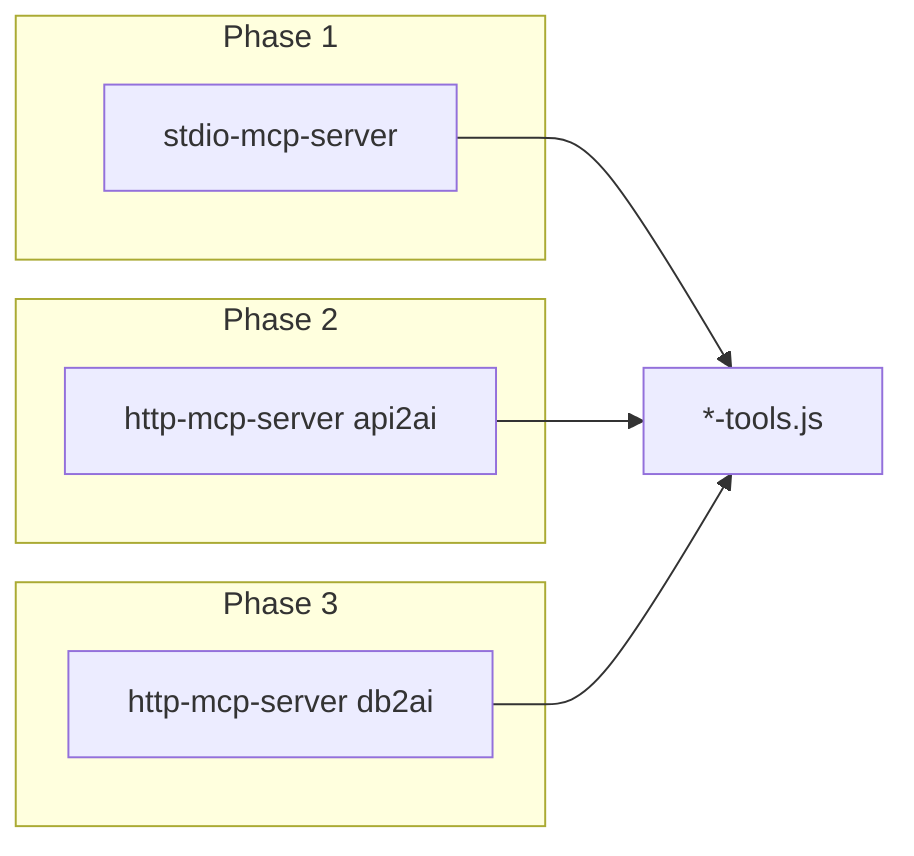
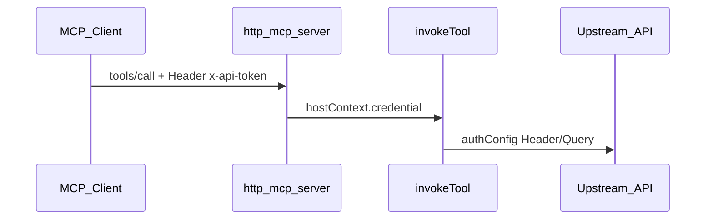

# api2ai/db2ai: MCP stdio + HTTP (3 Phasen)

## Nächster Schritt

**Phase 1 implementiert** → manueller **CP1** ausstehend → danach **Phase 2 Plan schärfen** und umsetzen.

---

## Architektur (gilt alle Phasen)

- **`*-tools.ts`:** nur `invokeTool`, `authConfig`, Schemas, `ApiHostContext`, `requiresAuth` — **kein** `mcpHostAdapter`, kein Env/Token-Lesen.
- **`stdio-mcp-server` / `http-mcp-server`:** Host-Runtime in core2ai (geplant): Argv, Base-URL-Startup-Check, Credential **pro `tools/call`**, JWT-Decode, `.env`-Reload, MCP-Transport.
- **`invokeTool`:** `hostContext` **Pflicht** (kein Fallback).



---

## Phase 1: stdio-Umbau + Tools entschlacken (JETZT)

**Ziel:** ~~`mcp-serve.ts`~~ → **`stdio-mcp-server.ts`** (erledigt); Token/Env-Logik nur im Host; Tools wie [`github-tools.ts`](api2ai/packages/extension/demos/generated/tools/github-tools.ts) ohne Adapter-Block.

### Lieferumfang

| Bereich | Änderung |
|---------|----------|
| **core2ai** | `render-mcp-host-shared.ts` + `render-stdio-mcp-server.ts`; `writeGeneratedMcpHosts` schreibt **nur stdio** (http erst Phase 2) |
| **api2ai + db2ai** | [`host-adapter-render.ts`](api2ai/packages/cli/src/generator/host-adapter-render.ts) aus Tools entfernen; [`invoke-render.ts`](api2ai/packages/cli/src/generator/invoke-render.ts) Pflicht-`hostContext`; [`render-generated-module.ts`](core2ai/src/test-fixtures/render-generated-module.ts) ohne adapter |
| **Demos** | `generate:all`; **alle** [`mcp.json`](api2ai/packages/extension/demos/.cursor/mcp.json)-Einträge → `stdio-mcp-server.js`; kein `mcp-serve` |
| **Tests** | stdio-Smoke/Integration: `stdioMcpServerPath` |

### Host-Runtime (stdio, Phase 1)

- Argv: `--base-url-env`, `--auth-env` (nur **Name** der Env-Var, kein Secret-Check beim Start).
- `validateHostAtStartup`: nur Base-URL Env non-empty.
- Pro `tools/call`: `.env` reload → `process.env[authEnvKey]` → `resolveApiHostContext` (+ JWT-Decode) → `invokeTool(..., hostContext)`.

### Nicht in Phase 1

- `http-mcp-server.ts`, HTTP-Tests, http-`mcp.json`-Einträge (ein Server enabled → Prefix `api2ai`)

### Checkpoint 1 (manuell)

1. Workspace `api2ai/packages/extension/demos`; stdio-Server aktiv.
2. Prompt **`api2ai`**: public + protected Tool-Call (Token in `.env.local` für stdio).
3. Protected ohne Token: Fehler beim **Call**, nicht beim Server-Start.
4. `npm run check` api2ai + demos.
5. db2ai: stdio-Demo (pagila) `tools/list` ok.

**Exit:** „CP1 ok“ → Phase-2-Plan schärfen + implementieren.

---

## Phase 2: HTTP-MCP (api2ai) — nach CP1 schärfen

**Status:** Grob skizziert; Details (Cursor `url`/`command`, CP2-Tests) werden **nach Phase 1** finalisiert.

**Ziel:** Streamable HTTP (`StreamableHTTPServerTransport`, SDK ^1.29); stateful `mcp-session-id`; Upstream-Token **vom MCP-Client pro Request** (Header), nicht in committed Config.

### Split-Demos (festgelegt)

| Demo | http in mcp.json | stdio in mcp.json |
|------|------------------|-------------------|
| open-meteo, spaceflight-news, mock-api, open-meteo-geocoding | ja | ja |
| tmdb, github | nein | ja (`envFile` für Secrets) |

### Port + URL — hardcoded in mcp.json, dokumentiert in `.env.example`

**Entscheidung:** Kein `--port-env` für Demos. Port und MCP-URL an **einer** sichtbaren Stelle:

| Quelle | Inhalt |
|--------|--------|
| **[`.env.example`](api2ai/packages/extension/demos/.env.example)** | Pro http-Demo: `*_HTTP_PORT` (URL steht in committed `mcp.json`) |
| **`mcp.json` (committed)** | Feste `"url": "http://127.0.0.1:3850/mcp"` — **gleicher** Wert wie Default in `.env.example` |
| **Node-Start (Terminal/README)** | `--port 3850` (numerisch, passend zur URL) |

Cursor interpoliert Env **nicht** in `url` — deshalb committed `mcp.json` = hardcoded Defaults; wer Ports ändert, passt `.env.example`-Doku, Startbefehl **und** lokale `url` an.

Default-Ports:

| Server | Port | MCP-URL |
|--------|------|---------|
| `api2ai-open-meteo-http` | 3848 | `http://127.0.0.1:3848/mcp` |
| `api2ai-spaceflight-news-http` | 3849 | `http://127.0.0.1:3849/mcp` |
| `api2ai-mock-api-http` | 3850 | `http://127.0.0.1:3850/mcp` |
| `api2ai-open-meteo-geocoding-http` | 3851 | `http://127.0.0.1:3851/mcp` |

### Token — nur MCP-Client, nicht in committed mcp.json



- **Committed `mcp.json`:** nur `"url"`, **kein** `headers`, **keine** Platzhalter wie `YOUR_MOCK_JWT`.
- **Protected APIs (mock-api http):** MCP-Client sendet `x-api-token` **pro MCP-HTTP-Request** (nicht in committed `mcp.json`).
- **github, tmdb:** nur stdio — Token aus `envFile` / `--auth-env`.
- **stdio (übrige Demos):** Base-URL/DB-URL in committed `mcp.json` `env`; Secrets nur wo nötig über `envFile`.
- **mock-api http:** JWT nach `login` in Tool-Antwort → Client setzt es als `x-api-token` für Folge-Calls; Agents schreiben **keine** Tokens in `.env` (bestehende Policy).

Beispiel committed http-Eintrag:

```json
"api2ai-mock-api-http": {
    "url": "http://127.0.0.1:3850/mcp"
}
```

Startbefehl (Port = URL):

```text
node ./generated/cli/http-mcp-server.js ./generated/tools/mock-api-tools.js \
  --base-url-env MOCK_API_BASE_URL --port 3850 --path /mcp
```

### HTTP-Host-Argv (Phase 2, vorläufig)

| Flag | Zweck |
|------|--------|
| `--base-url-env` | wie stdio |
| `--port` | numerisch (Demos hardcoded; Tests optional `--port 0`) |
| `--host` | optional, Default `127.0.0.1` |
| `--path` | Default `/mcp` |
| `--auth-header` | Default `x-api-token` (Upstream-Credential vom MCP-Client) |

### Nach CP1 noch zu schärfen (Phase 2)

- Cursor: startet Server per `command` oder nur `url` + manueller Prozess?
- Vitest HTTP-Smoke (Client sendet Header in Tests).
- Regel [`mcp-api2ai-only.mdc`](api2ai/packages/extension/demos/.cursor/rules/mcp-api2ai-only.mdc): Prefix `api2ai` (stdio oder `*-http`, je nachdem was enabled ist).
- CORS Env (`MCP_HTTP_CORS_ORIGIN`).

### Checkpoint 2 (TBD)

- Vitest: mindestens open-meteo-http.
- `npm run check` grün.

---

## Phase 3: HTTP-MCP (db2ai) — erledigt in Demos

- Gleicher `stateless-http-mcp-server`; pagila/sakila/access-demo jeweils stdio + `*-http` in `mcp.json`.
- Ports: access-demo **3852**, pagila **3853**, sakila **3854**; Secrets nicht in committed `mcp.json`.

---

## Cursor-Regeln (Phase 2)

| Prefix | Server |
|--------|--------|
| `api2ai` | stdio: `api2ai-spaceflight-news`, `api2ai-tmdb` (kein `*-http`) |
| `api2ai` | welcher `api2ai-*`-Server in Cursor enabled ist (stdio oder `*-http`) |

---

## Risiken

- P1 Breaking: kein `mcp-serve`-Alias.
- Phase-2-Details bewusst offen bis nach CP1.
