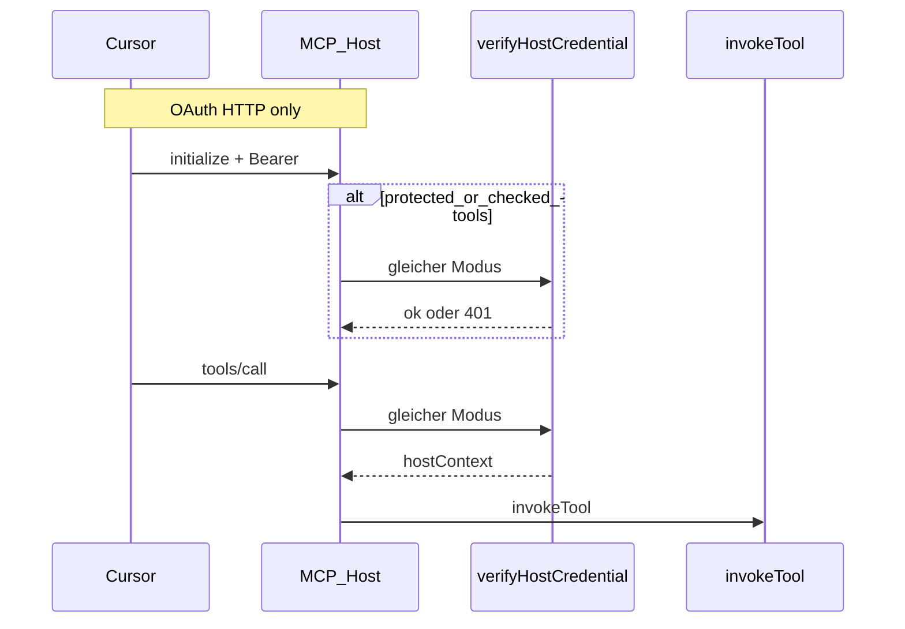

# Credential-Validierung vor Tool-Call (stdio / HTTP / OAuth)

## Konzeptuelle Einheit

### Eine Modus-Enum, zwei CLI-Flags

**Gleiche fünf Modi** überall — kein separates `none` mehr; VSW nutzt **`opaque`** wie GitHub-PAT:

```typescript
type HostCredentialValidationMode = 'hs256' | 'static' | 'opaque' | 'oidc';
```

| CLI-Flag | Transport |
|---|---|
| `--credential-validation <mode>` | stdio, stateless HTTP |
| `--oauth-token-validation <mode>` | OAuth HTTP |

Zusatz-Env je nach Modus: `--jwt-secret-env`, `--auth-expected-env`. **Runtime-Logging:** nicht in diesem Plan — siehe [`mcp_host_observability`](mcp_host_observability.plan.md). **`rs256-pem` / `OAUTH_SKIP_ISSUER_VERIFY`:** nicht in v1 (siehe unten).

Die DSL (`auth`, `access`) bleibt unverändert; Strenge ist **Host-Deployment**.

### Wo konfigurieren?

| Transport | Modus setzen in |
|---|---|
| stdio | [`mcp.json`](api2ai/packages/extension/demos/.cursor/mcp.json) → `args` (Cursor startet Host) |
| stateless HTTP | Launch-Skript (`mcp-http-demos.mjs`) + `.env` — `mcp.json` nur Client-URL/Header |
| OAuth HTTP | Launch-Skript (`mcp-oauth-demos.mjs`) + `.env` (`OAUTH_TOKEN_VALIDATION`) — `mcp.json` nur URL + OAuth-Client |

---

## Modus × Transport — was passt?

### Hart ablehnen (Startup `throw`)

In `validateHostAtStartup` / `validateStatelessHttpHostAtStartup` / `validateOAuthHttpHostAtStartup` nach Parsen der CLI:

| Kombination | Warum ungültig |
|---|---|
| `requiresAuth` ohne Modus-Flag | Pflicht-Config fehlt |
| `oidc` auf **stdio** oder **stateless HTTP** | braucht OAuth-IdP (`--oauth-issuer`, JWKS) — nur OAuth-HTTP-Host |
| `static` ohne `--auth-expected-env` | Expected-Wert fehlt |
| `hs256` ohne `--jwt-secret-env` | Secret fehlt |
| `oidc` auf OAuth ohne `--oauth-issuer` (und kein Default) | JWKS-Discovery unmöglich |
| `static` auf **OAuth HTTP** | Bearer ist kein fester Demo-Key-Vergleich — Modus nur für stdio/HTTP |

### Warnung auf stderr (Start einmal, Host läuft weiter)

| Kombination | Warnung |
|---|---|
| `opaque` + **db2ai** + `requiresAuth` | Host ist einzige Auth-Schicht — `opaque` nur für Dev/VSW-ähnliche Delegation; Produktion: `static`/`hs256` |
| `opaque` + `checked`-Tools im Modul | JWT-Claims in `src/auth/*` sind **unverifiziert** — `checked` nur mit `hs256`/`oidc`/`static` vertrauenswürdig |
Keine Warnung nötig: `opaque` + api2ai (bewusste API-Delegation), `hs256`/`oidc` auf bookings/orders-Demos.

### Erlaubte Matrix (Kurz)

| Modus | stdio | stateless HTTP | OAuth HTTP |
|---|---|---|---|
| `static` | ja | ja | **nein** (reject) |
| `hs256` | ja | ja | ja |
| `opaque` | ja | ja | ja |
| `oidc` | **nein** (reject) | **nein** (reject) | ja |
`requiresAuth === false` (z. B. open-meteo): **kein** Validierungs-Flag nötig.

---

## Modus-Referenz

| Modus | Host prüft | Credential-Typ | stdio/HTTP | OAuth | Typisch |
|---|---|---|---|---|---|
| **`static`** | exakter String (`timingSafeEqual`) | fester API-Key | ja | selten | Pagila `demo`, interne Gates |
| **`hs256`** | HMAC-SHA256 + `exp` | symmetrisch signiertes JWT | ja | ja | orders-demo, bookings-demo |
| **`oidc`** | JWKS + Signatur + `iss` (+ `aud`) | IdP-Token | nein | ja | bookings OAuth, saubere IdPs |
| **`opaque`** | **kein Crypto** — nur Presence; JWT-Claims optional unsicher lesen | PAT, Broker-Bearer | ja | ja | GitHub/TMDB, **VSW** (API validiert) |

Strenge (locker → streng): `opaque` → `static` → `hs256` → `oidc` (mit Issuer).

**`opaque` einheitlich:** Ersetzt das frühere OAuth-`none`. Bedeutet: *Host verifiziert nicht* — Credential muss für protected/checked vorhanden sein; Gültigkeit liegt bei Upstream-API (api2ai) oder ist bewusst delegiert (VSW Dev).

---

## Wann wird geprüft? (initialize vs. Tool-Call)

### Entscheidung: **ein Modus, beide Hooks — nicht getrennt konfigurierbar**

| Zeitpunkt | Transport | Was passiert |
|---|---|---|
| **`initialize`** | nur **OAuth HTTP** | Login-Gate: Bearer vorhanden + `verifyHostCredential(mode)` — nur wenn `mcpRequiresBearerOnInitialize` (protected/checked-Tools existieren) |
| **jeder `tools/call`** | **alle** Transports | `resolveContext()` → `resolveVerifiedHostCredential` bzw. `verifyOAuthBearerToken` mit **demselben Modus** |
| — | stdio / stateless HTTP | **kein** separates `initialize`-Gate; nur Tool-Call-Pfad |



**Warum nicht zwei Configs** (`--init-validation` vs `--call-validation`)?

- Getrennte Strenge erzeugt Lücken (strikt bei Login, lax bei Call — oder umgekehrt).
- `exp`-Ablauf und widerrufene Tokens müssen **pro Call** auffallen — bei `hs256`/`oidc`/`static` ist Re-Verify sinnvoll.
- Bei `opaque`: Initialize prüft nur **Presence** (Cursor-Exchange darf nicht an Crypto scheitern); jeder Call prüft ebenfalls Presence für protected/checked — kein Mehrwert durch Split.
- **Ausnahme später:** Post-Login Token Exchange ([`oauth_post-login_exchange`](oauth_post-login_exchange_49250986.plan.md)) — anderes Token nach Login; eigener Hook, **nicht** über getrennte Init/Call-Validation-Flags.

**Implementierung:** Eine Funktion `verifyHostCredential(credential, mode, config)` — aufgerufen von:

1. `resolveHostContextForCall` / `resolveHostContextForHttpCall` (jedes Call)
2. `resolveHostContextForOAuthSession` (jedes Call)
3. `handleOAuthHttpPost` initialize-Branch (nur OAuth, nur wenn Gate aktiv)

---

### api2ai vs. db2ai

| | **db2ai** | **api2ai** |
|---|---|---|
| Auth-Grenze | Host **einzige** Schicht | Host + Upstream-API |
| Empfohlene Modi | `static`, `hs256` | `opaque` (PAT/VSW), `hs256`/`oidc` für Demos |
| `opaque` in Produktion db2ai | **nein** — zu schwach ohne zweiten Prüfer | **ja** — API gibt 401 |

---

## Praxis-Erkenntnis: VSW / Keycloak Token Exchange

Echte API über Keycloak + OAuth-Broker (Token Exchange). `oidc`-Validierung scheitert an Lexik-JWT **ohne `iss`** → Cursor „Exchanging tokens“.

- Workaround war **hart in `generated/**`** — Port in [`render-mcp-host-shared.ts`](core2ai/src/codegen/render-mcp-host-shared.ts).
- **VSW:** `--oauth-token-validation opaque` (API validiert; kein eigener rs256-Use-Case in v1).
- **Langfristig strenger VSW:** Broker/IdP JWT mit korrektem `iss` → `oidc`; oder später `rs256-pem` (v2).

---

## Zielverhalten stdio / stateless HTTP

Bei `requiresAuth`: `--credential-validation` **Pflicht** beim Start.

Pro Tool-Call in `resolveContext`:

1. Credential lesen (Env / Header)
2. `verifyHostCredential(mode)` — gleiche Logik wie OAuth
3. Verifizierte Claims in `hostContext` (`hs256`/`oidc`/`static`); bei `opaque` nur Presence + optional unsafe decode
4. Ungültig → throw → MCP-Tool-Error

`public`-Tools ohne Credential: erlaubt.

`invokeTool`-Guard in [`render-check-stubs.ts`](db2ai/packages/cli/src/generator/render-check-stubs.ts) bleibt zweite Linie.

---

## Zielverhalten OAuth HTTP

`OAuthTokenValidationMode` → **`HostCredentialValidationMode`** (dieselbe Enum).

| Modus | initialize + tool-call (gleich) |
|---|---|
| `opaque` | Bearer non-empty; keine Signatur/`iss`; Claims optional unsicher |
| `hs256` | `verifyAccessTokenJwt` |
| `oidc` | `jwtVerify` + JWKS + `issuer` (unverändert; bookings-Demos) |
| `static` | nicht vorgesehen für OAuth-Bearer (nur stdio/HTTP) |

`mcpRequiresBearerOnInitialize`: bei `opaque` nur Presence; bei strikten Modi volle Verify.

---

## Scope VSW / nicht anfassen

- `vsw/oauth-idp/*`, Tool-Generator, `generated/tools/*`
- Nur: core2ai MCP-Host-Codegen → regenerierte `generated/cli/*-mcp-server.ts`

---

## Demo-Konfiguration (mcp.json + Launch-Skripte)

Nach Codegen-Regenerierung: **alle** Demos mit `auth` + protected/checked-Tools bekommen den passenden Modus — sonst Startup-`throw` (`requiresAuth` ohne Flag).

### Prinzip

| Transport | Wer setzt Host-Flags? | Was bleibt in `mcp.json`? |
|---|---|---|
| **stdio** | [`mcp.json`](api2ai/packages/extension/demos/.cursor/mcp.json) → `args` | `command`, `env`, `envFile`, Secrets |
| **stateless HTTP** | [`mcp-http-demos.mjs`](api2ai/packages/extension/demos/scripts/mcp-http-demos.mjs) → `buildHostLaunch` | nur `url` + `headers` (Client-Credential) |
| **OAuth HTTP** | [`mcp-oauth-demos.mjs`](api2ai/packages/extension/demos/scripts/mcp-oauth-demos.mjs) → `buildOAuthHostLaunch` + `.env` | nur `url` + `auth.CLIENT_ID` |

`start-mcp-http.mjs` / `start-mcp-oauth.mjs`: stderr-Zeile mit `credential-validation` / `oauth-token-validation` (Modus aus `build*Launch`), damit lokales Debugging ohne `mcp.json`-Änderung möglich ist.

### `mcp-http-demos.mjs` / `mcp-oauth-demos.mjs` (Generator der Host-`args`)

**Stateless HTTP** — pro Demo in `HTTP_DEMOS` Metadaten + `buildHostLaunch`:

```javascript
// Beispiel pagila / todo-api
credentialValidation: 'static',
authExpectedEnv: 'MCP_AUTH_EXPECTED', // todo-api: 'TODO_API_KEY'
```

`buildHostLaunch` hängt an `args` an (nur wenn Modul `requiresAuth`):

```text
--credential-validation static --auth-expected-env <ENV_NAME>
```

Demos **ohne** `auth` (z. B. spaceflight-news, open-meteo): **keine** Validierungs-Flags — unverändert.

**OAuth HTTP** — `buildOAuthHostLaunch` erweitern:

| `OAUTH_TOKEN_VALIDATION` | Zusätzliche `args` |
|---|---|
| `hs256` (Default orders/bookings) | `--jwt-secret-env <demo.jwtSecretEnv>` (wie heute) |
| `oidc` | `--oauth-issuer` (+ optional `--oauth-audience`) (wie heute) |
| `opaque` | **kein** `--jwt-secret-env`, **kein** `--oauth-issuer` — nur `--oauth-token-validation opaque` |

`if/else` heute (`oidc` vs `else` → immer hs256-Secret) muss **`opaque`** als dritter Zweig — sonst Startup-Fail bei VSW/opaque.

### api2ai — [`mcp.json`](api2ai/packages/extension/demos/.cursor/mcp.json)

| Server-Eintrag | Änderung in `args` |
|---|---|
| `github-stdio` | `--credential-validation`, `opaque` (nach `--auth-env` / `GITHUB_TOKEN`) |
| `tmdb-stdio` | `--credential-validation`, `opaque` |
| `open-meteo-stdio` | **keine** (nur public Tools) |
| `open-meteo-geocoding-stdio` | **keine** |
| `todo-api-http-stateless` | **keine** Host-`args` (HTTP-Host via Launch-Skript) — Header `x-api-token` bleibt |
| `bookings-api-oauth` | **keine** Host-`args` (OAuth via `start-mcp-oauth.mjs`) |
| `spaceflight-news-http-stateless` | **keine** |

### api2ai — [`mcp-http-demos.mjs`](api2ai/packages/extension/demos/scripts/mcp-http-demos.mjs)

| Demo | Modus | Env für `static` |
|---|---|---|
| `todo-api` | `static` | `TODO_API_KEY` (= `demo-todo-api-key`, passt zu `mcp.json` Header) |
| `spaceflight-news` | — | kein `auth` |

### api2ai — [`mcp-oauth-demos.mjs`](api2ai/packages/extension/demos/scripts/mcp-oauth-demos.mjs) + [`.env.example`](api2ai/packages/extension/demos/.env.example)

| Demo | Default | Override |
|---|---|---|
| `bookings-api` | `hs256` via `BOOKINGS_API_JWT_SECRET` | `OAUTH_TOKEN_VALIDATION=oidc` + `OAUTH_ISSUER` (kommentiert wie heute) |

`.env.example` ergänzen:

```bash
# Host credential validation (OAuth HTTP host CLI)
# OAUTH_TOKEN_VALIDATION=hs256|oidc|opaque
```

### db2ai — [`mcp.json`](db2ai/packages/extension/demos/.cursor/mcp.json)

| Server-Eintrag | Änderung in `args` |
|---|---|
| `sakila-stdio` | `--credential-validation`, `static`, `--auth-expected-env`, `MCP_AUTH_EXPECTED` |
| `pagila-http-stateless` | **keine** Host-`args` (Launch-Skript) — Header `x-api-token: demo` bleibt |
| `orders-demo-oauth` | **keine** Host-`args` (Launch-Skript) |

### db2ai — [`mcp-http-demos.mjs`](db2ai/packages/extension/demos/scripts/mcp-http-demos.mjs)

| Demo | Modus | Env |
|---|---|---|
| `pagila` | `static` | `MCP_AUTH_EXPECTED=demo` (Header in `mcp.json` muss matchen) |

### db2ai — [`mcp-oauth-demos.mjs`](db2ai/packages/extension/demos/scripts/mcp-oauth-demos.mjs) + [`.env.example`](db2ai/packages/extension/demos/.env.example)

| Demo | Default |
|---|---|
| `orders-demo` | `hs256` + `ORDERS_DEMO_JWT_SECRET` (unverändert) |

`.env.example`: `MCP_AUTH_EXPECTED=demo` (Pagila) + `MCP_AUTH_EXPECTED=sakila-demo` (Sakila stdio, Wert = `DB2AI_AUTH_TOKEN` in `.env`); `OAUTH_TOKEN_VALIDATION`-Kommentar um `opaque` erweitern.

### VSW (OAuth, anderer Rechner — nicht in Demo-`mcp.json`)

Launch manuell oder eigenes Skript — gleiches Muster wie `buildOAuthHostLaunch` mit `opaque`:

```bash
node oauth-http-mcp-server.js ./generated/tools/vsw-tools.js \
  --oauth-idp-url ... \
  --oauth-token-validation opaque \
  --port ...
```

### Demo-Übersicht

| Demo | Transport | Modus | Config-Ort |
|---|---|---|---|
| Pagila | HTTP | `static` | `mcp-http-demos.mjs` + `MCP_AUTH_EXPECTED` |
| Sakila | stdio | `static` | `mcp.json` args + `MCP_AUTH_EXPECTED` |
| todo-api | HTTP | `static` | `mcp-http-demos.mjs` + `TODO_API_KEY` |
| orders-demo | OAuth | `hs256` | `mcp-oauth-demos.mjs` + `.env` |
| bookings-api | OAuth | `hs256` / `oidc` | `mcp-oauth-demos.mjs` + `OAUTH_TOKEN_VALIDATION` |
| github / tmdb | stdio | `opaque` | `mcp.json` args |
| spaceflight / open-meteo | stdio/HTTP | — | kein Flag |
| **VSW** | OAuth | `opaque` | Launch-Args / `.env` |

### Reihenfolge bei Umsetzung

1. Generator + Regenerierung (`generated/cli/*`)
2. **`mcp-http-demos.mjs` / `mcp-oauth-demos.mjs`** (sonst starten HTTP/OAuth-Hosts ohne Flags → Crash)
3. **`mcp.json`** (stdio)
4. **`.env.example`** + lokale `.env` / `.env.local` anpassen
5. Integrationstests: Host-Start-Args in Tests/fixtures mitziehen

---

## Build & Tests

1. core2ai `npm run build`
2. Regeneriere `generated/cli/*-mcp-server.ts` (api2ai + db2ai)
3. `build:generated`, `npm run check`
4. Tests: static/hs256 Negativ; bookings Regression; OAuth `opaque` Smoke

---

## Prompt-Block (anderer Rechner / VSW)

> OAuth-Host: Bearer in `initialize` und jedem `tools/call` mit gleichem Modus. VSW: `opaque`. bookings: `hs256`/`oidc`. Generator only.
>
> Plan: [`credential_pre-tool_validation_aecd8a89.plan.md`](credential_pre-tool_validation_aecd8a89.plan.md)

---

## Out of scope v1

| Feature | Entscheidung | VSW / später |
|---|---|---|
| **Runtime-Logging / Debug** | eigener Plan | [`mcp_host_observability`](mcp_host_observability.plan.md) — nach Credential-Plan oder parallel |
| **`OAUTH_SKIP_ISSUER_VERIFY`** | weglassen | `oidc` mit korrektem `iss` am Broker, oder `opaque` |
| **`rs256-pem`** | weglassen | kein aktiver Use Case; VSW nutzt `opaque`. v2 wenn Host-Signatur ohne OIDC/`iss` nötig und `opaque` zu schwach |

**v1-Modi:** `hs256` \| `static` \| `opaque` \| `oidc` — deckt Demos, db2ai, api2ai, VSW ab.
