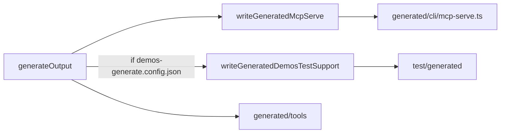

# Demos ohne `@core2ai/core`: `test/generated` im Codegen-Pfad

## Ziel

- **VSIX / kopierter Demo-Workspace:** `npm install` ohne `@core2ai/core` (nicht auf npm).
- **Monorepo-Tests:** import aus `test/generated/`, nicht `@core2ai/core/test-*`.
- **Eine Pipeline** mit `mcp-serve`: kein separates `emit-demos-test-support.mjs`.

## Bestehender Mechanismus (Referenz)

Bei jedem `generate` (DSL → Tools) ruft [`api2ai/packages/cli/src/generator.ts`](api2ai/packages/cli/src/generator.ts) (db2ai analog) auf:

1. `renderToolsModule` → `generated/tools/*.ts`
2. [`renderMcpServe`](api2ai/packages/cli/src/generator/render-mcp-serve.ts) → [`writeGeneratedMcpServe`](core2ai/src/codegen/project-bootstrap.ts) → `generated/cli/mcp-serve.ts`

Quelle für `mcp-serve`: nur [`render-mcp-serve.ts`](core2ai/src/codegen/render-mcp-serve.ts) (Inline-Template).

**Erweiterung:** derselbe `generateOutput`-Lauf schreibt bei Demo-Workspaces zusätzlich `test/generated/*.ts`.



---

## core2ai: nur noch Render unter `src/test-fixtures`

**Entfernen** (Implementierung wandert in Inline-Templates):

- [`generated-module.ts`](core2ai/src/test-fixtures/generated-module.ts)
- [`compile-generated-fixture.ts`](core2ai/src/test-fixtures/compile-generated-fixture.ts)
- [`mcp-stdio-smoke.ts`](core2ai/src/test-fixtures/mcp-stdio-smoke.ts)
- [`index.ts`](core2ai/src/test-fixtures/index.ts)
- gesamtes [`src/test-helpers/`](core2ai/src/test-helpers/) (Inhalt → `render-env-helpers.ts`)

**Neu** (einzige Quellen, Inline wie `render-mcp-serve.ts`):

| Datei | Ausgabe `demos/test/generated/` |
|--------|-----------------------------------|
| `render-generated-module.ts` | `generated-module.ts` |
| `render-compile-generated-fixture.ts` | `compile-generated-fixture.ts` |
| `render-mcp-stdio-smoke.ts` | `mcp-stdio-smoke.ts` |
| `render-env-helpers.ts` | `env-helpers.ts` |
| `render-test-support-index.ts` | `index.ts` (Barrel) |

Kein Unterordner `render/` nötig — flach unter `src/test-fixtures/`, klar getrennt von gelöschten Implementierungsdateien.

**[`project-bootstrap.ts`](core2ai/src/codegen/project-bootstrap.ts):**

```ts
export function writeGeneratedDemosTestSupport(projectRoot: string): void {
  // if !exists(demos-generate.config.json) → return
  // mkdir test/generated
  // writeFile × 5 aus render*Source()
}
```

- Export in [`codegen/index.ts`](core2ai/src/codegen/index.ts) (wie `renderMcpServeSource`).
- **Kein** separates Emit-Skript.

**[`core2ai/package.json`](core2ai/package.json):** Exports `./test-fixtures` und `./test-helpers` **entfernen** (demos importieren lokal; CLI nutzt nur `./codegen`).

---

## Trigger: wann schreiben?

In **api2ai** und **db2ai** [`generator.ts`](api2ai/packages/cli/src/generator.ts), nach `renderMcpServe`:

```ts
const projectRoot = resolveBootstrapProjectRootFromSource(source);
if (fs.existsSync(path.join(projectRoot, 'demos-generate.config.json'))) {
  writeGeneratedDemosTestSupport(projectRoot);
}
```

- **Monorepo `npm run generate:all`:** pro DSL ein Lauf → `test/generated` wird idempotent mehrfach geschrieben (gleicher Inhalt) — akzeptabel.
- **Fremdes User-Projekt** ohne `demos-generate.config.json`: nur `mcp-serve`, kein `test/generated`.

Nach Änderung an Render-Templates: `npm run build` in **core2ai**, dann `npm run generate:all` in api2ai/db2ai (wie bei `renderMcpServeSource`).

---

## Consumer (api2ai + db2ai)

1. `@core2ai/core` aus [`demos/package.json`](api2ai/packages/extension/demos/package.json) entfernen; Lockfile neu.
2. Test-Imports → `../generated/index.js` (siehe vorherige Plan-Tabelle).
3. **`test/generated/**/*.ts` committen** (nach erstem `generate:all`).
4. Regel [demos-build-generated.mdc](api2ai/.cursor/rules/demos-build-generated.mdc): bei Änderung `core2ai/src/test-fixtures/render-*.ts` → core2ai `build` + consumer `generate:all` (nicht „emit“).

---

## Verifikation

1. `cd core2ai && npm run build`
2. `cd api2ai && npm run generate:all && npm run check && npm test`
3. `cd db2ai` — dasselbe
4. Leerer Ordner mit kopiertem Demo-`package.json` (ohne `@core2ai/core`) → `npm install` grün
5. VSIX-Smoke: `generate:all` + `build:generated` mit installierter Extension

---

## VSIX / Demo-Kopie

`test/` inkl. committed `test/generated` **weiter mitkopieren** (`DEMO_COPY_SKIP_DIRS` unverändert). Entscheidend für `npm install`: kein `@core2ai/core` in `demos/package.json`.

---

## Nicht im Scope

- Separates `scripts/emit-demos-test-support.mjs`
- `generate.mjs` / VSIX-Embed ändern (CLI im Bundle ruft bereits `generateOutput`)
- `packages/cli` behält `@core2ai/core` für Codegen
