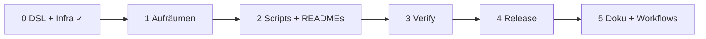

# Aufräumen → Release → Deckel (Doku + Workflows)

## Entscheidungen

- C2 ja, **kein HTTP-MCP-Code** (nur Doku).
- **DSL:** `toolName` und `optionalParams`-Einträge als **ID** (Identifier), nicht STRING — beide Sprachen.
- **READMEs** vor dem Deckel nochmal durchgehen (Inhalt + Verweise).
- **package.json-Scripts** ausdünnen — Übersicht in **Workflow-Checklisten**, nicht in 40 Zeilen Root-Scripts.
- Reihenfolge: **DSL zuerst** → Aufräumen → Scripts/README → Verify → Release → Doku/Workflows.

## Fortschritt (Stand vor Commit-Runde)

**Erledigt (7 Todos):**

| Todo                          | Kurz                                                                        |
| ----------------------------- | --------------------------------------------------------------------------- |
| dsl-identifiers               | toolName/optionalParams als ID; api2ai + db2ai Grammar, Demos, Tests        |
| dsl-db2ai-optionalparams-xref | Cross-Ref, Scope, Go-to-Def, Langium-Completion                             |
| dsl-completion                | ID-Snippets; api2ai OpenAPI-Completion; db2ai ohne Hand-Completion          |
| dsl-completion-tests          | completions + linking.test.ts (db2ai); api2ai ID-Tests                      |
| generate-validation-gate      | CLI + Extension: kein Generate bei DSL-Fehlern                              |
| core2ai-codegen-validation    | `document-validation.ts`; Consumer nutzen core2ai                           |
| hybrid-pin-local              | use-local/use-pin; check-push + check-resolved; Pre-push (nicht Pre-commit) |

**Offen:** cleanup A (Rest), C1/C2, Script-Dünnung, README-Review, formal verify-all, **Release**, docs/workflows.

**Vor Consumer-Commits:** `npm run core2ai:use-pin` in api2ai/db2ai (kein `file:` im Lockfile committen). Release bewusst später.



---

## Phase DSL — `toolName` und `optionalParams` als ID

**Ziel-Syntax (beide Sprachen):**

```txt
toolName: listCustomerOrders          // war: "listCustomerOrders"
access: checked {
    optionalParams: [customerId]     // war: ["customerId"]
}
```

### Grammar (Langium)

| Feld             | Heute     | Neu   |
| ---------------- | --------- | ----- |
| `toolName`       | `STRING`  | `ID`  |
| `optionalParams` | `STRING+` | `ID+` |

- **db2ai:** `terminal ID` existiert schon (für `params.name`); Grammar in [`db-2-ai-dsl.langium`](db2ai/packages/language/src/db-2-ai-dsl.langium) anpassen.
- **api2ai:** `terminal ID` in [`api-2-ai-dsl.langium`](api2ai/packages/language/src/api-2-ai-dsl.langium) ergänzen (analog db2ai).
- `langium:generate` in beiden Consumern; AST-Typen bleiben `string`, nur Lexer-Regel ändert sich.

### Validator / Codegen / Demos

- Fehlermeldungen: `` `toolName: listX` `` statt `` `toolName: "listX"` ``.
- Generator liest weiter `.toolName` / `getOptionalParams()` — **kein** core2ai-Release nötig, wenn nur Consumer-Language.
- **Alle** `.api2ai` / `.db2ai` Demos + Language-Tests migrieren; `npm run generate:all`; committed generated diff.
- README/DSL-Beispiele in Extension-Demos aktualisieren.

### Completion — umgesetzt

| Repo       | Umsetzung                                                                                                                                                                                                    |
| ---------- | ------------------------------------------------------------------------------------------------------------------------------------------------------------------------------------------------------------ |
| **api2ai** | ID-Syntax in `buildOptionalParamCompletionItems` (OpenAPI-Params); Snippets ohne Quotes                                                                                                                      |
| **db2ai**  | `optionalParams+=[SqlParamNameField:ID]` + `Db2AiDslScopeComputation`; **Langium** `completionForCrossReference` (manueller Param-Autocomplete entfernt); Block-Keywords in `optionalParams:[…]` unterdrückt |

Beide: `CHECKED_BODY_INSERT` / `ACCESS_KIND_INSERT.checked` ohne Quotes.

### Tests — Regression (soll rot werden, wenn Completion bricht)

**api2ai** — [`completions.test.ts`](api2ai/packages/language/test/completions.test.ts) hat bereits 4 `optionalParams`-Tests, aber mit **String-Syntax**. Die müssen auf ID umgestellt werden; zusätzlich:

- Test mit Cursor **innerhalb** `optionalParams: [cust|]` (Prefix-Match).
- Test dass **keine** Quote-Vorschläge mehr kommen.

**db2ai** — **Lücke:** [`completions.test.ts`](db2ai/packages/language/test/completions.test.ts) endet bei SQL-Block-Keywords — **zero** Tests für `optionalParams` oder `checked`-Block. Deshalb kein roter Test bei kaputtem Autocomplete.

Neu in db2ai (analog api2ai):

1. `optionalParams` Keyword inside `access: checked { … }`
2. SQL-Param-Namen inside `optionalParams: [|]` und `[cust|]`
3. Optional: `toolName: |` schlägt Snippet ohne Quotes vor

Parsing/Validation: [`parsing.test.ts`](db2ai/packages/language/test/parsing.test.ts), [`access-validating.test.ts`](db2ai/packages/language/test/access-validating.test.ts) auf ID-Syntax umstellen.

### Breaking change

- Bestehende `.api2ai`/`.db2ai` mit Quotes sind **Parse-Fehler** nach Migration — bewusst (kein Dual-Support).
- Extension-Version bump (Workflow 04) erwähnen, wenn VSIX mit neuer Grammar shipped wird.

---

## Workflow-Checklisten (`core2ai/docs/workflows/`)

Ein Ort, keine Duplikate in api2ai/db2ai. Hub [`docs/README.md`](core2ai/docs/README.md) verlinkt alle Checklisten.

### Deine vier (+ ergänzte) Workflows

| #   | Datei                                                                                                   | Wann                                                   |
| --- | ------------------------------------------------------------------------------------------------------- | ------------------------------------------------------ |
| 1   | [`01-core2ai-release.md`](core2ai/docs/workflows/01-core2ai-release.md)                                 | `@core2ai/core` taggen; api2ai/db2ai pinnen            |
| 2   | [`02-vsix-build-local-test.md`](core2ai/docs/workflows/02-vsix-build-local-test.md)                     | VSIX bauen, Extension Development Host, Demos generate |
| 3   | [`03-vsix-github-release.md`](core2ai/docs/workflows/03-vsix-github-release.md)                         | `release:vsix` + gh prerelease                         |
| 4   | [`04-version-bump.md`](core2ai/docs/workflows/04-version-bump.md)                                       | **Welche** Version wann (siehe unten)                  |
| 5   | [`05-fresh-clone-dev-setup.md`](core2ai/docs/workflows/05-fresh-clone-dev-setup.md)                     | Neuer Rechner / frischer Clone                         |
| 6   | [`06-dsl-or-grammar-change.md`](core2ai/docs/workflows/06-dsl-or-grammar-change.md)                     | `.langium` / Validator / Generator                     |
| 7   | [`07-dsl-only-regenerate.md`](core2ai/docs/workflows/07-dsl-only-regenerate.md)                         | Nur `.api2ai`/`.db2ai` geändert                        |
| 8   | [`08-mcp-host-change-without-release.md`](core2ai/docs/workflows/08-mcp-host-change-without-release.md) | Lokales Monorepo debug — **nicht** für committed Pin   |
| 9   | [`09-db2ai-docker-demos.md`](core2ai/docs/workflows/09-db2ai-docker-demos.md)                           | Pagila/Sakila/access-demo                              |
| 10  | [`10-daily-pre-commit.md`](core2ai/docs/workflows/10-daily-pre-commit.md)                               | Vor Commit/PR: minimale Kommandos                      |

### Inhalt pro Checkliste (Vorlage)

- **Ziel** (1 Satz)
- **Voraussetzungen** (clean git, Node 20+, Docker …)
- **Schritte** — nummeriert, copy-paste-fähige Befehle, **welches Repo** (core2ai / api2ai / db2ai)
- **Verify** — was grün sein muss
- **Häufige Fehler** — 2–3 Bulletpoints
- **Siehe auch** — Link Skill [`core2ai-release`](../.cursor/skills/core2ai-release/SKILL.md) wo relevant

### 04-version-bump — drei getrennte Versionswelten

In der Checkliste **explizit trennen** (Quelle der Verwirrung):

| Was                               | Wo `version`                                                           | Tag / Release                                          |
| --------------------------------- | ---------------------------------------------------------------------- | ------------------------------------------------------ |
| **`@core2ai/core`**               | `core2ai/package.json` + Workspace-Pakete + `scripts/core2ai-pin.json` | Git-Tag `vX.Y.Z` auf **core2ai**                       |
| **VSIX (api2ai/db2ai)**           | `packages/extension/package.json`                                      | GitHub Release `vscode-api2ai-X.Y.Z.vsix` (prerelease) |
| **Workspace-Root** (api2ai/db2ai) | Root `package.json` `0.0.2`                                            | Meist **nicht** released — nur Metadaten               |

`npm run version:patch` in Consumern bump **nur Extension** — nicht core2ai. core2ai-Bump nur im Release-Workflow (01).

---

## Script-Ausdünnung (`package.json`)

**Problem heute:** Root api2ai/db2ai ~40 Scripts — Release-Kette, viele Smoke/MCP-Einzeltests, db2ai-Forwarder `generate:pagila`, doppeltes `refresh-pin`/`use-pin`.

### Zielbild Root (Consumer) — ~15 „Primary“-Scripts

| Kategorie     | Behalten (Primary)                                                                                                             | Aus Root entfernen / verschieben                                                                                    |
| ------------- | ------------------------------------------------------------------------------------------------------------------------------ | ------------------------------------------------------------------------------------------------------------------- |
| **Build**     | `build`, `build:clean`, `clean`, `watch`                                                                                       | —                                                                                                                   |
| **Langium**   | `langium:generate`, `langium:watch`                                                                                            | —                                                                                                                   |
| **Generate**  | `generate:all`                                                                                                                 | db2ai: `generate:pagila/sakila/access-demo` (nur in `demos/package.json`)                                           |
| **Quality**   | `check`, `test`, `format`                                                                                                      | `lint:fix` optional behalten; `test:coverage` → Workflow 10                                                         |
| **Install**   | `install:github-https`, `install:demos` (api2ai), `install:hooks`                                                              | doppeltes `postinstall`+hooks dokumentieren                                                                         |
| **Pin**       | `core2ai:pin`, `core2ai:use-pin`, `core2ai:use-local`, `core2ai:link-mode`, `core2ai:check-push-pin`, `core2ai:check-resolved` | `core2ai:refresh-pin` (Alias zu use-pin — einen behalten); ~~`apply-pin`~~, ~~`check-staged-pin`~~ entfernt         |
| **Release**   | `release:vsix`                                                                                                                 | `release:verify`, `release:package`, `extension:release:vsix` als **interne** Steps in `scripts/release-vsix.mjs`   |
| **Extension** | —                                                                                                                              | `extension:vsix` nur via `release:vsix` oder `npm run extension:vsix -w packages/extension` in Workflow             |
| **Version**   | `version:patch/minor/major`                                                                                                    | in Workflow 04 erklären                                                                                             |
| **Dev/Debug** | —                                                                                                                              | `test:smoke*`, `test:mcp*` → [`scripts/dev-smoke.mjs`](api2ai/scripts/dev-smoke.mjs) oder CLI; in Workflow 02/07/09 |

**core2ai Root** (~12 Scripts): bereits schlank — nur README-Tabelle + Link workflows.

**demos/package.json`:** `generate:all` behalten; Einzel-`generate:*` optional per Loop/Arg im gemeinsamen `generate.mjs` (C1).

### README statt Script-Wald

- Root README: **Tabelle „Daily commands“** (5–8 Zeilen) + Link `core2ai/docs/workflows/`.
- Lange Script-Listen aus README **entfernen** oder in „Advanced“ auslagern.
- `.cursor/rules/langium-generate-build.mdc` — Primary-Scripts unverändert nennen (`build`, `check`, …).

---

## README-Review (Phase D — vor Release oder parallel zu Script-Dünnung)

| Repo / Pfad                                     | Prüfpunkte                                                                     |
| ----------------------------------------------- | ------------------------------------------------------------------------------ |
| [`core2ai/README.md`](core2ai/README.md)        | Pin-Beispiel aktuell; Link `docs/` + `workflows/`; codegen nicht „placeholder“ |
| [`api2ai/README.md`](api2ai/README.md)          | Script-Tabelle kürzen; Architecture-Link; VSIX/Demos-Pfade                     |
| [`db2ai/README.md`](db2ai/README.md)            | Docker-Workflow; `.env` vs api2ai `.env.local` — in Doku vereinheitlichen      |
| `packages/language`, `cli`, `extension` READMEs | Tote Links (z. B. api2ai `util.ts`); Duplikat mit Root                         |
| `packages/extension/demos/README.md`            | MCP-Setup, generate, env                                                       |
| Skill vs Workflow                               | Skill bleibt für **Agent**; Workflow für **Menschen** — gegenseitig verlinken  |

---

## Phase A — Quick wins

### Erledigt (Scripts-Aufräumen + Quick wins)

- ~~`check-staged-core2ai-pin.mjs`~~ gelöscht; `core2ai:check-staged-pin` aus api2ai/db2ai entfernt (ersetzt durch Pre-push + `check-push-pin`).
- ~~`core2ai:apply-pin`~~ npm-Alias entfernt; `apply-core2ai-pin.mjs` bleibt intern für `refresh-pin`.
- README + Rules + Release-Skill: nur noch `use-pin` / `refresh-pin`.
- Typo `succesfully` → `successfully` (api2ai `generate-command.ts`).
- Stale Auth-Artefakte entfernt: api2ai `api2ai-invoke-options.{js,d.ts,mjs,d.mjs}`; db2ai leeres `db2ai-invoke-options.mjs`.
- ~~`.pagila-src`~~ aus eslint/prettierignore/gitignore/vscodeignore/DEMO_COPY_SKIP (db2ai + api2ai + core2ai).
- db2ai `core2ai-pin.targets.json`: `packages/extension/demos/package.json` ergänzt.
- api2ai Extension: unnötige `@core2ai/core`-Dependency entfernt (nur demos/cli brauchen Pin).
- Petstore-Fixture → `langium-test-mini.openapi.yaml`; Language-Tests aktualisiert.

---

## Phase C1 / C2

### C1 — Demos & Consumer-Scripts

| Punkt                                     | Beschreibung                                                                                                        |
| ----------------------------------------- | ------------------------------------------------------------------------------------------------------------------- |
| **Shared `generate.mjs`**                 | ✓ `core2ai/scripts/demos-generate.mjs` + `demos-generate.config.json` pro Consumer; dünner Wrapper in demos/scripts |
| **`install-git-hooks.mjs` deduplizieren** | ✓ `core2ai/scripts/install-consumer-git-hooks.mjs`; Consumer-Wrapper                                                |
| **api2ai-history-rewrite**                | ✓ Backup-Ordner gelöscht                                                                                            |

### C2 — Codegen / CLI

| Punkt                          | Beschreibung                                                  |
| ------------------------------ | ------------------------------------------------------------- |
| **auth-stub-render → core2ai** | Gemeinsame Teile nach `@core2ai/core/codegen`; `generate:all` |
| **api2ai parse/validate**      | CLI + Tests analog db2ai                                      |

### scripts-thin (Root `package.json`, eng mit C1)

| Entfernen / verschieben                                       | Wohin                                                                                         |
| ------------------------------------------------------------- | --------------------------------------------------------------------------------------------- |
| db2ai `generate:pagila/sakila/access-demo`                    | nur `demos/package.json`                                                                      |
| `test:smoke*`, `test:mcp*`                                    | `scripts/dev-smoke.mjs` oder Workflows 02/07/09                                               |
| `release:verify`, `release:package`, `extension:release:vsix` | `scripts/release-vsix.mjs` (intern von `release:vsix`)                                        |
| `core2ai:refresh-pin` vs `use-pin`                            | einen Primary behalten                                                                        |
| `githubHttpsEnv` Duplikat                                     | optional: aus `core2ai-install-utils` für Consumer `npm-install-github-https` wiederverwenden |

**Bewusst nicht:** HTTP-MCP-Code; Merge openapi/sql `generator/*.ts`.

---

## Verify → Release → Deckel

**Verify:** wie bisher, alle drei Repos.

**Release:** Skill **core2ai release** — Checkliste 01 ist die menschenlesbare Fassung.

**Deckel:**

| Pfad                                | Inhalt                                             |
| ----------------------------------- | -------------------------------------------------- |
| `docs/README.md`                    | Hub: Architektur + Workflows                       |
| `docs/01`–`04`                      | Drei Ebenen + MCP-Transport (nur Doku)             |
| `docs/consumer-build-cheatsheet.md` | „Ich ändere X → Y“ (kurz, verweist auf workflows/) |
| `docs/workflows/01`–`10`            | Checklisten                                        |

---

## Erfolgskriterien (ergänzt)

**Erreicht (dieser Sprint):**

- `toolName: listX` und `optionalParams: [customerId]` parsebar; Quote-Syntax entfernt (api2ai + db2ai).
- db2ai: Cross-Ref optionalParams → params.name; Go-to-Def + Referenz-Completion; linking.test.ts.
- Completion-Tests für optionalParams in api2ai und db2ai grün.
- Generate läuft nicht bei Validierungsfehlern (CLI + Extension).
- Hybrid Pin/Local + **Pre-push** blockiert `file:…core2ai` am Branch-Tip; `check-resolved` für node_modules.
- Obsolete Pin-Scripts: ~~check-staged~~, ~~apply-pin npm-Alias~~.
- Phase A Quick wins: Petstore-Fixture neutral; pagila-src entfernt; stale auth stubs; extension dep bereinigt.
- `@core2ai/core/codegen`: zentrale Generate-Validierung.

**Noch offen (Rest des Plans):**

- auth-stub-Shared-Code in core2ai; api2ai hat `parse`/`validate`.
- Root-`package.json` api2ai/db2ai ausgedünnt; READMEs aktuell.
- `docs/workflows/` deckt Release, VSIX lokal, VSIX GitHub, Version-Bump + 6 weitere typische Abläufe ab.
- Nutzer findet „Was mache ich als Nächstes?“ über `core2ai/docs/README.md`, nicht über `npm run` grep.

---

## Bewusst nicht in diesem Sprint

- HTTP-MCP-Implementierung
- Merge openapi/sql `generator/*.ts`
- VSIX **ohne** prerelease (öffentlicher Marketplace) — noch nicht im Scope
