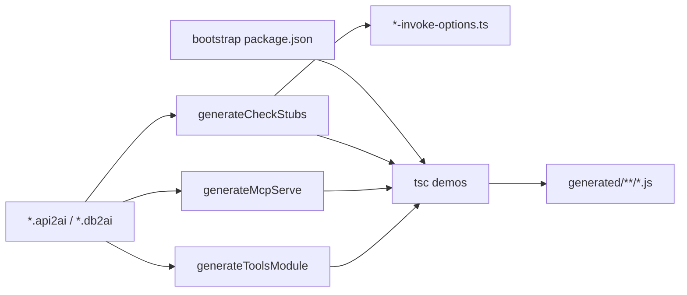
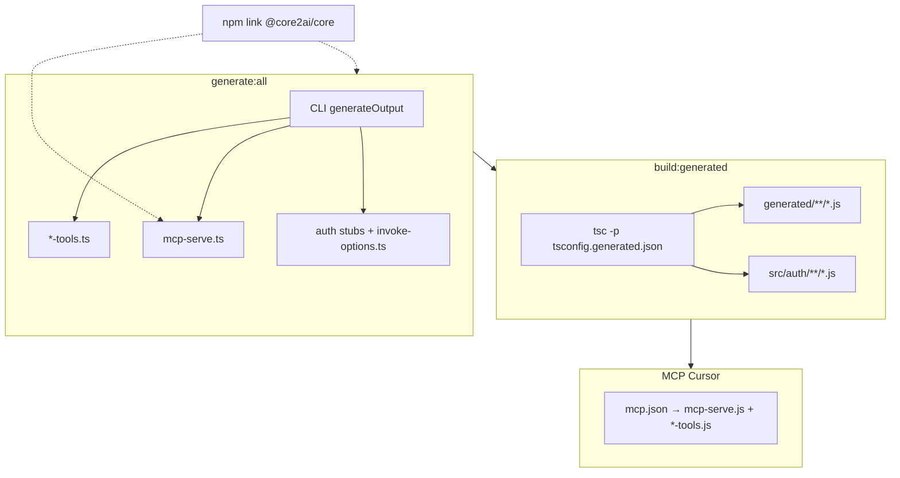

# Aufräumen: npm link, TS-only Generator, kein esbuild für Demos

## Verständnis — ja, mit Präzisierungen

Deine vier Punkte habe ich so verstanden:

| Punkt | Dein Ziel | Ist-Zustand (kurz) |
|-------|-----------|-------------------|
| **1** | `@core2ai/core` per **npm link**, kein Git-Pin | Pin-Skripte + `github:…#v0.0.5` in Manifesten; `core2ai:use-local` nutzt bereits `file:../core2ai` |
| **2** | Generator erzeugt **alle** Laufzeit-Artefakte; **kein esbuild** dafür | Parallel `renderTsModule` + `renderJsModule`; `bundle:mcp-runtime` → kopiertes `mcp-serve.mjs`; Auth-Stubs via esbuild `.ts`→`.mjs` |
| **2b/2c** | Nur **TS** ausgeben; Orchestrierung in getrennten Schritten | Eine Funktion [`generateOutput`](api2ai/packages/cli/src/generator.ts) macht alles |
| **3** | core2ai **kein Monorepo** mehr | Migration begonnen: `src/` → `out/` im Working Tree; Scripts/Docs/`check` noch teils auf `packages/` |
| **4** | Tests dürfen kaputt gehen | vitest in core2ai entfernt; Consumer-Tests nicht Priorität |

**Zwei Präzisierungen aus deiner Antwort:**
- **Link-Modell:** echtes `npm link` (in core2ai `npm link`, in Consumern `npm link @core2ai/core`) — nicht GitHub-Tag-Pin.
- **Laufzeit:** `tsc` emittiert `.js`; `.cursor/mcp.json` zeigt auf `.js`, nicht `.mjs`.

**Esbuild bleibt nur** für den VS-Code-Extension-Build ([`embed-cli-bundle.mjs`](api2ai/packages/extension/embed-cli-bundle.mjs), [`esbuild.mjs`](api2ai/packages/extension/esbuild.mjs)) — das sind keine Generator-Artefakte.

### Design-Prinzip: generierter Output

**Keep it simple** — Priorität liegt auf einfachem Generator-Code, nicht auf schönem generiertem Code:

- Generierte Dateien **dürfen hässlich sein** (lange Blöcke, Wiederholungen, wenig Struktur).
- **Duplikation ist OK** — z. B. JWT-Helfer pro Tool-Datei inline, auch wenn dieselbe Logik in `core2ai` existiert; **kein** Zwang zu shared Templates oder Sync mit [`jwt.ts`](core2ai/src/mcp-host/jwt.ts).
- **Inline-Helfer** in [`host-adapter-render.ts`](api2ai/packages/cli/src/generator/host-adapter-render.ts) (String-Template) reicht — nur wenn es wirklich hilft, kurzer Export in `@core2ai/core/codegen`, nicht Pflicht.
- Kein Refactoring der Generator-Templates „zum Lesbarkeit“ — nur was für TS-only / keine core2ai-Imports nötig ist.

---

### Zwei Laufzeiten — VSIX vs. MCP

Du verstehst die **VSIX** richtig: Für Sprache, Validierung, Completion und **Generate** soll `@core2ai/core` **keine** separate Laufzeit-Dependency in der Extension sein — der Code wird **beim VSIX-Build** eingepackt.

| Laufzeit | Wo | `@core2ai/core` heute | Ziel |
|----------|-----|----------------------|------|
| **Extension / VSIX** | Cursor Extension Host + eingebettetes `cli.cjs` | `@core2ai/core/codegen` wird per esbuild **in `cli.cjs` gebündelt** (nur `esbuild` external) | Unverändert: **kein npm link** für VSIX-Nutzer |
| **MCP stdio server** | Separater Node-Prozess aus Demo-Workspace (`mcp.json` → `generated/cli/mcp-serve.*` + `*-tools.*`) | Generierte Tools **importieren** `@core2ai/core/mcp-host`; Auflösung über `demos/node_modules` (heute GitHub-Pin) | Siehe unten |

**npm link** gilt damit nur für **Entwickler** mit ausgechecktem `core2ai` + `api2ai`/`db2ai` — **nicht** für normale VSIX-Nutzer der Extension.

**MCP-Demo-Workspace (dritter Fall):** Cursor startet MCP **außerhalb** der VSIX. **`generated/tools/*-tools.*` dürfen keinen Import aus `@core2ai/core` haben** (siehe Phase C). Nur `mcp-serve` darf `@core2ai/core/mcp-host` nutzen (Dev: npm link; VSIX: gebündelter Host im Embed).

**Plan-Vorgehen MCP:**

- **Tool-Module:** self-contained — JWT/Env-Helfer (`resolveCredentialAndOptionalJwt` etc.) werden **vom Generator inline** erzeugt, nicht importiert.
- **VSIX-Build:** MCP-Host in `embed-api2ai/resources/` packen (Extension-esbuild, kein Consumer-`bundle:mcp-runtime`).
- **Generator Embed-Pfad:** `mcp-serve.ts` nutzt im VSIX-Kontext die gebündelte Host-Datei.
- **demos/package.json:** `@core2ai/core` aus Tool-Runtime-Deps entfernen (nur noch ggf. für Dev-CLI, nicht für kompilierte Tools).
- README: **npm link** = Monorepo-Entwicklung; **VSIX** = Extension + Demos ohne core2ai-Checkout für Tools.

---

## Was du in der Generator-Liste vergessen hast

Deine drei Generator-Schritte sind richtig, ergänzt um zwei Neben-Artefakte:



| Schritt | Output (nur `.ts` schreiben) | Heute |
|---------|------------------------------|-------|
| **generateToolsModule** | `generated/tools/*-tools.ts` ( **kein** `@core2ai/core`-Import ) | + paralleles `*-tools.mjs`; bei Auth: Import aus `@core2ai/core/mcp-host` |
| **generateMcpServe** | `generated/cli/mcp-serve.ts` | Kopie von esbuild-Bundle `mcp-serve.mjs` |
| **generateCheckStubs** | `src/auth/<toolName>.ts` (write-once) | + esbuild `*.mjs` |
| **(fehlte)** **invoke-options** | `src/auth/*-invoke-options.ts` | [`renderAuthInvokeOptionsTypeFile`](api2ai/packages/cli/src/generator/auth-stub-render.ts) |
| **(fehlte)** **bootstrap** | minimales `package.json` wenn fehlend | [`writeMinimalPackageJsonIfAbsent`](core2ai/src/codegen/project-bootstrap.ts) |

Kein separates Artefakt für MCP-Server-Identity — das bleibt Export-Block **in** `*-tools.ts` (`renderMcpServerIdentityExports`).

---

## Ziel-Pipeline



---

## Phase A — core2ai flach fertigstellen

Arbeiten in [`core2ai/`](core2ai/) (Working Tree fortsetzen):

- **`package.json`**: `files` auf `out/`, `src/`, `scripts` korrigieren; `typecheck` → `tsc -p tsconfig.json` (nicht gelöschtes `tsconfig.build.json`); `clean` ohne `--workspaces`.
- **Git**: alte `packages/*` aus Index entfernen; flache Struktur committen.
- **`access-stubs.ts`**: esbuild-Import/`compileAuthStubSources` entfernen — Stubs nur noch `.ts` schreiben, Map zeigt auf `.ts`-Pfade (Imports mit `.js`-Suffix für NodeNext bleiben im **generierten** TS).
- **Neu (minimal):** `renderMcpServeTs()` in codegen **oder** direkt in Consumer-Generator — was kürzer ist.
- **JWT/Tool-Helfer:** **nicht** zwingend in core2ai — einfachster Weg: String-Block in `host-adapter-render.ts` bei `authKind === 'credential'` vor `mcpHostAdapter` einfügen (Duplikat von jwt-Logik explizit erlaubt).
- **Entfernen**: [`consumer-bundle-mcp-runtime.mjs`](core2ai/scripts/consumer-bundle-mcp-runtime.mjs), esbuild-Dep in core2ai (falls nur für Stubs/Bundle).

Kein `runMcpStandalone`-Refactor in core2ai, solange ein generiertes `mcp-serve.ts` mit wenigen Zeilen reicht.

---

## Phase B — npm link statt Git-Pin

**Setup (Doku + einmalig):** siehe [Phase F — README-Dokumentation](#phase-f--readme-dokumentation-npm-link).

**Entfernen/vereinfachen:**
- Pin-Skripte: `core2ai-pin.json`, `apply-core2ai-pin.mjs`, `refresh-core2ai-pin.mjs`, `check-push-core2ai-pin.mjs`, `core2ai:use-pin`, `core2ai:check-push-pin`
- Consumer npm scripts: `bundle:mcp-runtime` aus root [`package.json`](api2ai/package.json) `build`
- [`bundle-mcp-runtime.config.json`](api2ai/scripts/bundle-mcp-runtime.config.json), [`mcp-serve-emitted.mjs`](api2ai/packages/cli/resources/mcp-serve-emitted.mjs)
- Cursor-Rules: [`github-core-dependency.mdc`](api2ai/.cursor/rules/github-core-dependency.mdc), [`core2ai-consumer-impact.mdc`](api2ai/.cursor/rules/core2ai-consumer-impact.mdc) — Pin/bundle/generate-Release-Kette ersetzen durch link + generate + build:generated

**Manifeste:** `@core2ai/core` in [`packages/cli/package.json`](api2ai/packages/cli/package.json) und [`demos/package.json`](api2ai/packages/extension/demos/package.json) ohne `github:`-Spec; Link-Auflösung über `npm link`. Pre-push-Pin-Check abschalten.

**Kein npm-Registry-Publish:** `@core2ai/core` wird nicht auf npmjs veröffentlicht. Einziger Verteilweg: Repo auschecken + `npm link`.

---

## Phase C — Generator TS-only (api2ai + db2ai)

**Regel:** `generated/tools/*-tools.ts` hat **null** Imports aus `@core2ai/core`. Erlaubte Imports: nur Auth-Stubs (`src/auth/…`), `zod`, ggf. DB-Client (`pg`) in db2ai — keine core2ai-Runtime.

In [`packages/cli/src/generator.ts`](api2ai/packages/cli/src/generator.ts) (db2ai analog):

1. **`renderJsModule` + `jsPath`-Schreiben entfernen** — nur noch `renderTsModule`.
2. **`copyBundledMcpServeInto` ersetzen** durch `writeGeneratedMcpServe(cliDir)` (core2ai codegen) → `generated/cli/mcp-serve.ts`.
3. **Tool-Auth-Helfer inline (statt Import):**
   - `MCP_HOST_JWT_IMPORT` / `mcpHostJwtImport` entfernen.
   - Bei `authKind === 'credential'`: JWT/Env-Helfer als **plain String** in `host-adapter-render.ts` (copy-paste aus jwt-Logik OK) vor `mcpHostAdapter` ausgeben.
   - `resolveHostContext()` ruft lokale `resolveCredentialAndOptionalJwt` auf — fertig, keine Abstraktionsschicht.
4. **Auth-Stubs:** `ensureCheckedAuthStubs` ohne esbuild; Import-Map nur `.ts`; nach tsc laufen `.js`-Artefakte.
5. **Refactor** (logische Trennung, eine Orchestrierung `generateOutput`):
   - `generate-tools-module.ts`
   - `generate-mcp-serve.ts`
   - `generate-check-stubs.ts` (+ invoke-options)
6. **`module-render.ts`**: dual TS/JS-Pfade (`typescript: boolean`) entfernen; `renderGeneratedImports` nur noch Auth-Stub-Imports.
7. **`host-adapter-render.ts`**: nur noch TS-Variante von `renderMcpHostAdapterBlock`.
8. **Prettier**: nur noch `[tsPath, mcpServePath, …]` formatieren.
9. **`check:generated` / ESLint:** Assert/Review — kein `@core2ai/core` in `generated/tools/**/*.ts`.

[`project-bootstrap.ts`](core2ai/src/codegen/project-bootstrap.ts): `requiredRuntimeDeps` für Demo-`package.json` **ohne** `@core2ai/core` (Tools brauchen es nicht mehr). `copyBundledMcpServeInto` streichen.

---

## Phase D — tsc-Build für Demos

[`tsconfig.generated.json`](api2ai/packages/extension/demos/tsconfig.generated.json) anpassen:

- `noEmit: false`, `outDir: "."` (oder `generated/out`), `rootDir: "."`
- `include`: `generated/**/*.ts`, `src/auth/**/*.ts`
- `exclude`: `*.api2ai`, Mock-Server-Skripte

Neue Scripts in demos `package.json`:

- `build:generated` → `tsc -p tsconfig.generated.json`
- `generate:all` am Ende optional `build:generated` (oder separater Root-Schritt)

Root [`api2ai/package.json`](api2ai/package.json):

- `build` ohne `bundle:mcp-runtime`
- `check:generated` = lint + typecheck auf **Quell-TS**; optional zusätzlich prüfen, dass `.js` existiert nach build

**[`mcp.json`](api2ai/packages/extension/demos/.cursor/mcp.json):** alle Pfade `.mjs` → `.js` (z. B. `./generated/cli/mcp-serve.js`, `./generated/tools/tmdb-tools.js`).

**Gitignore / committed output:** `.js` committen (wie heute `.mjs`), damit Cursor/MCP ohne Extra-Schritt laufen.

**Aufräumen:** alle `generated/**/*.mjs` und `src/auth/**/*.mjs` löschen.

---

## Phase E — Extension-Embed (VSIX packt ein, Consumer nicht)

[`embed-cli-bundle.mjs`](api2ai/packages/extension/embed-cli-bundle.mjs):

- **`cli.cjs`:** unverändert — bundelt `@core2ai/core/codegen` + CLI (VSIX braucht kein npm link).
- **MCP-Host:** esbuild **nur hier** (Extension-Build), Output z. B. `embed-api2ai/resources/mcp-host-bundled.js` — ersetzt Consumer-`bundle:mcp-runtime` / `mcp-serve-emitted.mjs`.
- **Generator Embed-Pfad:** wenn `API2AI_EMBED_HOME` gesetzt (VSIX / on-save generate), `mcp-serve.ts` importiert/startet die gebündelte Host-Datei aus dem Embed; im Monorepo-Dev-Pfad importiert es `@core2ai/core/mcp-host` (npm link).

Generator-Fallback in [`createBootstrapConfig`](api2ai/packages/cli/src/generator.ts): `@core2ai/core`-Version aus verlinktem Paket (Dev), nicht `github:…#v0.0.5`.

Extension-`demos/`: committed `generated/**/*.js` für VSIX/demo-copy — VSIX-Nutzer ohne core2ai-Checkout.

---

## Phase F — README-Dokumentation (npm link)

Alle Pin-/Release-/GitHub-Install-Abschnitte durch **npm link + Sibling-Checkout** ersetzen. Footer `#Col3:23` in jedem README beibehalten.

### Erwartete Verzeichnisstruktur

```
MCP/                    # oder ein beliebiger gemeinsamer Elternordner
  core2ai/              # Pflicht für Entwicklung an api2ai/db2ai — nicht für reine VSIX-Nutzer
  api2ai/
  db2ai/
```

**Zielgruppen in READMEs trennen:**

| Zielgruppe | braucht core2ai-Checkout? | Setup |
|------------|---------------------------|--------|
| VSIX-Nutzer (Demos, Generate on save) | **Nein** | VSIX installieren; Demo-Workspace anlegen; MCP nutzt mitgelieferte `generated/**/*.js` |
| Entwickler (api2ai / db2ai / core2ai) | **Ja** | npm link (unten) |

### Was jetzt gilt (funktionierende Reihenfolge — verifiziert)

**README-Pass am Ende:** diesen Abschnitt in die Root-READMEs übernehmen. Nicht manuell `ln -sfn` — nur echtes `npm link`.

`@core2ai/core` steht **nicht** auf registry.npmjs.org. `"@core2ai/core": "0.0.5"` in Manifesten ist Platzhalter; Auflösung nur über Link. **demos** ist kein Workspace — dort Link **vor** `npm install`, sonst 404.

**Frischer Clone (api2ai oder db2ai):**

```bash
# 1. core2ai
cd core2ai
npm install
npm run build
npm link

# 2. Consumer-Workspace
cd ../db2ai   # bzw. ../api2ai
cd packages/cli && npm link @core2ai/core && cd ../..
rm -rf node_modules package-lock.json
npm install

# 3. demos (eigenes package.json — Link zuerst!)
cd packages/extension/demos
rm -rf node_modules package-lock.json
npm link @core2ai/core
npm install
npm run generate:all
npm run build:generated
```

**Nach Änderungen in core2ai:**

```bash
cd core2ai && npm run build
cd ../db2ai && npm run langium:generate && npm run build && npm run generate:all
cd packages/extension/demos && npm run build:generated
# MCP-Server in Cursor neu starten
```

**Link prüfen:**

```bash
ls -l node_modules/@core2ai/core    # Symlink → …/core2ai
node -p "require('@core2ai/core/package.json').name"
```

---

### Kanonische Anleitung — Entwicklung (in READMEs wiederverwenden)

**Merken für README-Pass am Ende:** demos hat kein Workspace-Hoisting — dort **`npm link @core2ai/core` vor `npm install`**, sonst 404 von registry.npmjs.org.

**1. core2ai auschecken und verlinken**

```bash
git clone git@github.com:annettedorothea/core2ai.git
cd core2ai
npm install
npm run build
npm link
```

**2. Consumer (api2ai oder db2ai) — einmalig nach `npm install`**

```bash
cd ../api2ai   # bzw. ../db2ai
npm install    # oder npm run install:github-https

cd packages/cli
npm link @core2ai/core

cd ../extension/demos   # api2ai; db2ai: gleicher Pfad
npm link @core2ai/core
```

**3. Nach Änderungen in core2ai**

```bash
cd core2ai && npm run build
# Link zeigt weiter auf dasselbe Repo — Consumer neu bauen/generieren:
cd ../api2ai && npm run langium:generate && npm run build && npm run generate:all
# demos: npm run build:generated
```

**4. Prüfen, ob der Link greift**

```bash
ls -l node_modules/@core2ai/core   # Symlink, nicht leeres Verzeichnis
node -p "require('@core2ai/core/package.json').name"
```

Hinweis: `@core2ai/core` ist **nicht** auf der npm-Registry — nur `npm link` nach lokalem Checkout.

### Dateien und Änderungen

| Datei | Inhalt |
|-------|--------|
| [`core2ai/README.md`](core2ai/README.md) | Pin/Tag-Release-Abschnitt entfernen; Paket-Tabelle auf flaches `@core2ai/core` + Subpaths `./codegen`, `./mcp-host` aktualisieren; Abschnitt **Consumers** mit Link-Anleitung; klar: kein npm publish |
| [`api2ai/README.md`](api2ai/README.md) | **Prerequisite:** core2ai als Sibling auschecken; Getting started: Link-Schritte vor `build`; Pin-Skripte aus Tabelle streichen; `bundle:mcp-runtime`/`core2ai:use-pin` entfernen |
| [`db2ai/README.md`](db2ai/README.md) | wie api2ai |
| [`MCP/README.md`](MCP/README.md) | Kurz: drei Repos nötig, core2ai zuerst linken, Verweis auf READMEs |
| [`core2ai/docs/README.md`](core2ai/docs/README.md) + [`consumer-build-cheatsheet.md`](core2ai/docs/consumer-build-cheatsheet.md) | Pin/bundle-Kette durch link → generate → build:generated ersetzen (kurz, konsistent mit Root-READMEs) |

Alte Begriffe in READMEs entfernen oder ersetzen: `core2ai:use-pin`, `core2ai:use-local`, `github:…#vX.Y.Z`, `bundle:mcp-runtime`, `mcp-serve.mjs` → `mcp-serve.js`.

---

## Explizit out of scope

- Keine Reparatur bestehender vitest/Integrationstests
- Kein neues Testkonzept (später)
- **Kein npm-Registry-Publish** von `@core2ai/core` — nur lokaler Checkout + `npm link`

---

## Reihenfolge der Umsetzung

1. core2ai flach + `renderMcpServeTs` + Stubs ohne esbuild
2. api2ai Generator TS-only + tsc demos + mcp.json
3. db2ai spiegeln
4. Pin/bundle-Skripte und Rules entfernen/aktualisieren
5. **READMEs + docs hub** (Phase F)
6. Generierte `.mjs` löschen, einmal `generate:all` + `build:generated`, MCP in Cursor neu starten
