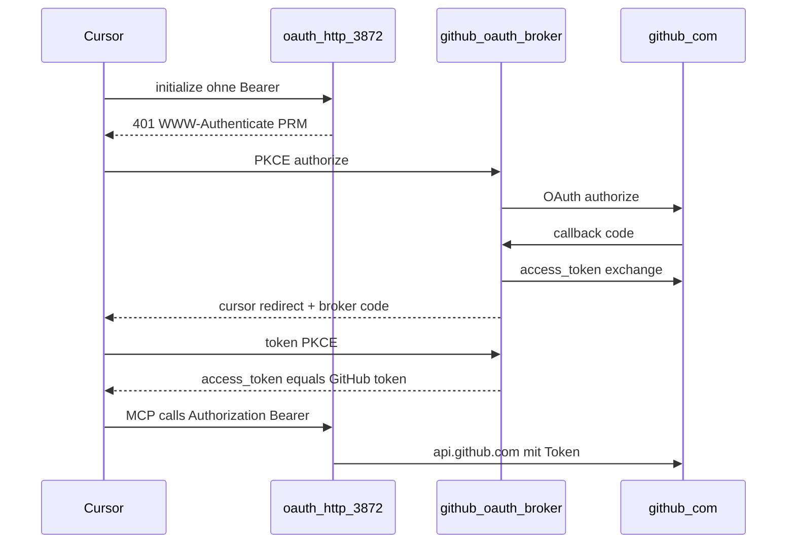

# GitHub: PAT (stdio) + OAuth HTTP (Broker)

## Zielbild

| Transport | mcp.json | Credential | Upstream |
|-----------|----------|------------|----------|
| **stdio** (unverändert) | `stdio-api2ai-github` | `GITHUB_TOKEN` in `.env.local` | `api.github.com` |
| **oauth-http** (neu) | `oauth-api2ai-github` | Cursor OAuth → **GitHub Access Token** | `api.github.com` |

Alle GitHub-Tools in [`github.api2ai`](api2ai/packages/extension/demos/github.api2ai) sind `protected` → OAuth-Host mit **401 bei `initialize`** (bestehende Logik), Cursor-Login beim Server aktivieren.

## Warum nicht „mock-api-IDP kopieren“?

Der aktuelle [`oauth-http-mcp-server`](core2ai/src/codegen/render-oauth-http-mcp-server.ts) verifiziert Bearer als **lokales HMAC-JWT** (`verifyAccessTokenJwt` + `--jwt-secret-env`). GitHub-OAuth-Tokens sind **opaque** (`gho_…` / fine-grained) — die API prüft sie, der MCP-Host nicht.

**Pflicht:** neuer Modus **opaque Bearer** in core2ai (Token nach OAuth durchreichen, keine lokale JWT-Prüfung).

## Warum ein lokaler Broker?

GitHub OAuth Apps erlauben typisch **http(s)-Callbacks** (`http://127.0.0.1:…`), nicht `cursor://anysphere.cursor-mcp/oauth/callback`. Cursor spricht aber mit dem **Authorization Server** aus der PRM.

Lösung: **Broker als MCP-Authorization-Server** (wie mock-idp), der intern GitHub OAuth mit localhost-Callback macht und Cursor am Ende ein **echtes GitHub Access Token** aus `/token` liefert.



## 1. core2ai — opaque OAuth credential mode

**Dateien:** [`render-mcp-host-shared.ts`](core2ai/src/codegen/render-mcp-host-shared.ts), [`render-oauth-http-mcp-server.ts`](core2ai/src/codegen/render-oauth-http-mcp-server.ts)

- Neues CLI-Flag z. B. `--oauth-credential-mode jwt|opaque` (Default **`jwt`** für mock-api/access-demo).
- **`opaque`:**
  - `--jwt-secret-env` optional / ignoriert
  - `resolveHostContextForOAuthSession`: gültiger Bearer = non-empty Token (nach Trim); **kein** `verifyAccessTokenJwt`
  - `mcpRequiresBearerOnInitialize`-Pfad: gleiche opaque-Prüfung
  - Session-Cache (`upstreamCredential`) unverändert
- **`jwt`:** Verhalten wie heute (mock-api/db2ai).
- Startup-Log: Modus `opaque` vs `jwt` ausgeben.

Tests: kleine Unit/Erweiterung in [`mock-api-oauth-mcp-http.test.ts`](api2ai/packages/extension/demos/test/integration/mock-api-oauth-mcp-http.test.ts) bleibt **jwt**; optional neuer Test mit opaque + Dummy-Token (ohne GitHub-Netz).

## 2. api2ai — `github/oauth-broker/`

Neues Verzeichnis analog [`mock-api/oauth-idp/`](api2ai/packages/extension/demos/mock-api/oauth-idp/):

| Datei | Rolle |
|-------|--------|
| `server.mjs` | AS-Metadata (`/.well-known/oauth-authorization-server`), `/authorize`, `/token`, `/register` |
| `github-oauth.mjs` | Redirect zu GitHub, Callback `http://127.0.0.1:{port}/oauth/callback`, Token-Tausch |
| `kill-server.mjs` | Port freigeben |

**Broker-Verhalten (Kern):**

1. Cursor-PKCE an `/authorize` → State speichern → Redirect `https://github.com/login/oauth/authorize?...`
2. GitHub-Callback → `code` gegen GitHub `/login/oauth/access_token` → **GitHub `access_token`**
3. Broker erzeugt **eigenen** Authorization-`code` (gebunden an Cursor-PKCE + gespeichertes GitHub-Token)
4. Redirect `cursor://anysphere.cursor-mcp/oauth/callback?code=…`
5. Cursor `/token` → Response `access_token` = **GitHub-Token** (opaque)

**Env (`.env.example` / README):**

- `GITHUB_OAUTH_CLIENT_ID`, `GITHUB_OAUTH_CLIENT_SECRET` (GitHub OAuth App)
- `GITHUB_OAUTH_BROKER_PORT` (Vorschlag **3864**)
- `GITHUB_OAUTH_BROKER_URL=http://127.0.0.1:3864`
- Broker-`CLIENT_ID` für Cursor: z. B. `mcp-github-demo` (statisch in Broker + `mcp.json`)

**GitHub OAuth App (manuell, dokumentiert):**

- Authorization callback URL: `http://127.0.0.1:3864/oauth/callback` (Port aus Env)
- Scopes: mindestens für [`github.api2ai`](api2ai/packages/extension/demos/github.api2ai) (`read:user`, Repo-Zugriff je nach Tool — README mit Link zu GitHub-Docs)

## 3. api2ai — OAuth-MCP-Host für GitHub

**Erweitern:** [`scripts/mcp-oauth-demos.mjs`](api2ai/packages/extension/demos/scripts/mcp-oauth-demos.mjs), [`scripts/start-mcp-oauth.mjs`](api2ai/packages/extension/demos/scripts/start-mcp-oauth.mjs), [`package.json`](api2ai/packages/extension/demos/package.json)

| Demo | Port | PRM `authorization_servers` | Host-Flags |
|------|------|-------------------------------|------------|
| `github` | **3872** (`GITHUB_OAUTH_HTTP_PORT`) | `GITHUB_OAUTH_BROKER_URL` | `--oauth-credential-mode opaque`, **kein** `--jwt-secret-env` |

- `GITHUB_BASE_URL=https://api.github.com` (wie stdio)
- `generate` / `build:generated` — gleicher [`oauth-http-mcp-server.ts`](api2ai/packages/extension/demos/generated/cli/oauth-http-mcp-server.ts), nur andere CLI-Args beim Start

**[`mcp.json`](api2ai/packages/extension/demos/.cursor/mcp.json):**

```json
"oauth-api2ai-github": {
  "url": "http://127.0.0.1:3872/mcp",
  "auth": { "CLIENT_ID": "mcp-github-demo" }
}
```

`stdio-api2ai-github` **unverändert** lassen.

## 4. Doku und Abgrenzung

- [`README.md`](api2ai/packages/extension/demos/README.md): Tabelle um oauth-github ergänzen; stdio-only-Zeile für GitHub anpassen („stdio + oauth“)
- Kurzer Abschnitt **GitHub OAuth App einrichten** + Startreihenfolge: Broker → `demo:mcp-oauth:github` → nur `oauth-api2ai-github` in Cursor
- Phase-3-Plan-Hinweis: GitHub von „bewusst ohne oauth-http“ auf Broker-Modell (optional Plan-Datei aktualisieren)

**Nicht im Scope:**

- stateless `http-api2ai-github` (weiterhin kein Eintrag; PAT bleibt stdio)
- db2ai-Änderungen
- Entfernen von `stateless-http-mcp-server` (bleibt für andere Demos)

## 5. Tests / Verify

| Test | Inhalt |
|------|--------|
| Bestehend | `mock-api-oauth-mcp-http.test.ts` (jwt) grün |
| Neu (optional, `describe.skipIf` ohne Secrets) | Broker `/token` mit Mock; Integration `getGitHubAuthenticatedUser` mit gespeichertem Test-Token |
| Manuell CP | OAuth aktivieren → `getGitHubAuthenticatedUser` → Login liefert echten GitHub-User |

Nach Codegen: `core2ai` build → `writeGeneratedOAuthHttpMcpHost` / `generate` github → `build:generated` → `npm run check` (api2ai demos + core2ai).

## Risiken / Erwartung

- **GitHub Rate Limits / Scopes:** Tool-Fehler 401/403 von GitHub, nicht MCP — in README erwähnen.
- **Cursor + Broker:** gleiches Muster wie mock-api (Initialize-401); bei Problemen Server umbenennen / OAuth trennen.
- **Secrets:** `GITHUB_OAUTH_CLIENT_SECRET` nur in `.env.local`, nie in `mcp.json`.
