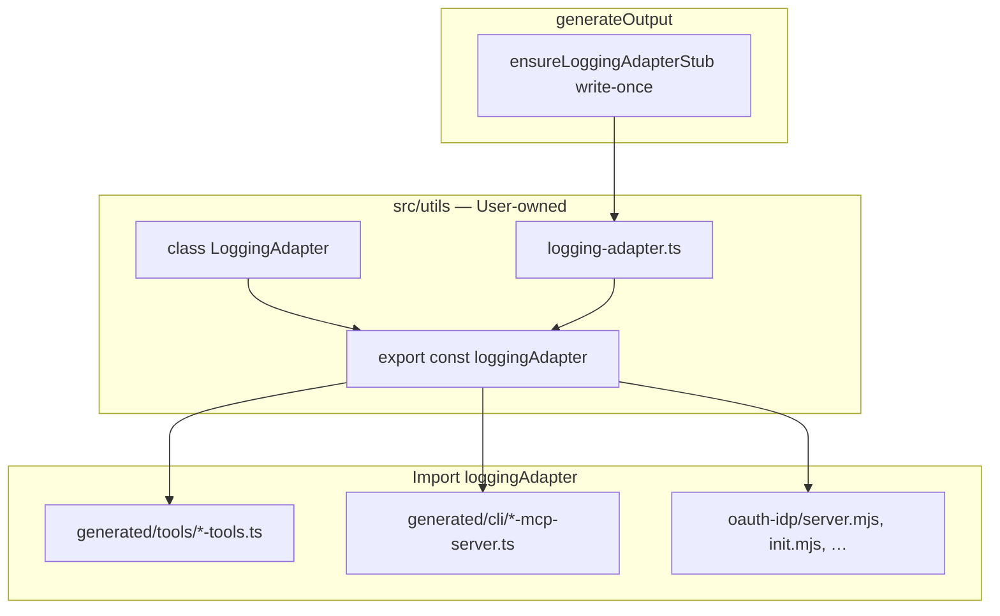

# LoggingAdapter Stub (write-once in src/utils)

## Kerngedanke

Statt Interface + globaler Injection (`setLogger`) oder Runtime-Package:

1. **`generate`** legt **einmalig** [`src/utils/logging-adapter.ts`](api2ai/packages/extension/demos/src/utils/logging-adapter.ts) an (write-once — wie [`src/auth/...`](api2ai/packages/extension/demos/src/auth/bookings-api-tools/listBookings.ts)).
2. Default-Implementierung loggt auf die **Konsole** (ANSI-Farben, **keine** extra Dependency wie chalk).
3. Will der User anderes Verhalten (Datei, JSON, Pino, …), **bearbeitet er diese eine Datei** — kein Bootstrap, kein DI-Container.
4. Alles im **Demos-Projekt** (und analog jedes generierte Endnutzer-Projekt) importiert denselben Export:

```ts
import { loggingAdapter } from '../../src/utils/logging-adapter.js';

loggingAdapter.info('MCP host listening', { port });
```

## Passt das?

**Ja** — konsistent mit dem etablierten Auth-Stub-Muster, einfacher als globale Injection, keine fragile Quell-Kopie, kein `@core2ai/core` zur Laufzeit.

Einzige bewusste Einschränkung: **`.mjs`-Demos** (oauth-idp, mock-APIs) importieren die **kompilierte** `logging-adapter.js` — `npm run build:generated` muss vor dem Start laufen (in `init.mjs` ohnehin üblich).

## Zielbild



## 1. Stub-Inhalt (write-once)

Neu in [core2ai/src/codegen/](core2ai/src/codegen/) — z. B. `logging-adapter-bootstrap.ts`:

```ts
export class LoggingAdapter {
    debug(message: string, context?: object): void { /* console, gray */ }
    info(message: string, context?: object): void { /* console, default */ }
    warn(message: string, context?: object): void { /* console, yellow */ }
    error(message: string, context?: object): void { /* console, red */ }
}

export const loggingAdapter = new LoggingAdapter();
```

**Default-Verhalten:**

| Methode | Ausgabe | Hinweis |
|---------|---------|---------|
| `debug` | stderr, grau (ANSI) | nur wenn `process.env.LOG_LEVEL === 'debug'` (optional, sonst immer) |
| `info` | stderr | |
| `warn` | stderr, gelb | |
| `error` | stderr, rot | |

- **Alle Level auf stderr** — MCP-stdio: stdout ist JSON-RPC.
- `context?: object` — wenn gesetzt, als kompaktes JSON-Suffix oder `console` zweites Argument (eine Zeile, konsistent).
- Datei-Header-Kommentar: *„Write-once — customize this file; re-generate does not overwrite.“*

`ensureLoggingAdapterStub(projectRoot)`:

- Pfad: `{projectRoot}/src/utils/logging-adapter.ts`
- `mkdir` für `src/utils` wenn nötig
- **Nur schreiben wenn Datei fehlt** (identisch zu Auth-Stubs)

Aufruf in [api2ai/packages/cli/src/generator.ts](api2ai/packages/cli/src/generator.ts) und [db2ai/packages/cli/src/generator.ts](db2ai/packages/cli/src/generator.ts) bei jedem `generateOutput` (idempotent).

## 2. Generierter Code

### Import-Pfade (relativ, wie Auth-Stubs)

| Von | Import |
|-----|--------|
| `generated/cli/*-mcp-server.ts` | `../../src/utils/logging-adapter.js` |
| `generated/tools/*-tools.ts` | `../../src/utils/logging-adapter.js` |

Hilfsfunktion in core2ai codegen: `relativeJsImportPath(fromTs, toTs)` — existiert bereits in [auth-stub-bootstrap.ts](core2ai/src/codegen/auth-stub-bootstrap.ts).

### MCP-Host-Templates

In [render-mcp-host-shared.ts](core2ai/src/codegen/render-mcp-host-shared.ts), [render-stdio-mcp-server.ts](core2ai/src/codegen/render-stdio-mcp-server.ts), HTTP/OAuth-Varianten, [mcp-host-credential-validation.ts](core2ai/src/codegen/mcp-host-credential-validation.ts):

- `console.error('[mcp] …')` → `loggingAdapter.info/warn/error('[mcp] …', { … })`
- Banner: Runtime-Deps unverändert (`@modelcontextprotocol/sdk`, `zod`) — **kein** `@core2ai/core`

### Tools-Module

[render-tools-module.ts](api2ai/packages/cli/src/generator/render-tools-module.ts) + [invoke-render.ts](api2ai/packages/cli/src/generator/invoke-render.ts):

- `loggingAdapter.debug` beim Tool-Aufruf (sparsam)
- `loggingAdapter.error` bei HTTP-/Auth-Fehlern

## 3. Demos-Build

[tsconfig.generated.json](api2ai/packages/extension/demos/tsconfig.generated.json) und [tsconfig.json](api2ai/packages/extension/demos/tsconfig.json) — `include` erweitern:

```json
"src/utils/**/*.ts"
```

(api2ai + db2ai demos parallel)

`build:generated` erzeugt `src/utils/logging-adapter.js` neben der `.ts`-Datei (wie `src/auth/**`).

## 4. Demo-Infrastruktur (.mjs)

Handgeschriebene Skripte importieren dieselbe kompilierte Datei:

```js
import { loggingAdapter } from '../src/utils/logging-adapter.js';
loggingAdapter.info('[oauth-idp] listening', { port: PORT });
```

Betroffene Dateien (api2ai + db2ai):

- `oauth-idp/server.mjs`
- `bookings-api/server.mjs`, `todo-api/server.mjs`, `cakes-api/server.mjs` (api2ai)
- `scripts/init.mjs`, `scripts/kill-*.mjs`

**Voraussetzung:** `build:generated` vor Demo-Start (in `init.mjs` sicherstellen falls noch nicht).

## 5. Was bewusst nicht im Scope

| Thema | Entscheidung |
|-------|--------------|
| `@core2ai/core/logging` Runtime-Export | **Nein** — Stub ersetzt das |
| `setLogger` / globale Injection | **Nein** — User editiert Stub |
| Emit/Kopie von Logging-Quellen | **Nein** |
| core2ai CLI / `document-validation` | bleibt bei chalk/console (Build-Zeit, kein Projekt-Stub) |
| Log-Level-Framework / strukturiertes Logging-Lib | v1 nur Stub; User kann in Stub nachrüsten |

## 6. Verifikation

1. `npm run build && npm run check` — **core2ai**
2. `generate:all` → Stub existiert, **zweites** `generate:all` überschreibt Stub **nicht**
3. User ändert Stub → Änderung bleibt nach Re-Generate
4. `build:generated && npm run check` — **api2ai** + **db2ai**
5. `init` / MCP smoke — Logs über Adapter, kein `console.log` auf stdout in stdio-Host

## Empfohlene Reihenfolge

1. `logging-adapter-bootstrap.ts` in core2ai + Generator-Wiring
2. MCP- + Tools-Templates umstellen
3. tsconfig + `generate:all` + `build:generated`
4. Demo `.mjs` migrieren
5. `check` + manueller Stub-Edit-Test
