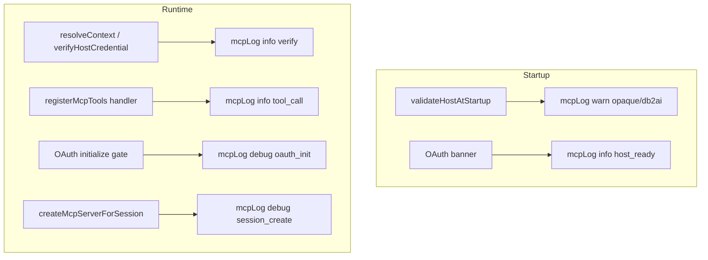

# MCP Host Observability (v1)

## Abgrenzung

| Plan | Inhalt |
|---|---|
| [`credential_pre-tool_validation`](credential_pre-tool_validation_aecd8a89.plan.md) | **Was** geprüft wird (`hs256`/`static`/`opaque`/`oidc`), Fehler an Client |
| **Dieser Plan** | **Wie** der Host intern sichtbar macht, was passiert — nur stderr, env-gated |

Kein `MCP_OAUTH_DEBUG` — ein einheitlicher Schalter für alle Transports.

**Empfohlene Reihenfolge:** Credential-Plan zuerst (liefert `verifyHostCredential` + Modi), dann Observability darauf aufsetzen. Kann auch parallel, wenn Verify-Hooks schon im Generator existieren.

---

## Ist-Zustand

Generierter Host ([`render-mcp-host-shared.ts`](core2ai/src/codegen/render-mcp-host-shared.ts), [`render-stdio-mcp-server.ts`](core2ai/src/codegen/render-stdio-mcp-server.ts), [`render-stateless-http-mcp-server.ts`](core2ai/src/codegen/render-stateless-http-mcp-server.ts), [`render-oauth-http-mcp-server.ts`](core2ai/src/codegen/render-oauth-http-mcp-server.ts)):

- **Startup:** feste `console.error`-Banner (URL, Modus, IdP)
- **Runtime:** praktisch stumm — Tool-Fehler nur als MCP-JSON-RPC an Cursor
- **OIDC-Verify:** `catch → { ok: false }` ohne stderr (VSW-Debugging schwer)

stdio: **stdout = JSON-RPC** → alle Logs **nur stderr**.

---

## Ziel v1

Ein kleines, generiertes Logging-Modul im Shared-Codegen:

```typescript
type McpLogLevel = 'error' | 'warn' | 'info' | 'debug';

// process.env.MCP_LOG_LEVEL — default 'warn' (error + warn immer sichtbar)
function mcpLog(level: McpLogLevel, event: string, fields?: Record<string, string | number | boolean>): void;
```

Ausgabe: eine Zeile stderr, maschinenlesbar genug für `grep`, kein JSON-Pflicht in v1:

```text
[mcp] level=info event=tool_call tool=pagila_list_films access=protected duration_ms=42 validation_mode=static ok=true
```

---

## Log-Level

| Level | Default sichtbar? | Beispiele |
|---|---|---|
| `error` | ja | unhandled request, Startup-Fail (bleibt `throw` + log) |
| `warn` | ja | `opaque` + db2ai; `opaque` + checked-Tools; fehlende optionale Config |
| `info` | nur wenn `MCP_LOG_LEVEL=info` oder `debug` | Tool-Call Start/Ende, Verify ok/fail (ohne Details) |
| `debug` | nur `MCP_LOG_LEVEL=debug` | OAuth initialize gate, Session-Lifecycle, OIDC-Fehlerkategorie |

**Env:** `MCP_LOG_LEVEL=warn|info|debug` (unbekannter Wert → `warn`).

Kein separates `MCP_OAUTH_DEBUG` — OAuth nutzt dieselbe Hierarchie.

---

## Security-Policy (Pflicht)

**Niemals loggen:**

- Bearer-Token, PAT, API-Keys, JWT-Strings
- JWT-Payload / Claims-Werte (`customerId`, `role`, …)
- Tool-Argumente, SQL, Request-Bodies
- Env-**Werte** (nur Env-**Namen** wie `jwtSecretEnvKey`)

**Erlaubt bei Verify-Fail (`debug`):**

- `validation_mode`, `reason` aus festem Enum: `missing` | `expired` | `bad_signature` | `issuer_mismatch` | `jwks_fetch_failed` | `static_mismatch` | `invalid_jwt_format`

`verifyOAuthBearerToken`: im `catch` Grund kategorisieren, **nicht** `err.message` blind ausgeben (kann Token-Fragmente enthalten).

---

## Hook-Punkte



### 1. Credential-Verify (alle Transports)

Nach [`resolveVerifiedHostCredential`](credential_pre-tool_validation_aecd8a89.plan.md) / `verifyOAuthBearerToken`:

- `info`: `event=credential_verify`, `mode`, `ok=true|false`, `hook=tool_call|oauth_init`
- `debug` bei fail: `reason` (Enum oben)

### 2. Tool-Calls (`registerMcpTools`)

- `info`: `event=tool_call`, `tool`, `access`, `duration_ms`, `ok=true|false`
- Bei `ok=false`: nur `error_message` aus `formatToolError` wenn **keine** Secrets/Token-Muster (v1: erste 200 Zeichen, kein Regex-Wunder — lieber toolName + generische Kategorie)

### 3. OAuth HTTP

- `debug`: `oauth_init` (gate aktiv?, bearer present?, verify ok?)
- `debug`: `session_create` / `session_close` mit `session_id` (UUID ok — kein PII)
- `error`: bestehendes `oauth HTTP request failed` → `mcpLog(error, …)` mit `err.name` nur

### 4. Stateless HTTP

- `error`: Request-Handler-Catch wie heute, über `mcpLog`

### 5. Startup

Bestehende `console.error`-Banner in [`render-*-mcp-server.ts`](core2ai/src/codegen/) auf `mcpLog('info', 'host_ready', …)` umstellen — einheitliches Prefix `[mcp]`.

Credential-Plan-Warnungen (`opaque` + db2ai): `mcpLog('warn', 'validation_mode_weak', …)`.

---

## Dateien

| Datei | Änderung |
|---|---|
| [`core2ai/src/codegen/render-mcp-host-shared.ts`](core2ai/src/codegen/render-mcp-host-shared.ts) | `mcpLog`, Hooks in `registerMcpTools`, Verify |
| [`core2ai/src/codegen/mcp-host-product-runtime.ts`](core2ai/src/codegen/mcp-host-product-runtime.ts) | ggf. Verify-Reason aus Product-Runtime |
| [`core2ai/src/codegen/render-oauth-http-mcp-server.ts`](core2ai/src/codegen/render-oauth-http-mcp-server.ts) | initialize gate, session logs |
| [`core2ai/src/codegen/render-stateless-http-mcp-server.ts`](core2ai/src/codegen/render-stateless-http-mcp-server.ts) | error path |
| [`core2ai/src/codegen/render-stdio-mcp-server.ts`](core2ai/src/codegen/render-stdio-mcp-server.ts) | startup banner |

**Nicht** hand-editieren: `api2ai`/`db2ai` `generated/cli/*`.

---

## Build

1. core2ai `npm run build`
2. Regeneriere `generated/cli/*-mcp-server.ts` (api2ai + db2ai)
3. `build:generated`, `npm run check`

---

## Doku

- Demo-README: `MCP_LOG_LEVEL=debug` für OAuth-Login-Probleme (VSW, bookings)
- [`db2ai-env-auth-policy.mdc`](db2ai/packages/extension/demos/.cursor/rules/db2ai-env-auth-policy.mdc): Produktion default `warn`; `debug` nur lokal

---

## Out of scope v1

| Thema | Warum später |
|---|---|
| Strukturiertes JSON / OpenTelemetry | v1 = stderr-Zeilen für Dev |
| Audit-Log (wer/wann/welches Tool) | Compliance, Retention, eigener Plan |
| Metriken (Prometheus) | braucht HTTP-Exporter-Design |
| Log von Upstream-API/SQL | Generator-Tools / Fetch-Layer — nicht MCP-Host |
| Client-seitiges Cursor-Logging | außerhalb Host |

---

## Test-Hinweis

Keine flaky stderr-Assertions in CI standardmäßig. Optional: Unit-Test des **Codegen-Strings** (enthält `mcpLog`, enthält nicht `token` in Log-Feldern). Integration manuell: `MCP_LOG_LEVEL=debug` + falscher Bearer → stderr zeigt `reason=bad_signature` ohne Token.
