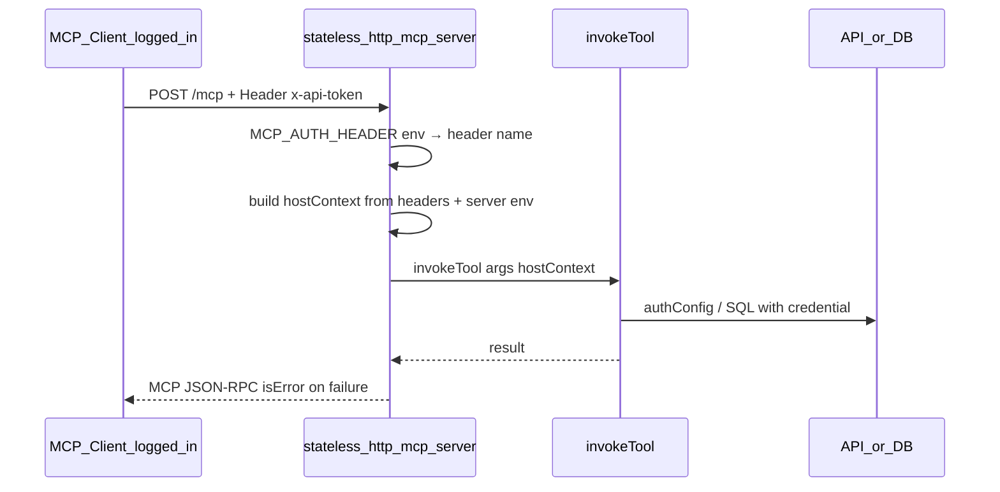

# Phase 2: Stateless HTTP-MCP (api2ai + db2ai)

Ersetzt die offenen Abschnitte **Phase 2** und **Phase 3** in [`core2ai/.cursor/plans/api2ai_mcp_http_host_49be43c6.plan.md`](core2ai/.cursor/plans/api2ai_mcp_http_host_49be43c6.plan.md). Phase 1 ist abgeschlossen.

## Benennung: stateless jetzt, stateful später

| Host-Binary (generiert) | Phase | Transport |
|-------------------------|-------|-----------|
| `stdio-mcp-server.js` | 1 (done) | MCP stdio |
| **`stateless-http-mcp-server.js`** | **2 (jetzt)** | Streamable HTTP, `sessionIdGenerator: undefined` |
| `stateful-http-mcp-server.js` | später | Sessions / server-side State — **nicht** Phase 2 |

Codegen-Quellen analog: `render-stateless-http-mcp-server.ts`, `writeGeneratedStatelessHttpMcpHost`, Consumer `render-stateless-http-mcp-host.ts`.

---

## Transport-agnostische Tools (bereits erfüllt — beibehalten)

**Regel:** Tool-Module kennen **kein** HTTP, **kein** `Request`, **keine** MCP-Transport-Details.

```typescript
// ungünstig — nicht so
function invokeTool(args, req: Request) {
    const auth = req.headers.authorization;
}

// unser Modell (Phase 1, unverändert in Phase 2)
function invokeTool(toolName, args, hostContext?: ApiHostContext) {
    const { baseUrl, credential, jwt } = hostContext;
    // credential → authConfig → upstream API
}
```

Mapping zum gewünschten Muster:

| Konzept | Bei uns |
|---------|---------|
| `context.auth?.accessToken` | `hostContext.credential` |
| JWT-Claims für checked Tools | `hostContext.jwt` |
| Base-URL / DB | `hostContext.baseUrl` / `hostContext.connectionString` |

**Host-Aufgabe (stdio oder stateless-http):** Transport-spezifisch Credential + Infrastruktur-Kontext **aufbauen**, dann `invokeTool(..., hostContext)` aufrufen.

- **stdio:** liest `process.env[--auth-env]`
- **stateless-http:** liest konfigurierbaren Header (`MCP_AUTH_HEADER`) → `hostContext.credential` (+ JWT-Decode)

Tools wie [`github-tools.ts`](api2ai/packages/extension/demos/generated/tools/github-tools.ts) bleiben unverändert; `headers` in `InvokeOptions` sind **Upstream-HTTP-Header**, nicht MCP-Request-Header.

---

## Kernentscheidung: stateless + Token-Weiterleitung

**Szenario:** Der User ist im MCP-Client bereits authentifiziert. Der Host speichert **keine Sessions** und **keine Tokens** — pro MCP-HTTP-Request Header → `hostContext` → `invokeTool`.



**Transport:** MCP SDK `StreamableHTTPServerTransport` mit `sessionIdGenerator: undefined` (vgl. SDK `simpleStatelessStreamableHttp.ts`). Pro POST: neuer `McpServer` + Transport + `handleRequest`.

**Abgrenzung stdio (unverändert):** Credential aus `process.env[--auth-env]` pro `tools/call`.

---

## Konfiguration: Header-Name über Env

| Env (Server-Prozess) | Bedeutung | Default |
|----------------------|-----------|---------|
| `MCP_AUTH_HEADER` | Name des **eingehenden** HTTP-Headers für Credential | `x-api-token` |

Beispiele: `MCP_AUTH_HEADER=x-api-token` oder `MCP_AUTH_HEADER=x-api-key`.

- **Nicht** in committed `mcp.json` als Token-Wert — Client sendet Header-Wert zur Laufzeit.
- Demos dokumentieren in `.env.example` (Header-**Name**, kein Secret).

**Startup (stateless-http):** Base-URL bzw. DB-Connection-Env prüfen; **kein** Token-Check beim Start. Protected ohne Header → `isError` beim Call.

---

## Hauptarbeit: core2ai Codegen

Quellen unter [`core2ai/src/codegen/`](core2ai/src/codegen/):

### 1. Shared Host erweitern — [`render-mcp-host-shared.ts`](core2ai/src/codegen/render-mcp-host-shared.ts)

- `readAuthHeaderNameFromEnv()` — `MCP_AUTH_HEADER`, Fallback `x-api-token`
- `readCredentialFromHttpHeaders(headers, headerName)` — case-insensitive
- `resolveHostContextForHttpCall(hostConfig, generated, incomingHeaders)` — baseUrl/DB aus Server-Env, credential/jwt aus Headers
- `registerMcpTools(..., resolveContext: () => ApiLikeHostContext)` — stdio: env-basiert; stateless-http: Header-Closure

`validateHostAtStartup` für stateless-http: **ohne** `--auth-env`-Pflicht.

### 2. Neues Template — `render-stateless-http-mcp-server.ts`

- Node HTTP server, POST auf `--path` (default `/mcp`)
- Argv: `<tools.js>`, `--base-url-env` (api2ai), `--port`, optional `--host`, `--path`
- db2ai: kein `--base-url-env`; `connectionEnv` aus Tool-Modul
- Pro Request: Headers → `hostContext` → `registerMcpTools` → stateless transport
- Upstream-Fehler → MCP `isError`, nicht HTTP 401

### 3. Bootstrap — [`project-bootstrap.ts`](core2ai/src/codegen/project-bootstrap.ts)

- `writeGeneratedStatelessHttpMcpHost(cliDir)` → `generated/cli/stateless-http-mcp-server.ts`

### 4. Test-Fixtures

- `render-mcp-http-smoke.ts` — Vitest: HTTP-Client + Auth-Header gegen lokalen Host

---

## Consumer: api2ai + db2ai (parallel, dünn)

- `render-stateless-http-mcp-host.ts` neben `render-stdio-mcp-host.ts`
- `generateOutput`: stdio + stateless-http; Rückgabe `statelessHttpMcpHostPath`
- **Keine Änderungen an `*-tools.ts`**

---

## Demos: mcp.json + Start

### api2ai

| Demo | stateless-http | stdio |
|------|----------------|-------|
| open-meteo, spaceflight-news, mock-api, open-meteo-geocoding | ja | ja (enable one in Cursor) |
| tmdb, github | nein | ja (secrets via `envFile`, committed `mcp.json`) |

| Server | Port |
|--------|------|
| `api2ai-open-meteo-http` | 3848 |
| `api2ai-spaceflight-news-http` | 3849 |
| `api2ai-mock-api-http` | 3850 |
| `api2ai-open-meteo-geocoding-http` | 3851 |

```text
node ./generated/cli/stateless-http-mcp-server.js ./generated/tools/mock-api-tools.js \
  --base-url-env MOCK_API_BASE_URL --port 3850 --path /mcp
```

### db2ai

| Demo | stateless-http | stdio |
|------|----------------|-------|
| pagila, sakila, access-demo | ja | ja (enable one in Cursor) |

| Server | Port |
|--------|------|
| `db2ai-access-demo-http` | 3852 |
| `db2ai-pagila-http` | 3853 |
| `db2ai-sakila-http` | 3854 |

```text
node ./generated/cli/stateless-http-mcp-server.js ./generated/tools/access-demo-tools.js \
  --port 3852 --path /mcp
```

Committed `mcp.json`: nur `"url"`, keine Token-Header.

Demo-Start: `npm run demo:mcp-http:all` (Hintergrund), `npm run demo:mcp-http:kill` (Ports freigeben).

---

## Tests + Regeln

- Vitest: **open-meteo-http** (public) + **access-demo-http** (protected + Header-JWT)
- ~~Regel `http api2ai`~~ entfallen: nur ein `api2ai-*`-Server enabled; Prefix weiter `api2ai` ([`mcp-api2ai-only.mdc`](../../api2ai/packages/extension/demos/.cursor/rules/mcp-api2ai-only.mdc))

---

## Build-Reihenfolge

1. core2ai → `npm run build`
2. api2ai + db2ai embed rebuild
3. `generate:all`, `build:generated`, `check`, `test`
4. Manueller **CP2**

---

## Bewusst nicht in Phase 2

- `stateful-http-mcp-server` (spätere Phase)
- OAuth am MCP-Host
- CORS-Härtung (nur bei Bedarf)

## Nach Phase 2 (Demos-Policy, 2026-06)

- Committed `mcp.json`: feste `"url"`, **kein** `${env:…}`, **keine** Token-`headers`.
- api2ai: **tmdb/github** nur stdio; alle anderen Demos stdio + `*-http`.
- db2ai: alle drei Demos stdio + `*-http`; Secrets über `envFile` (stdio) bzw. MCP-UI (HTTP).
