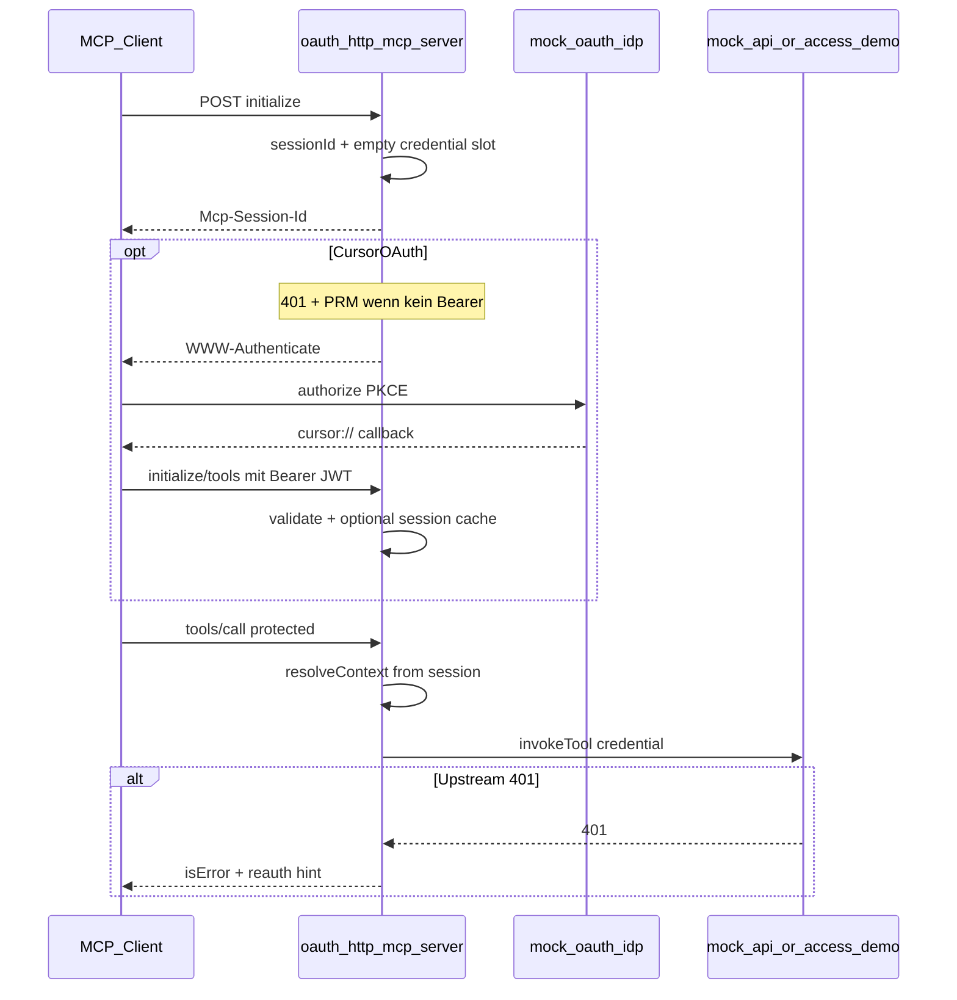

# Phase 3: OAuth + stateful HTTP MCP

## Verständnis (ja — so ist es gemeint)

Du trennst drei Ebenen:

| Ebene | Rolle | Demo |
|-------|--------|------|
| **MCP-Client** (Cursor) | Streamable HTTP + **OAuth 2.1** (Browser, PKCE); sendet `Authorization: Bearer` + `Mcp-Session-Id` | `mcp.json` → `url` + `auth.CLIENT_ID` |
| **MCP-Host** (`oauth-http-mcp-server`) | Resource Server: PRM/401; validiert MCP-Bearer; `resolveContext()` → `hostContext.credential` (ggf. Session-Cache) | generiert in core2ai |
| **Upstream** | API/DB; `public` / `protected` / `checked` in **Tools** | mock-api (3847), access-demo (Postgres) |

Tools rufen weiter nur `invokeTool(..., hostContext)` auf — **kein** `Request`, kein OAuth im `*-tools.ts` ([Phase-2-Regel](core2ai/.cursor/plans/mcp_http_stateless_phase2_b2ad381b.plan.md)).



**Wann Login anstoßen**

| Situation | Strategie |
|-----------|-----------|
| Modul hat **nur** `protected`/`checked` (`requiresAuth` + kein `access: public`) | **Eager:** nach `initialize` MCP-401 / OAuth, bevor sinnvolle Tool-Calls |
| Modul hat **auch** `public` (z. B. mock-api `login`, access-demo `listProducts`) | **Lazy (festgelegt):** MCP-`initialize` / `tools/list` **ohne** Bearer erlaubt; Cursor zeigt „Needs login“ ggf. erst bei protected `tools/call` oder nach Upstream-**401** → `isError` + Hinweis (bestehende [invoke-render.ts](api2ai/packages/cli/src/generator/invoke-render.ts)) |
| Public API ohne Auth (open-meteo) | **Nicht** in Phase-3-OAuth-Demos |

Host erkennt „hat public Tool“ zur Laufzeit: `generated.generatedTools.some(t => t.access === 'public')` — **kein** DSL-Change nötig.

**Hinweis CP2:** Bei lazy verbindet Cursor oft erst ohne Browser-Login; OAuth testen über protected Tool (`listCustomerOrders` / `listProductsWithReviews`) oder manuell „Needs login“ in MCP-Settings.

---

## Benennung: `oauth-http-mcp-server` (empfohlen)

| Name | Bewertung |
|------|-----------|
| **`oauth-http-mcp-server.js`** | Passt zu Ziel (Login-Flow, Token in Session); unterscheidet sich von [`stateless-http-mcp-server.js`](core2ai/src/codegen/render-stateless-http-mcp-server.ts) |
| `http-session-mcp-server` | Technisch korrekt (MCP-Session), sagt nicht **warum** State da ist |
| `stateful-http-mcp-server` | Alter Plan-Name ([mcp_http_stateless_phase2](core2ai/.cursor/plans/mcp_http_stateless_phase2_b2ad381b.plan.md)); ok als Alias in Doku |

Codegen: `render-oauth-http-mcp-server.ts`, `writeGeneratedOAuthHttpMcpHost` in [`project-bootstrap.ts`](core2ai/src/codegen/project-bootstrap.ts).

**Stateless bleibt** für open-meteo & Co.; OAuth-Host **zusätzlich** nur für mock-api / access-demo.

---

## 1. Mini-OAuth-IDP (hartcoded, Copy in beiden Demos)

**Kein** gemeinsamer Ordner auf Repo-Root — **zwei Kopien** (bewusst Copy&Paste, bei Änderungen beide sync halten):

| Workspace | Pfad (neben bestehendem Demo-Backend) | JWT / Claims | Default-Port |
|-----------|----------------------------------------|--------------|--------------|
| **api2ai** | [`mock-api/oauth-idp/`](api2ai/packages/extension/demos/mock-api/oauth-idp/) | `mintCustomerToken` / Secret aus [`mock-api/jwt.mjs`](api2ai/packages/extension/demos/mock-api/jwt.mjs) (`MOCK_API_JWT_SECRET`) — Claims `customerId`, `role` | **3860** (`MOCK_API_OAUTH_IDP_PORT`) |
| **db2ai** | [`access-demo/oauth-idp/`](db2ai/packages/extension/demos/access-demo/oauth-idp/) | Gleiche Claim-Form wie bestehende Demo-JWTs (`customerId`, `role`; kompatibel mit [`access-demo-mcp-http.test.ts`](db2ai/packages/extension/demos/test/integration/access-demo-mcp-http.test.ts)) — Secret `ACCESS_DEMO_JWT_SECRET` (in `.env.example`, gleicher Wert wie für manuelle Test-Tokens) | **3862** (`ACCESS_DEMO_OAUTH_IDP_PORT`) |

**Dateien pro Kopie (Vorschlag):**

- `server.mjs` — HTTP IDP (`authorize`, `token`, `/.well-known/oauth-authorization-server`)
- `kill-server.mjs` — Port freigeben (wie mock-api)
- `README.md` — Kurzdoku + Cursor-Redirect

Optional kleine `jwt.mjs` in `access-demo/oauth-idp/`, die nur re-exportet oder dupliziert mintet; api2ai-IDP importiert `../jwt.mjs`.

**Zweck:** Login für Cursor-OAuth und Vitest; **kein** Produktions-IDP.

| Festwert (beide IDPs) | Wert |
|-----------------------|------|
| `CLIENT_ID` | `mcp-demo-local` (in jeweiliger `mcp.json` `auth.CLIENT_ID`) |
| Redirect (Cursor) | `cursor://anysphere.cursor-mcp/oauth/callback` |
| Users | `alice`, `bob`, `admin` (HTML „Login as …“) |
| Flow | Authorization Code + **PKCE S256** |
| Token | HS256 `access_token` — **ein** Token für MCP-Bearer **und** Upstream (Demo) |

**Endpoints (identisch in beiden Kopien):**

- `GET /authorize` — Redirect mit `code` an Request-`redirect_uri`
- `POST /token` — `code` + `code_verifier` → `access_token`
- `GET /.well-known/oauth-authorization-server`

**MCP-Host** (eigener Prozess, nicht im IDP-Ordner): PRM mit `authorization_servers` auf **jeweilige** IDP-URL (`http://127.0.0.1:3860` bzw. `:3862`).

**Scripts (je Workspace `packages/extension/demos/package.json`):**

- api2ai: `demo:oauth-idp` → `mock-api/oauth-idp/server.mjs`; `demo:oauth-idp:kill`
- db2ai: `demo:oauth-idp` → `access-demo/oauth-idp/server.mjs`; `demo:oauth-idp:kill`

**Doku:** Abschnitt in [`mock-api/README.md`](api2ai/packages/extension/demos/mock-api/README.md); neues [`access-demo/README.md`](db2ai/packages/extension/demos/access-demo/README.md) (OAuth + Docker-Verweis).

---

## 2. `oauth-http-mcp-server` (core2ai Codegen)

Basis: MCP SDK **stateful** Streamable HTTP (`sessionIdGenerator: () => randomUUID()`), Referenz `simpleStreamableHttp.ts` (nicht stateless).

### Session-Store (in-memory)

```typescript
type McpOAuthSession = {
    sessionId: string;
    upstreamCredential?: string;  // Bearer JWT für mock-api / access-demo
    createdAt: number;
};
```

- Key: `Mcp-Session-Id` aus Transport/SDK
- **Kein** Token in committed `mcp.json` (Policy wie Phase 2)
- `upstreamCredential`: aus **`Authorization: Bearer`** (Cursor nach IDP-Login); optional im Session-Cache gespiegelt — **nicht** über MCP-Host-HTTP-Callback (Cursor nutzt `cursor://…`)

### Pro MCP-Session (SDK-konform)

- **Ein** `McpServer` + **ein** `StreamableHTTPServerTransport` pro Session (nicht ein Server für alle Clients)
- `registerMcpTools` einmal pro Session mit:

```typescript
resolveContext: () =>
    resolveHostContextForOAuthSession(httpHostConfig, generated, sessionStore, sessionId)
```

Analog zu [`resolveHostContextForHttpCall`](core2ai/src/codegen/render-mcp-host-shared.ts) — liest Credential primär aus **Request-`Authorization: Bearer`**, Session-Cache nur als Spiegel (nicht stateless-Header `x-api-token`).

### OAuth am MCP-Host (Cursor-first)

| Route | Zweck |
|-------|--------|
| `GET /.well-known/oauth-protected-resource` | PRM — Cursor/Client discovert Authorization Server |
| `POST /mcp` + `GET /mcp` | Stateful Streamable HTTP (`sessionIdGenerator`) |
| `GET /oauth/login` | **Fallback:** Browser-Link in README/Vitest wenn Cursor keinen OAuth-Dialog öffnet |

**Kein eigener `http://…/oauth/callback` für Cursor** — Callback läuft über `cursor://anysphere.cursor-mcp/oauth/callback`; Cursor tauscht `code` am IDP `/token`.

**MCP-401:** Nur wenn Host MCP-Auth verlangt (Module **ohne** public Tool → 401 auf `initialize`). **mock-api / access-demo (lazy):** kein 401 auf `initialize`; PRM trotzdem publizieren (Discovery). Optional 401 auf protected `tools/call` ohne Bearer — oder nur Tool-`isError` „Missing host credential“ (einfacher, Phase 3: **Tool-Fehler**, kein MCP-HTTP-401 auf `tools/call`).

**Credential-Auflösung:** `resolveHostContextForOAuthSession` prüft zuerst `Authorization: Bearer` (von Cursor), optional cached pro `Mcp-Session-Id`; JWT validieren → `hostContext.credential` für `invokeTool`.

**Upstream-401 (lazy):** Tool-`isError` wie heute; Hinweis „in Cursor: MCP erneut verbinden / Needs login“.

### Shared Host ([`render-mcp-host-shared.ts`](core2ai/src/codegen/render-mcp-host-shared.ts))

Neuer Modus `oauth-http`:

- `resolveHostContextForOAuthSession`
- `parseOAuthHttpHostArgv` (Port, path, `--base-url-env` / db `connectionEnv`, `--oauth-idp-url` für PRM, `--jwt-secret-env` mock-api/access-demo)
- Session-Map + GC (TTL optional, z. B. 1h Demo)

Stdio + stateless **unverändert**.

---

## 3. Consumer + Demos

### api2ai — mock-api

| Transport | Server-Name (Vorschlag) | Port |
|-----------|-------------------------|------|
| stateless | `http-api2ai-mock-api` | 3850 (bleibt) |
| **oauth** | `oauth-api2ai-mock-api` | **3870** |

- [`mcp.json`](api2ai/packages/extension/demos/.cursor/mcp.json): z. B. `oauth-api2ai-mock-api` mit `url` + **`auth.CLIENT_ID": "mcp-demo-local"`** (kein Token in `headers`)
- Generator: [`render-oauth-http-mcp-host.ts`](api2ai/packages/cli/src/generator/) + `generateOutput` schreibt drittes Host-Binary
- README: `mock-api/oauth-idp` → mock-api backend → oauth-mcp-host → **Cursor „Needs login“**; PRM zeigt auf `http://127.0.0.1:3860`
- **`login`-Tool / `POST /login/{customerId}`:** Für **`oauth-api2ai-mock-api` redundant** (gleiche JWT-Funktion wie `mock-api/oauth-idp`, aber Token landet nicht in der MCP-OAuth-Session). **Behalten** in Phase 3 für **stdio** + **stateless-http** (`.env` / `x-api-token`, bestehende Tests [`mock-api-mcp-stdio`](api2ai/packages/extension/demos/test/integration/mock-api-mcp-stdio.test.ts), `get-token.mjs`, curl). Doku: OAuth-Host = nur IDP; `login`-Tool nicht im oauth-http-README bewerben. **Nicht entfernen** aus `mock-api.api2ai` ohne Breaking Change — optional später deprecaten.

### db2ai — access-demo

| Transport | Server-Name | Port |
|-----------|-------------|------|
| stateless | `http-db2ai-access-demo` | bestehend |
| **oauth** | `oauth-db2ai-access-demo` | **3871** |

- Docker access-demo unverändert
- `access-demo/oauth-idp` + OAuth-MCP-Host; PRM → `http://127.0.0.1:3862`; protected Tools mit Session-Bearer

### Bewusst **ohne** oauth-http

- open-meteo, spaceflight-news, pagila, sakila, tmdb, github (wie heute)

---

## 4. Tests

| Test | Was |
|------|-----|
| `mock-api/oauth-idp` smoke (api2ai) | `/token` + JWT verifizierbar mit `mock-api/jwt.mjs` |
| `access-demo/oauth-idp` smoke (db2ai) | `/token` + JWT kompatibel mit Alice-Testtoken-Claims |
| `mock-api-oauth-mcp-http.test.ts` | Spawn `mock-api/oauth-idp` + mock-api + oauth-host |
| `access-demo-oauth-mcp-http.test.ts` | Docker + `access-demo/oauth-idp` + oauth-host |
| Erweiterung [`render-mcp-http-smoke.ts`](core2ai/src/test-fixtures/render-mcp-http-smoke.ts) | Optional `connectMcpOAuthHttp` mit Session-Header-Follow |

Vitest: programmatischer OAuth (PKCE + `/token`) oder direktes Bearer-JWT — **kein** Cursor-Prozess nötig.

**Manueller CP2 in Cursor:** IDP + Hosts starten → `oauth-api2ai-mock-api` aktivieren → „Needs login“ → Browser → Tools sichtbar.

---

## 5. Cursor-Integration (direkt — nicht „später“)

[Cursor Docs](https://cursor.com/docs/mcp): **Streamable HTTP + OAuth** sind supported (seit v1.0). Cursor:

- erkennt geschützte Server über **401 + PRM** (`/.well-known/oauth-protected-resource` am MCP-Host),
- nutzt **PKCE** und festes Redirect **`cursor://anysphere.cursor-mcp/oauth/callback`**,
- speichert Tokens im System-Keychain,
- unterstützt **statisches** `auth.CLIENT_ID` in `mcp.json` (passend zu unserem Mini-IDP, **ohne** Dynamic Client Registration in Phase 3).

**Phase-3-Demo implementiert genau diesen Pfad** — nicht erst in einer späteren Phase.

**Fallback `/oauth/login` nur wenn:**

- Cursor-Bug: Browser öffnet nicht (bekannt z. B. [Forum #146988](https://forum.cursor.com/t/oauth-browser-redirect-not-triggered-for-http-based-mcp-servers/146988)) → URL aus MCP-Logs kopieren,
- Tests ohne Cursor (Vitest, curl),
- anderer MCP-Client ohne OAuth.

**Bewusst vereinfacht in Phase 3 (nicht „Cursor blockiert“):**

- Kein RFC 8707 Resource Indicator (optional nachrüsten),
- Kein HTTPS (localhost ok),
- Ein JWT für MCP-Resource **und** Upstream (mock-api/access-demo) — produktiv wären getrennte Audiences/Token-Austausch.

---

## 6. Abhängigkeiten / Build

1. core2ai: Templates + `npm run build` + `check`
2. api2ai/db2ai: `render-oauth-http-mcp-host.ts`, `generate:all`, `build:generated`
3. Demos: IDP-Kopien + Scripts `demo:oauth-idp`, `demo:mcp-oauth:*`; `.env.example` Ports 3860 (api2ai IDP), 3862 (db2ai IDP), 3870/3871 (MCP hosts)
4. Rules: [`api2ai-env-auth-policy.mdc`](api2ai/packages/extension/demos/.cursor/rules/api2ai-env-auth-policy.mdc) — dritter Transport `oauth-http`

---

## 7. Implementierungsnotizen (kein Blocker, im Code klären)

- **IDP:** Wenn Cursor Dynamic Client Registration versucht → minimaler `POST /register`-Stub oder feste Client-Liste (`mcp-demo-local`); in README festhalten was getestet wurde.
- **`ACCESS_DEMO_JWT_SECRET`:** In db2ai `.env.example` dokumentieren (Wert muss zu bestehendem Alice-Test-JWT in Vitest passen; beim Implementieren einmal verifizieren).
- **SDK stateful:** `GET /mcp` für SSE laut SDK erlauben; Session-`DELETE` wie Referenz-Example — in Codegen an `simpleStreamableHttp.ts` anlehnen.
- **Copy&Paste IDP:** Kurzkommentar `// sync with …/oauth-idp/server.mjs` in beiden Kopien.

---

## 8. Nicht in Phase 3

- Ersetzen von stateless-http für alle Demos
- Produktions-IDP, HTTPS, horizontale Session-Skalierung
- Automatisches Retry von Tool-Calls nach OAuth (nur Hinweise; Client/Agent steuert)
- OAuth **inside** generated tools
- Entfernen des mock-api **`login`**-Tools (OpenAPI + DSL) — erst wenn stdio/stateless-Demos umgestellt sind

---

## Plan-Datei

Nach Freigabe: [`core2ai/.cursor/plans/oauth_http_mcp_phase3.plan.md`](core2ai/.cursor/plans/oauth_http_mcp_phase3.plan.md)
