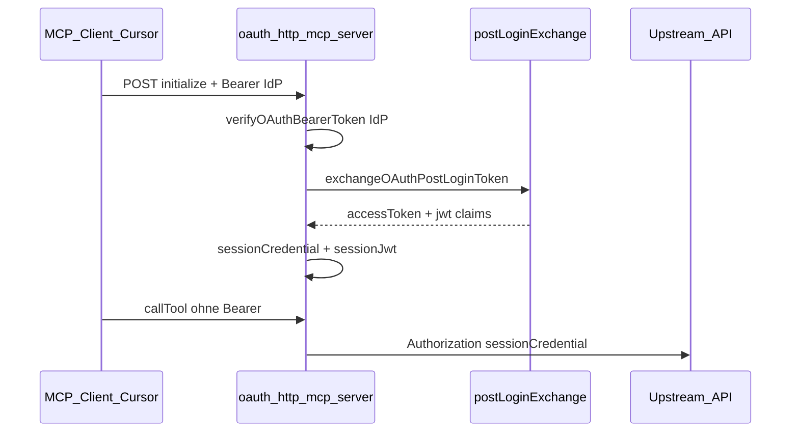

# OAuth Post-Login Token Exchange

## Ausgangslage

Der OAuth-HTTP-Host lebt in **core2ai** ([`render-mcp-host-shared.ts`](core2ai/src/codegen/render-mcp-host-shared.ts), [`render-oauth-http-mcp-server.ts`](core2ai/src/codegen/render-oauth-http-mcp-server.ts)) und wird in **api2ai**-Projekten nach `generate:all` ausgerollt. **Produkt-Scope:** Post-Login-Exchange ist ein **api2ai**-Use-Case (Upstream-HTTP-API mit eigenem Bearer). **db2ai** bleibt unverändert: OAuth-MCP dient dort der Tool-Autorisierung gegen eine **DB** (`connectionEnv`), nicht dem Austausch gegen ein API-eigenes Token — dafür keine DSL, kein Stub, keine Demo.

**Login** aus Sicht des Hosts = erster `initialize`-Request mit gültigem `Authorization: Bearer` (IdP-Token). Danach hält der Host die Credential in `McpOAuthSession.upstreamCredential` und nutzt sie in `resolveHostContextForOAuthSession` für `host.credential` / `host.jwt` (nach `verifyOAuthBearerToken` + `hostContextFromOAuthCredential`).



**Problem heute:** IdP-Token und API-Credential sind dasselbe Objekt. Echte Setups brauchen oft einen Exchange (eigenes Backend, andere Claims, kürzere TTL).

**Entscheidung (von dir):** Session-JWT kommt **vom Hook** (`accessToken` + `jwt`); der Host **verifiziert Session-Tokens nicht erneut** — analog zu vertrauenswürdigem Projektcode wie [`src/auth/*.ts`](api2ai/packages/extension/demos/src/auth/listBookings.ts).

---

## Zielverhalten

| Phase | Bearer im Request | Session | `host.credential` / `host.jwt` |
|--------|-------------------|---------|--------------------------------|
| Initialize (Login) | IdP-Token (muss `verifyOAuthBearerToken` bestehen) | nach Hook: nur Custom-Token | aus Hook |
| Folge-Requests | optional IdP (wird ignoriert, wenn Session schon exchanged) | Custom-Token | aus Session |
| Ohne Hook (opt-out) | wie heute | `upstreamCredential` = IdP-Token | wie heute |

- **IdP-Token** wird nur für Login-Gate (`mcpRequiresBearerOnInitialize`) und für den **einmaligen** Hook-Input verwendet; er landet **nicht** dauerhaft in der Session, sobald Exchange erfolgreich war.
- Hook-Fehler → Session bekommt **kein** Credential; Tool-Calls liefern „Missing host credential“ / 401 — kein stilles Fallback auf IdP-Token.

---

## Architektur

### 1. Session-Modell erweitern (core2ai Codegen)

In [`render-mcp-host-shared.ts`](core2ai/src/codegen/render-mcp-host-shared.ts) `McpOAuthSession` z. B.:

```ts
type McpOAuthSession = {
    sessionId: string;
    createdAt: number;
    /** Legacy-Pfad ohne Hook */
    upstreamCredential?: string;
    /** Nach Post-Login-Exchange */
    sessionCredential?: string;
    sessionJwt?: Record<string, unknown>;
    exchangeCompleted?: boolean;
};
```

### 2. Hook-Typ + optionaler Export aus Tools-Modul

Neue Typen in **core2ai** (z. B. `src/codegen/oauth-post-login-types.ts`, in `@core2ai/core/codegen` exportiert):

```ts
export type OAuthPostLoginExchangeInput = {
    idpAccessToken: string;
    idpClaims: Record<string, unknown>;
    sessionId: string;
};

export type OAuthPostLoginExchangeResult = {
    accessToken: string;
    jwt: Record<string, unknown>;
};

export type OAuthPostLoginExchangeFn = (
    input: OAuthPostLoginExchangeInput
) => Promise<OAuthPostLoginExchangeResult>;
```

`readGeneratedModule` in [`mcp-host-product-runtime.ts`](core2ai/src/codegen/mcp-host-product-runtime.ts) liest optional:

`imported.exchangeOAuthPostLoginToken` — muss `function` sein, sonst ignorieren (Rückwärtskompatibilität).

### 3. Write-once Stub (wie checked auth)

Neues Bootstrap analog [`auth-stub-bootstrap.ts`](core2ai/src/codegen/auth-stub-bootstrap.ts):

- Pfad: `src/oauth/postLoginTokenExchange.ts` (write-once)
- Export: `exchangeOAuthPostLoginToken`
- Generator importiert Stub in `*-tools.ts` (wie `parameterCheckers`)

**api2ai:** in [`render-tools-module.ts`](api2ai/packages/cli/src/generator/render-tools-module.ts) / `generator.ts` Stub und Import **nur**, wenn `model.auth?.postLoginTokenExchange === true`. Sonst kein `src/oauth/`-Stub, kein Import, kein Export in `*-tools.ts`.

### 4. DSL-Opt-in im bestehenden `auth`-Block (nur api2ai)

Erweiterung in [`api-2-ai-dsl.langium`](api2ai/packages/language/src/api-2-ai-dsl.langium) im `Auth`-Typ:

```langium
Auth:
    '{'
        ('in' ':' location=AuthLocation)?
        ('name' ':' name=STRING)?
        ('prefix' ':' prefix=STRING)?
        ('postLoginTokenExchange' ':' postLoginTokenExchange=BOOLEAN)?
    '}';
```

Beispiel **library-api** (Flag gesetzt → Stub wird angelegt):

```api2ai
auth {
    in: header
    name: "Authorization"
    prefix: "Bearer "
    postLoginTokenExchange: true
}
```

Beispiel **bookings-api** (ohne Flag → kein OAuth-Stub):

```api2ai
auth {
    in: header
    name: "Authorization"
    prefix: "Bearer "
}
```

**Generator-Regel (eindeutig):**

| `auth.postLoginTokenExchange` | `generate` |
|-------------------------------|------------|
| `true` | `ensureOAuthPostLoginStubFromSource` + Import/Binding in `*-tools.ts` |
| fehlt / `false` | kein Stub, kein Import — Runtime-Hook nur wenn Export manuell hinzugefügt |

Zusätzlich in api2ai:

- Validator: Flag nur innerhalb `auth` (Grammatik erzwingt); optional **warning**, wenn `postLoginTokenExchange: true` aber kein `auth`-Block (unmöglich bei gültigem Modell).
- Completion: `postLoginTokenExchange: true` in `AUTH_KEYWORD_INSERT` ([`api-2-ai-dsl-completion-provider.ts`](api2ai/packages/language/src/api-2-ai-dsl-completion-provider.ts)).
- Nach Änderung: `npm run langium:generate` in api2ai.

**Runtime** bleibt export-basiert: Host nutzt Hook nur, wenn `exchangeOAuthPostLoginToken` im geladenen Tools-Modul existiert — das Modul bekommt die Funktion nur durch Generator + implementierten Stub, wenn das Auth-Flag gesetzt ist.

**core2ai Codegen:** Exchange-Session-Logik und `readGeneratedModule`-Hook nur im **`product === 'api2ai'`**-Zweig von [`render-mcp-host-shared.ts`](core2ai/src/codegen/render-mcp-host-shared.ts) / [`mcp-host-product-runtime.ts`](core2ai/src/codegen/mcp-host-product-runtime.ts). Der **db2ai**-OAuth-Host behält das heutige Verhalten (`upstreamCredential` = IdP-Bearer, DB-Context unverändert).

### 5. Runtime-Logik: `ensureSessionCredentialAfterLogin` (api2ai)

Neue async-Hilfsfunktion im OAuth-Codegen-String (in `render-mcp-host-shared.ts`), aufgerufen aus `resolveHostContextForOAuthSession`:

```text
Wenn generated.exchangeOAuthPostLoginToken fehlt → bestehendes Verhalten (upstreamCredential = verifiziertes IdP-Bearer).

Wenn Hook vorhanden:
  1. Bearer lesen → verifyOAuthBearerToken (IdP) — unverändert für Login-Gate
  2. Wenn verify ok und sessionId:
     - Wenn session.exchangeCompleted → credential/sessionJwt aus Session (kein Re-Exchange)
     - Sonst: Hook(idpToken, idpClaims, sessionId)
       → session.sessionCredential, session.sessionJwt, exchangeCompleted=true
       → IdP-Token NICHT in upstreamCredential schreiben
  3. hostContext: credential = sessionCredential, jwt = sessionJwt (normalizeHostJwtClaims optional auf Hook-jwt anwenden)
```

**Wichtig:** Bei Cache-Treffer (`!bearer`, aber `sessionId`) **nicht** `verifyOAuthBearerToken` auf `sessionCredential` aufrufen (deine Vorgabe). Stattdessen nur `sessionCredential` + `sessionJwt` verwenden; optional leichte Plausibilitätsprüfung (non-empty strings).

**Re-Login / neues IdP-Bearer:** Policy im Plan: solange `exchangeCompleted`, neues IdP-Bearer auf derselben Session **nicht** automatisch re-exchangen (vermeidet Race mit Cursor). Session-Ende = Transport `onclose` (bereits in [`render-oauth-http-mcp-server.ts`](core2ai/src/codegen/render-oauth-http-mcp-server.ts)). Dokumentieren; später optional `forceReExchange` im Hook-Input.

### 6. Initialize-Pfad

[`handleOAuthMcpRequest`](core2ai/src/codegen/render-oauth-http-mcp-server.ts) bleibt: Initialize prüft **nur IdP**-Bearer.

Optional (empfohlen): direkt nach `createMcpServerForSession` einmal `resolveHostContextForOAuthSession(..., headers, sessionStore, sessionId)` aufrufen, damit Exchange **vor** dem ersten Tool-Call** passiert und Fehler früh sichtbar sind (stderr-Log, kein Token-Leak).

---

## Demo & Tests: neue **library-api**

**bookings-api bleibt unverändert** (bestehender OAuth-MCP-Test ohne Post-Login-Exchange). Für Token Exchange kommt eine **eigene kleine Test-API** dazu, damit IdP- und API-JWT klar getrennt sind und der Exchange-Endpoint realistisch bleibt.

### library-api (Upstream)

Neue Demo unter [`api2ai/packages/extension/demos/library-api/`](api2ai/packages/extension/demos/library-api/):

| Komponente | Zweck |
|------------|--------|
| `openapi/library-api.openapi.yaml` | Spec inkl. `POST /oauth/token-exchange` |
| `library-api.api2ai` | Tools + `auth { … postLoginTokenExchange: true }` |
| `server.mjs` | In-Memory-Bibliothek (z. B. `GET /books`, `GET /loans/{memberId}`) |
| `jwt.mjs` | Verifikation **nur** mit `LIBRARY_API_JWT_SECRET` (≠ IdP-Secret) |
| `data/books.json` | Statische Demo-Daten |
| `oauth-idp/server.mjs` | Mini-OAuth für MCP (eigener Port, `LIBRARY_OAUTH_IDP_JWT_SECRET`) |
| `get-token.mjs` | Optional: direktes API-JWT für Invoke-Tests ohne MCP |

**Token-Exchange (Kern der Demo-API):**

```http
POST /oauth/token-exchange
Authorization: Bearer <idp_access_token>
Content-Type: application/json

→ 200 { "access_token": "<library_jwt>", "token_type": "Bearer", "expires_in": 3600 }
```

- Server verifiziert IdP-JWT mit **IdP-Secret** (gleicher Wert wie `oauth-idp` / Host `--jwt-secret-env` für Login).
- Antwort: neues JWT mit **API-Secret**, Claims z. B. `memberId` (aus IdP `customerId`), `libraryTier`, `iss: library-api`, `token_use: library_api` — bewusst **nicht** dasselbe Token wie vom IdP.
- Fehler: `401` bei ungültigem/abgelaufenem IdP-Token; kein Fallback.

**Ports (Vorschlag, in README + `.env.local`-Template dokumentieren):**

| Dienst | Default-Port | Env |
|--------|--------------|-----|
| library-api Backend | 3851 | `LIBRARY_API_PORT` |
| library-api OAuth IdP | 3862 | `LIBRARY_OAUTH_IDP_PORT` |
| library-api OAuth MCP HTTP | 3872 | `LIBRARY_API_OAUTH_HTTP_PORT` |

### MCP + Hook

1. [`library-api.api2ai`](api2ai/packages/extension/demos/library-api.api2ai) — z. B. `listBooks` (protected), optional `listLoans` (checked + `src/auth/listLoans.ts` wenn sinnvoll).
2. [`src/oauth/postLoginTokenExchange.ts`](api2ai/packages/extension/demos/src/oauth/postLoginTokenExchange.ts) (write-once): `fetch(LIBRARY_API_BASE_URL + '/oauth/token-exchange', { headers: { Authorization: 'Bearer ' + idpAccessToken } })` → `accessToken` + `jwt` aus Response-Body (Payload dekodieren oder API liefert ergänzend `claims` im JSON — bevorzugt dekodieren wie bei anderen Demos).
3. [`OAUTH_HTTP_DEMOS`](api2ai/packages/extension/demos/scripts/mcp-oauth-demos.mjs): Eintrag `library-api` (analog `bookings-api`).
4. [`.cursor/mcp.json`](api2ai/packages/extension/demos/.cursor/mcp.json): `library-api-oauth` mit URL `http://127.0.0.1:3872/mcp`, `auth.CLIENT_ID` für IdP.
5. [`package.json`](api2ai/packages/extension/demos/package.json) Scripts: `demo:library-api`, `demo:library-oauth-idp`, `demo:mcp-oauth:library-api`, Kill-Einträge in [`kill-all-demos.mjs`](api2ai/packages/extension/demos/scripts/kill-all-demos.mjs).
6. [`init`](api2ai/packages/extension/demos) / [`README.md`](api2ai/packages/extension/demos/README.md): library-api + IdP + OAuth-MCP-Host mitstarten.

### Integrationstest (neu)

[`library-api-oauth-mcp-http.test.ts`](api2ai/packages/extension/demos/test/integration/library-api-oauth-mcp-http.test.ts) + Fixture [`library-api-fixture.ts`](api2ai/packages/extension/demos/test/support/library-api-fixture.ts):

- Backend + IdP + generierter `oauth-http-mcp-server` (wie bookings-OAuth-Test).
- IdP-Token holen → `connect` mit Bearer → `listBooks` OK.
- Zweiter Client/Transport **ohne** `Authorization` auf gleicher Session (oder neuer Client mit `mcp-session-id` — je nach SDK: Session-Cookie/Header vom ersten Connect) → Tool-Call OK (beweist Session-Credential).
- Assertion: `access_token` aus Exchange ≠ IdP-Token-String; exchanged JWT enthält `token_use: library_api` (oder `iss: library-api`), IdP-Token nicht.

---

## Build-/Release-Kette

1. **core2ai:** `src/codegen/**` ändern → `npm run build` / `watch`
2. **api2ai:** `npm run generate:all` → `npm run build:generated --prefix packages/extension/demos` → `npm run check`
3. **db2ai:** kein Pflichtschritt für dieses Feature (kein DSL/Stub/Demo); optional später `generate:all` nur wenn core2ai-Shared-Änderungen den db2ai-OAuth-Host-Template ohnehin neu ausrollen
4. MCP in Cursor neu starten (`library-api-oauth`)

Kein Hand-Edit an [`generated/cli/oauth-http-mcp-server.ts`](api2ai/packages/extension/demos/generated/cli/oauth-http-mcp-server.ts).

---

## Sicherheit & Betrieb

- Hook läuft im **Projekt-Prozess** (volles Vertrauen wie auth-Stubs); keine Secrets in generiertem Code loggen.
- IdP-Token nur an Hook übergeben, nicht in `host.credential` nach Exchange.
- Fehler im Hook: `console.error` mit Message, **ohne** Token-Body; Session ohne `sessionCredential`.
- Dokumentation: Hook muss `jwt` mit den Claims liefern, die `checked`-Tools und die Upstream-API erwarten (`customerId`, `role`, …).

---

## Nicht im Scope (bewusst)

- **db2ai:** Post-Login-Exchange, `auth.postLoginTokenExchange`, OAuth-Stubs, library-api, Tests — DB-Anbindung statt API-Token-Ausstellung
- RFC 8693 Token-Exchange als eingebaute Host-Funktion (nur Hook-Interface)
- Automatisches Refresh / Token-Rotation
- Extension/VSIX-UI für Hook-Konfiguration (reicht DSL + `src/oauth/`)
- Separates Session-JWT-Secret (von dir abgewählt zugunsten Hook-trust)

---

## Betroffene Dateien (Kern)

| Bereich | Dateien |
|---------|---------|
| Runtime-Codegen | [`core2ai/src/codegen/render-mcp-host-shared.ts`](core2ai/src/codegen/render-mcp-host-shared.ts), [`render-oauth-http-mcp-server.ts`](core2ai/src/codegen/render-oauth-http-mcp-server.ts), [`mcp-host-product-runtime.ts`](core2ai/src/codegen/mcp-host-product-runtime.ts) |
| Stub/Typen | neu: `oauth-post-login-stub-bootstrap.ts`, `oauth-post-login-types.ts`; [`core2ai/src/codegen/index.ts`](core2ai/src/codegen/index.ts) |
| DSL + Generator | api2ai `packages/language` (`Auth.postLoginTokenExchange`), [`render-tools-module.ts`](api2ai/packages/cli/src/generator/render-tools-module.ts), [`generator.ts`](api2ai/packages/cli/src/generator.ts) |
| Demo/Test | `library-api/**`, [`library-api.api2ai`](api2ai/packages/extension/demos/library-api.api2ai), `openapi/library-api.openapi.yaml`, `src/oauth/postLoginTokenExchange.ts`, `mcp-oauth-demos.mjs`, `library-api-oauth-mcp-http.test.ts` |
