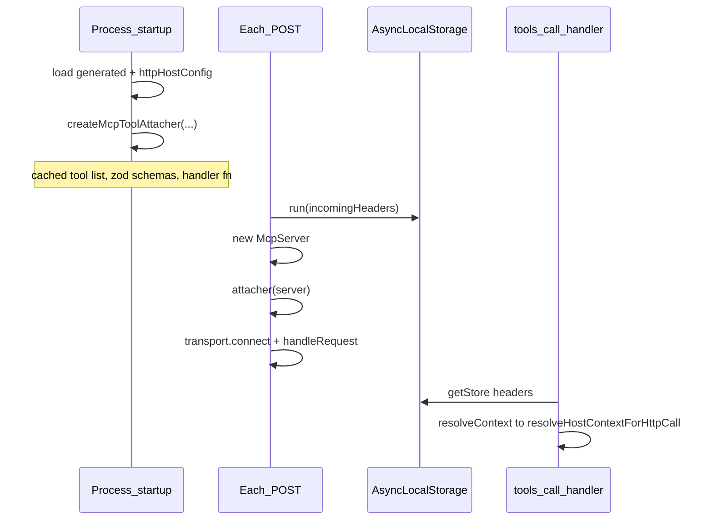

# Stateless-HTTP MCP: Performance (SDK-konform)

**Status:** nicht umgesetzt — bewusst zurückgestellt (Demos; Host bereits SDK-konform). TODO(perf) im Template entfernt.

## Ziel und Abgrenzung

**Ziel:** Weniger Arbeit pro HTTP-POST, ohne Semantik zu ändern — `resolveHostContextForHttpCall` weiter **bei jedem `tools/call`**, nicht beim Registrieren.

**Nicht-Ziel (bewusst):** Ein einziger `McpServer` für den ganzen Prozess. Das widerspricht dem MCP TypeScript SDK (1:1 `McpServer` ↔ `Transport`; ab SDK 1.26 wirft `connect()` bei erneutem Connect). Offizielles Stateless-Beispiel: [`simpleStatelessStreamableHttp.ts`](https://github.com/modelcontextprotocol/typescript-sdk/blob/main/examples/server/src/simpleStatelessStreamableHttp.ts) — **neuer Server pro POST**, Tools werden dort ebenfalls in `getServer()` jedes Mal registriert.

**Gewählte Strategie (deine Auswahl):** Pro POST weiter `new McpServer()` + `new StreamableHTTPServerTransport()`, aber **Vorbereitung der Tool-Registrierung einmal** + **Request-Scope per `AsyncLocalStorage`**.



## Ist-Zustand

In [`core2ai/src/codegen/render-stateless-http-mcp-server.ts`](core2ai/src/codegen/render-stateless-http-mcp-server.ts) erzeugt `handleStatelessMcpPost` pro POST:

1. `new McpServer`
2. `registerMcpTools` (komplette Schleife über alle Tools + Zod-Lookup)
3. `connect(transport)` + `handleRequest`

`resolveContext` ist bereits eine Callback-Funktion, die **erst im Handler** läuft ([`render-mcp-host-shared.ts`](core2ai/src/codegen/render-mcp-host-shared.ts) Zeilen 230–232). Die Header-Closure (`incomingHeaders` aus `req`) funktioniert semantisch, hängt aber an **neuer** Registrierung pro POST.

Stdio in [`render-stdio-mcp-server.ts`](core2ai/src/codegen/render-stdio-mcp-server.ts) bleibt unverändert (ein Server, Env-basiertes `resolveContext`).

## Ziel-Architektur

### 1. Request-Scope für HTTP-Header (`AsyncLocalStorage`)

Nur im Modus `stateless-http` in [`render-mcp-host-shared.ts`](core2ai/src/codegen/render-mcp-host-shared.ts):

- `import { AsyncLocalStorage } from 'node:async_hooks'`
- `httpIncomingHeadersStorage` + `getHttpIncomingHeaders()` (wirft klaren Fehler, wenn außerhalb eines POST-Scopes aufgerufen)
- `resolveContext` für HTTP-Attacher:  
  `() => resolveHostContextForHttpCall(httpHostConfig, generated, getHttpIncomingHeaders())`

### 2. Einmaliger „Attacher“ statt voller `registerMcpTools`-Setup pro POST

Refactor in [`render-mcp-host-shared.ts`](core2ai/src/codegen/render-mcp-host-shared.ts):

- **`createMcpToolAttacher(generated, options)`** (beim Startup aufgerufen):
  - Einmal: Tool-Liste, `requireInputZodSchema`-Ergebnisse, `envDirs`, stabile Handler-Funktionen mit `options.resolveContext()` im Body (wie heute)
  - Rückgabe: **`async (server: McpServer) => void`** — nur noch `server.registerTool(...)` in der Schleife
- **`registerMcpTools`** für Stdio: intern `createMcpToolAttacher` + sofort `await attacher(server)` (kein Verhaltenswechsel)

Vorteil: Zod-Schema-Auflösung und Handler-Closures entstehen **einmal**; pro POST nur noch die SDK-Pflicht-`registerTool`-Aufrufe auf frischem `McpServer`.

### 3. Startup vs. POST in [`render-stateless-http-mcp-server.ts`](core2ai/src/codegen/render-stateless-http-mcp-server.ts)

**In `runStatelessHttpMcpStandaloneFromArgv`** (nach `readGeneratedModule` + `validateStatelessHttpHostAtStartup`):

```typescript
const attachMcpTools = await createMcpToolAttacher(generated, {
    envDirs: httpHostConfig.envDirs,
    resolveContext: () =>
        resolveHostContextForHttpCall(httpHostConfig, generated, getHttpIncomingHeaders()),
});
```

**In `handleStatelessMcpPost`:**

```typescript
await httpIncomingHeadersStorage.run(incomingHeaders, async () => {
    const server = new McpServer({ name, version });
    await attachMcpTools(server);
    const transport = new StreamableHTTPServerTransport({ sessionIdGenerator: undefined });
    // connect, readJsonBody, handleRequest, close — wie heute
});
```

- TODO(perf)-Kommentar entfernen oder durch Kurznotiz ersetzen: „Server/Transport pro POST (SDK); Attacher + ALS gehoisted“.
- `console.error`-Log optional ergänzen: `[mcp] tools attacher ready; context per tool call via request headers`.

## Betroffene Repos und Regeneration

| Repo | Änderung |
|------|----------|
| **core2ai** | Codegen-Templates (`render-mcp-host-shared.ts`, `render-stateless-http-mcp-server.ts`) |
| **api2ai / db2ai** | Keine Generator-Logik; nach core2ai-Build: `writeGeneratedStatelessHttpMcpHost` / `generate:all` + `build:generated` → [`packages/extension/demos/generated/cli/stateless-http-mcp-server.ts`](api2ai/packages/extension/demos/generated/cli/stateless-http-mcp-server.ts) (analog db2ai) |

Keine Änderungen an `*-tools.ts`, `mcp.json`, DSL oder `resolveHostContextForHttpCall`-Semantik.

## Tests und Verifikation

1. **core2ai:** `npm run build` && `npm run check`
2. **api2ai / db2ai:** `npm run generate:all` (falls bootstrap) + `npm run build:generated --prefix packages/extension/demos` + `npm run check`
3. **Bestehende Integrationstests** (unverändert erwartet grün):
   - api2ai: `open-meteo-mcp-http.test.ts`
   - db2ai: `access-demo-mcp-http.test.ts`
   - Smoke-Helfer: [`core2ai/src/test-fixtures/render-mcp-http-smoke.ts`](core2ai/src/test-fixtures/render-mcp-http-smoke.ts) — kein Pflicht-Update, sofern HTTP-Verhalten gleich bleibt
4. **Optional (empfohlen):** Kurzer Parallel-Smoke — zwei gleichzeitige `listTools` gegen denselben Demo-Host (bestätigt, dass getrennte `McpServer`-Instanzen pro POST nicht regressieren). Kann in bestehendem HTTP-Test oder separatem Vitest in demos `test/`.

Manuell: `npm run demo:mcp-http:all` (api2ai/db2ai), Cursor/`mcp-http-smoke` mit Auth-Header — protected Tools mit/ohne Token wie zuvor.

## Risiken / bewusst nicht optimiert

- **`registerTool` pro POST** bleibt SDK-pflichtig; der Gewinn liegt in weniger Allokation/Closure-Setup, nicht in „null Registration“.
- **Parallele POSTs:** weiter unterstützt (jeder POST eigener `McpServer` + Transport).
- **`loadLocalEnvFiles(..., { refresh: true })`** pro Tool-Call bleibt (wie Stdio-Kommentar „refreshed each tool call“) — nicht Teil dieser Optimierung.

## Plan-Datei

Nach Freigabe Implementierung; Planablage unter [`core2ai/.cursor/plans/stateless-http-mcp-perf.plan.md`](core2ai/.cursor/plans/stateless-http-mcp-perf.plan.md) (bei Umsetzung anlegen/aktualisieren).
