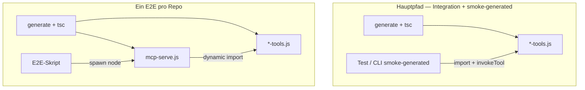

# Plan: Tests ohne `@core2ai/core/mcp-host` — Direct-Invoke + ein MCP-E2E

## Kurzantwort

**Ja:** Die meisten Tests rufen das Tool **direkt** auf — `import` des generierten `*-tools.js`, dann `invokeTool(…)` (ggf. nach `mcpHostAdapter.configureFromArgv`). **Kein** MCP-Server, **kein** stdio. Das bleibt so und ist richtig.

**Zusätzlich:** **Genau ein** Test pro Consumer startet den **echten** generierten MCP-Server:

```
node generated/cli/mcp-serve.js generated/tools/*-tools.js [host argv…]
```

Alles andere (Vitest auf MCP umstellen, `smoke-generated` über MCP, `readGeneratedModule` aus core2ai) ist **überflüssig**.

---

## Zwei Test-Pfade (bewusst getrennt)



| Pfad | Wann | Beispiele |
|------|------|-----------|
| **Direct-Invoke** | Schnell, detailliert, Auth/DB/HTTP | `mock-api-direct-invoke.test.ts`, Pagila/Sakila-Vitest, `smoke-generated` CLI |
| **MCP stdio** | Einmal End-to-End wie Cursor | api2ai: `e2e/mcp-smoke-mock-api.ts` · db2ai: `e2e/mcp-smoke.ts` (Pagila o. ä.) |

Direct-Invoke testet **Generierung + Tool-Logik**. MCP-E2E testet **zusätzlich** `mcp-serve.js` + MCP-Protokoll + Tool-Registrierung. Mehr MCP-Tests sind nicht nötig.

---

## Was `@core2ai/core/mcp-host` heute noch liefert — und was davon bleibt

| Export aus core2ai | Brauchen wir? | Ersatz |
|--------------------|---------------|--------|
| `readGeneratedModule` | **Nein** | Generiertes Modul exportiert bereits `invokeTool`, `mcpHostAdapter`, `generatedTools`, … — Tests importieren direkt |
| `loadLocalEnvFiles` | **Nein** | In Smokes: Env explizit setzen (Tests tun das ohnehin) oder optional kleine lokale Kopie in `test/support/env.ts` |
| `McpHostAdapter` (Typ) | **Nein** | Duck-Typ lokal in `smoke-host-env.ts` oder inline |
| `runMcpStdioSmoke` | **Nur E2E** | Kopie nach `packages/cli/test/support/mcp-stdio-smoke.ts` (api2ai + db2ai) |
| `runMcpStandaloneFromArgv`, `env.ts`, `mcp-server.ts`, … | **Nein** | Laufen nur noch im **generierten** `mcp-serve.ts` (`render-mcp-serve.ts`) |

**Folge:** Gesamter Ordner `core2ai/src/mcp-host/` kann nach Umbau **gelöscht** werden (inkl. ungenutztem `jwt.ts`).

---

## Phase 1 — Direct-Invoke: core2ai-Import entfernen

**Repos:** api2ai, db2ai · **Aufwand:** ~1–2h

Betroffene Dateien (Logik **unverändert**, nur ohne `@core2ai/core/mcp-host`):

- api2ai: `test/integration/mock-api-direct-invoke.test.ts`, `test/smoke/smoke-generated.ts`, `test/smoke/smoke-host-env.ts`
- db2ai: `test/support/direct-invoke.ts`, `test/smoke/smoke.ts`, `test/smoke/smoke-host-env.ts`

**Vorgehen:**

1. Nach `import(…*-tools.js)` die Exports des Moduls direkt nutzen (wie heute schon inhaltlich, nur ohne `readGeneratedModule`-Wrapper):

   ```ts
   const mod = await import(pathToFileURL(toolsJs).href);
   mod.mcpHostAdapter.configureFromArgv(…);
   await mod.invokeTool('login', args, mod.mcpHostAdapter.resolveHostContext());
   ```

2. `smoke-host-env.ts`: Parameter-Typ `Pick<…, 'configureFromArgv'>` oder kleines lokales Interface — **kein** Import aus core2ai.

3. Optional: winzige Hilfsfunktion `assertGeneratedToolModule(imported)` in `test/support/generated-module.ts` (Validierung der Exports) — **lokal im Consumer**, nicht in core2ai.

**Nicht tun:** Direct-Invoke-Tests auf MCP umbauen.

---

## Phase 2 — Ein MCP-E2E: Helfer lokal, core2ai los

**Repos:** api2ai, db2ai · **Aufwand:** ~30min

1. `packages/cli/test/support/mcp-stdio-smoke.ts` anlegen (Inhalt aus ehem. `core2ai/.../mcp-stdio-smoke.ts` — MCP-**Client**, kein Host).
2. Import in **nur** diesen Dateien umstellen:
   - api2ai: `test/e2e/mcp-smoke-mock-api.ts`
   - db2ai: `test/e2e/mcp-smoke.ts`
3. db2ai E2E: `readGeneratedModule`-Import entfernen — `hostArgs` / `--auth-env` stehen bereits in `DbMcpSmokeOptions` (explizit, kein Metadaten-Import nötig).

**Behalten:** genau **ein** E2E-Skript pro Repo; keine zweiten MCP-E2Es.

---

## Phase 3 — `core2ai/src/mcp-host` entfernen

**Repo:** core2ai · **Reihenfolge:** nach Phase 1+2 grün

1. `grep -r "@core2ai/core/mcp-host"` in api2ai + db2ai → leer.
2. Löschen: `src/mcp-host/**`, Exports `./mcp-host` und `./mcp-host/standalone-entry` aus `package.json`.
3. Docs/Rules: `README.md`, `core2ai-build.mdc`, guided-release (Trigger nur noch `src/codegen/**`).
4. Runtime-MCP bleibt allein in `src/codegen/render-mcp-serve.ts` → generiertes `cli/mcp-serve.ts`.

---

## Phase 4 — Verifikation

```bash
# api2ai / db2ai
npm run langium:generate && npm run build && npm run check
npm test                    # Vitest inkl. direct-invoke
npm run test:e2e            # der eine MCP-E2E

# core2ai (nach Phase 3)
npm run build && npm run check
npm pack --dry-run          # kein out/mcp-host im Tarball
```

Manuell unverändert: Demos `generate:all` → `build:generated` → MCP in Cursor.

---

## Was wir bewusst **nicht** machen

- Vitest (mock-api, Pagila, Sakila) **nicht** über MCP laufen lassen
- `smoke-generated` CLI **nicht** auf MCP umstellen — bleibt Direct-Invoke für schnelle manuelle Checks
- Kein zweites/ drittes MCP-E2E-Szenario
- Kein `readGeneratedModule` / `loadLocalEnvFiles` nach core2ai codegen verschieben — generiertes Modul reicht

---

## Aufwand (grob)

| Phase | Aufwand |
|-------|---------|
| 1 — Direct-Invoke ohne core2ai | ~1–2h |
| 2 — MCP-E2E-Helfer lokal | ~30min |
| 3 — mcp-host löschen + Docs | ~1h |
| 4 — Verifikation | ~30min |

**Nächster Schritt:** Phase 1 (Direct-Invoke entkoppeln), dann Phase 2, dann `mcp-host` in core2ai löschen.
