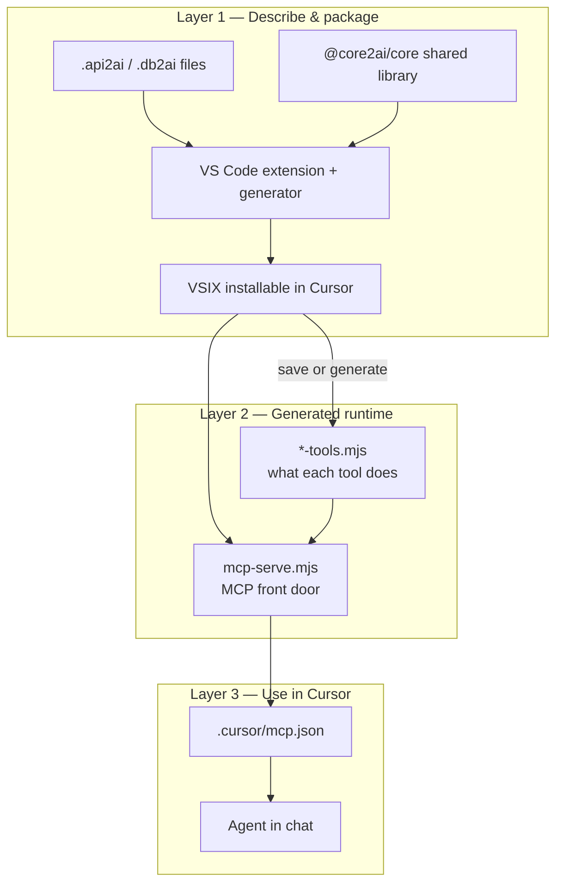
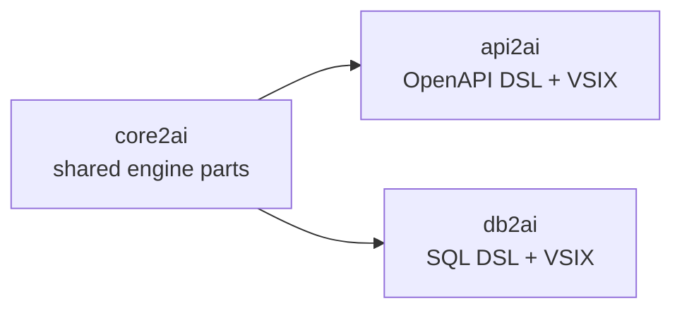

# Three layers overview

This page is the map. The details live in layers 2–4; start here when you wonder _where_ something belongs.

---

## The idea in one sentence

You **describe** what the AI may call (Layer 1), the extension **builds** runnable MCP files (Layer 2), and Cursor **connects** the agent to those files (Layer 3).

---

## Three layers, three jobs

| Layer | Plain-language job                                          | Main output                                             |
| ----- | ----------------------------------------------------------- | ------------------------------------------------------- |
| **1** | Edit the DSL, develop the extension, share code via core2ai | **VSIX** (`vscode-api2ai` / `vscode-db2ai`)             |
| **2** | Turn DSL into JavaScript the MCP protocol understands       | **`mcp-serve.mjs`** + **`*-tools.mjs`** in your project |
| **3** | Wire Cursor to those files and talk to the agent            | Working **MCP servers** in chat                         |

---

## Analogy — tool factory, tool builder, carpenter

The stack is easier to remember as a **tool factory** (Layer 1), where **tool builders** forge concrete tools from your DSL (Layer 2), and a **carpenter** — the AI agent — uses those tools at the workbench (Layer 3).

_Read left to right — the three panels match the three layers._

| Panel (left → right)                                                 | Layer | Role                                                              | In our stack                                                 |
| -------------------------------------------------------------------- | ----- | ----------------------------------------------------------------- | ------------------------------------------------------------ |
| **Tool factory** (construction site, sign on the roof)               | **1** | Build and operate the **plant** where tool specs become real code | Langium grammar, validator, generator, `@core2ai/core`, VSIX |
| **Tool builder** (workshop floor, benches, crate _“MADE TO BUILD”_)  | **2** | **Forge** runnable MCP tools from a DSL work order                | `*-tools.mjs`, `mcp-serve.mjs`, `generate`                   |
| **Carpenter** (workbench, blueprint on the wall, apron _“AI AGENT”_) | **3** | **Use** finished tools to build something useful for you          | `.cursor/mcp.json`, MCP settings, chat                       |

> **Schreiner** = **carpenter** (or _joiner_ in British English). In the illustration the craftsman wears an **AI AGENT** apron — that is Layer 3.

### How the DSL fits each stage

**Layer 1 — Tool factory**

You do not write API calls here. You build (or install via VSIX) the **machinery** that understands `.api2ai` and `.db2ai`:

- The **Langium grammar** is the factory layout: what a valid tool specification may say.
- The **validator** checks work orders against OpenAPI paths or SQL schemas before anything is forged.
- The **generator** is the production line.
- **core2ai** supplies shared parts (MCP host, codegen helpers) — like standard presses and furnaces both api2ai and db2ai reuse.
- The **VSIX** is the finished factory you ship to Cursor: language support, generate-on-save, embedded CLI.

**Layer 2 — Tool builder**

Your DSL file is the **work order**: which operations or queries should become named MCP tools, with what descriptions and access rules.

When you save or run `generate`, the tool builder:

1. Reads the work order (parse → validate).
2. Forges one **tool module** per DSL file (`*-tools.mjs`) — each export is a chisel or saw tuned to one HTTP path or SQL query.
3. Copies the generic **host** (`mcp-serve.mjs`) — the rack that holds tools and speaks MCP on stdio.

The agent never opens `.api2ai` / `.db2ai`. It only sees the **finished tools** (names, descriptions, argument shapes) that Layer 2 registered with MCP.

**Layer 3 — Carpenter**

You connect Cursor to the tool bench via **`mcp.json`**. The **carpenter** (agent) reads your question — the blueprint on the wall — and picks the right tool from the bench. Secrets and base URLs live in env vars (configured here, consumed in Layer 2).

If the carpenter builds the wrong piece, check Layer 3 wiring first (workspace root, MCP enabled, reload). If the tool itself is wrong, fix the DSL or generator and **re-forge** in Layer 2 — do not patch `generated/**` by hand.

Each layer doc shows its panel: [Layer 1](./02-layer1-dsl-extension-core2ai.md) · [Layer 2](./03-layer2-mcp-server-and-tools.md) · [Layer 3](./04-layer3-cursor-and-agent.md). The full triptych is above.

---

## Which repository is which?

| Repository  | Layer 1 role                                    | Layer 2 role                   | Layer 3 role                |
| ----------- | ----------------------------------------------- | ------------------------------ | --------------------------- |
| **core2ai** | MCP host bundle, codegen bootstrap, pin scripts | Bundled into `mcp-serve.mjs`   | —                           |
| **api2ai**  | `.api2ai` language + extension                  | Generates OpenAPI tool modules | Demos + `mcp.json` examples |
| **db2ai**   | `.db2ai` language + extension                   | Generates SQL tool modules     | Demos + `mcp.json` examples |

**core2ai does not define a DSL.** It is the shared toolbox both siblings import.

---

## Two kinds of “release” (do not mix them up)

| Release type        | What moves                                                                  | Typical trigger                                        |
| ------------------- | --------------------------------------------------------------------------- | ------------------------------------------------------ |
| **Library release** | Git tag on **core2ai** (`@core2ai/core`), then pin refresh in api2ai/db2ai  | You changed MCP host or codegen in `core2ai/packages/` |
| **VSIX release**    | Extension version in api2ai or db2ai, GitHub prerelease of the `.vsix` file | You changed DSL, generator, or extension UI            |

A new VSIX does **not** automatically update `@core2ai/core`. A new core2ai tag does **not** automatically publish a new VSIX. They are related but separate steps.

See [Layer 1](./02-layer1-dsl-extension-core2ai.md) for pin vs local development, and the [cheatsheet](./consumer-build-cheatsheet.md) for commands.

---

## Typical journey (new contributor)

1. **Install** the api2ai or db2ai VSIX (Layer 1 output).
2. **Create or open** a demo workspace with `.api2ai` / `.db2ai` files.
3. **Save** a DSL file → generated tools appear (Layer 2).
4. **Enable** MCP servers in Cursor (Layer 3).
5. **Chat** with a prompt that uses the demo prefix (`api2ai …` / `db2ai …`).

Detailed steps: [Layer 3 — Cursor and the agent](./04-layer3-cursor-and-agent.md).

---

## Where to go next

| Question                                         | Read                                                 |
| ------------------------------------------------ | ---------------------------------------------------- |
| How does the extension / DSL / core2ai pin work? | [02 — Layer 1](./02-layer1-dsl-extension-core2ai.md) |
| What are `mcp-serve.mjs` and `*-tools.mjs`?      | [03 — Layer 2](./03-layer2-mcp-server-and-tools.md)  |
| How do I test with the agent?                    | [04 — Layer 3](./04-layer3-cursor-and-agent.md)      |
| I changed something — which npm script?          | [Cheatsheet](./consumer-build-cheatsheet.md)         |

---

#Col3:23
