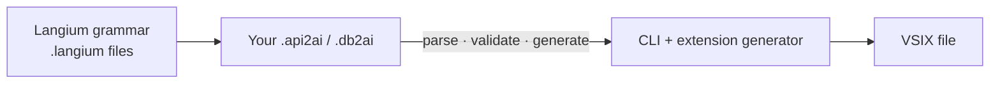
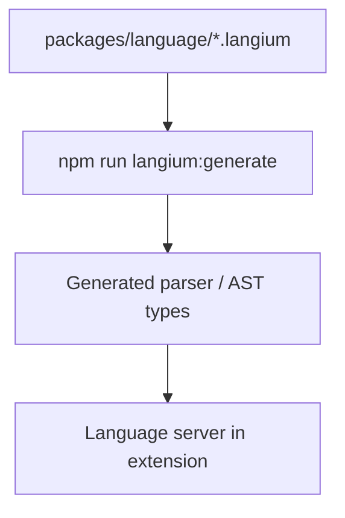
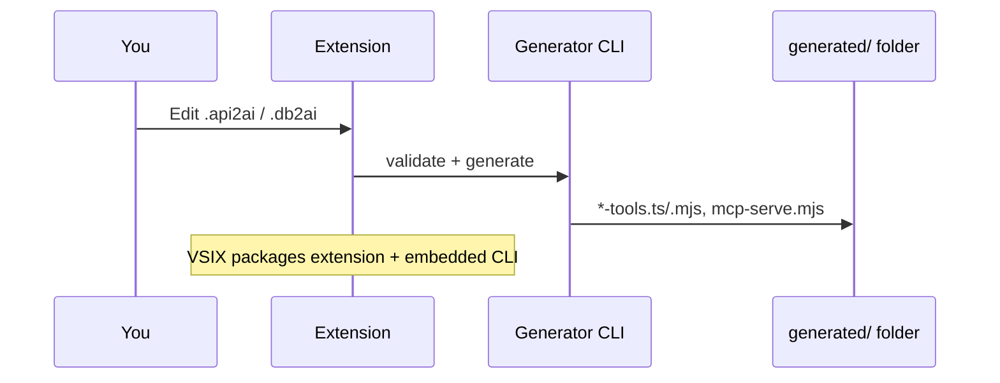
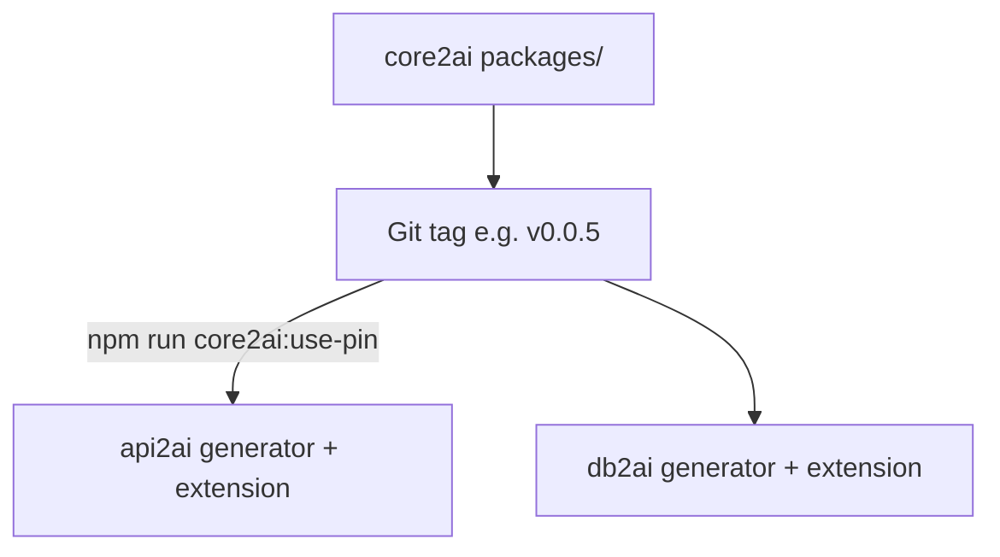

# Layer 1 — DSL, extension, and core2ai

Layer 1 is the **tool factory**: language design, code generation, and the VSIX you install in Cursor. You build the plant where tool specs are understood and forged — nothing here talks to live APIs yet; that happens in Layer 2 after you generate.

_Map: [overview — Tool factory panel](./01-three-layers-overview.md#tool-factory-analogy) · [Layer 2](./03-layer2-mcp-server-and-tools.md) · [Layer 3](./04-layer3-cursor-and-agent.md)_


---

## What Layer 1 produces



**End product for users:** an installable **VSIX** (`vscode-api2ai` or `vscode-db2ai`).

Inside the VSIX (and in a dev checkout):

- Syntax highlighting and completion for the DSL
- **Generate on save** — edits to DSL files refresh Layer 2 output in the project
- Embedded CLI for headless `parse` / `validate` / `generate`

---

## The three repos on Layer 1

| Piece                  | api2ai                   | db2ai                | core2ai             |
| ---------------------- | ------------------------ | -------------------- | ------------------- |
| DSL file               | `.api2ai` + OpenAPI YAML | `.db2ai` + DB schema | —                   |
| Language package       | `packages/language`      | `packages/language`  | —                   |
| Generator CLI          | `packages/cli`           | `packages/cli`       | codegen helpers     |
| Extension              | `packages/extension`     | `packages/extension` | —                   |
| Shared MCP host source | bundled via pin          | bundled via pin      | `packages/mcp-host` |

---

## Langium pipeline (how the language “exists”)

Langium turns a grammar file into a working language server.



After grammar changes you run `langium:generate` then `build`. The extension then understands your DSL files with validation and autocomplete.

**You rarely touch generated Langium output by hand** — same rule as Layer 2 generated tools.

---

## DSL → generator → VSIX (developer view)



In the monorepo you can also run the CLI directly:

```bash
node ./packages/cli/bin/cli.js validate path/to/file.api2ai
node ./packages/cli/bin/cli.js generate path/to/file.api2ai path/to/output.ts
```

---

## Where core2ai fits

**core2ai** is the shared foundation both siblings build on — standard machinery for the factory floor:

| Package             | Role                                                                  |
| ------------------- | --------------------------------------------------------------------- |
| `@core2ai/codegen`  | Validate before generate, auth-stub bootstrap, project layout helpers |
| `@core2ai/mcp-host` | Generic stdio MCP host (bundled into `mcp-serve.mjs`)                 |



api2ai and db2ai **do not** copy core2ai source by hand. They declare a **pin**:

```json
"@core2ai/core": "github:annettedorothea/core2ai#v0.0.5"
```

That pin means: “install exactly this tagged commit from GitHub.”

---

## Pin vs local — two ways to link core2ai

| Mode                    | Command                     | When to use                                                                                   |
| ----------------------- | --------------------------- | --------------------------------------------------------------------------------------------- |
| **Pin (production)**    | `npm run core2ai:use-pin`   | Normal work, CI, before push, after a core2ai release                                         |
| **Local (development)** | `npm run core2ai:use-local` | You are actively changing `../core2ai/packages/` and need consumers to pick it up immediately |

Think of **pin** as a fixed library edition on the shelf. **Local** is plugging in your draft manuscript from the desk next door.

After changing **mcp-host** or **codegen** in core2ai:

1. Release a new **core2ai tag** (library release).
2. In api2ai and db2ai: `core2ai:use-pin` → `bundle:mcp-runtime` → `generate:all` → `build` → `check`.
3. Restart MCP servers in Cursor.

See the [cheatsheet](./consumer-build-cheatsheet.md).

---

## Two release types (Layer 1 only)

### A — `@core2ai/core` library release

- Bump version in **core2ai**, tag on GitHub.
- Refresh pin in both consumers.
- Re-bundle MCP runtime and regenerate demos.

**Skip this** if you only changed api2ai/db2ai extension or generator — no core2ai `packages/` change.

### B — VSIX release (api2ai or db2ai)

- Bump `packages/extension/package.json` version (often together with CLI version).
- Build VSIX locally, test in Cursor.
- Publish with `npm run release:vsix` (uploads an already-tested VSIX).

Maintainers: follow [guided-release/SKILL.md](../.cursor/skills/guided-release/SKILL.md).

---

## Monorepo vs “demo workspace from VSIX”

| Setup                  | Who          | Layer 1 in practice                                                                           |
| ---------------------- | ------------ | --------------------------------------------------------------------------------------------- |
| **Clone api2ai/db2ai** | Contributors | Run extension via **Run api2ai/db2ai Extension**; demos folder is the workspace               |
| **VSIX only**          | End users    | Command **Create demo workspace** copies a starter folder; run `npm install` + `generate:all` |

Both paths use the same generator logic; only packaging differs.

---

## Build a VSIX locally

From api2ai or db2ai repository root:

```bash
npm run langium:generate && npm run build && npm run check
npm run extension:vsix -w packages/extension
```

Install the resulting `.vsix` in Cursor, or use Extension Development Host from the launch configuration.

---

## Layer 1 checklist

- [ ] DSL file validates (no red squiggles in editor)
- [ ] `npm run build && npm run check` green in the consumer repo
- [ ] If core2ai changed: pin refreshed, `bundle:mcp-runtime`, `generate:all`
- [ ] VSIX version bumped only when you intend a new extension release

**Next:** [Layer 2 — what generate produces](./03-layer2-mcp-server-and-tools.md)

---

#Col3:23
