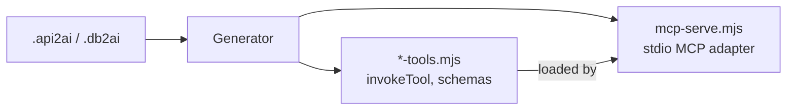
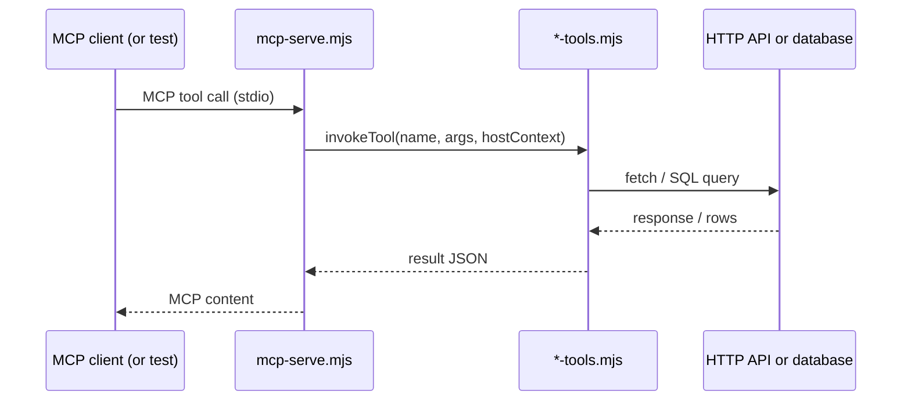
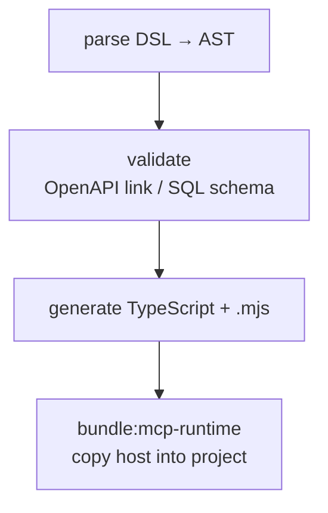

# Layer 2 — MCP server and tools

Layer 2 is the **tool builder** on the factory floor: ready-to-run files in your project folder. Your `.api2ai` / `.db2ai` file is the work order; **generate** forges MCP tools from it. Cursor does not read the DSL here — it loads these generated modules.

_Map: [overview — Tool builder panel](./01-three-layers-overview.md#tool-factory-analogy) · [Layer 1](./02-layer1-dsl-extension-core2ai.md) · [Layer 3](./04-layer3-cursor-and-agent.md)_


---

## The two main artifacts



| File                | Role                                                                            | Think of it as…                                   |
| ------------------- | ------------------------------------------------------------------------------- | ------------------------------------------------- |
| **`*-tools.mjs`**   | Implements each tool (`invokeTool`), input shapes, HTTP or SQL calls            | Individual tools forged from the DSL work order   |
| **`mcp-serve.mjs`** | Speaks MCP on stdio, loads one tool module, passes env for base URL and secrets | The tool rack + MCP adapter the carpenter reaches |

Typical paths (demo workspace):

```
generated/
  tools/
    open-meteo-tools.mjs
    github-tools.mjs
    …
  cli/
    mcp-serve.mjs
```

Optional hand-written pieces (not regenerated):

```
src/auth/*.ts   ← “checked access” parameter validation (api2ai/db2ai demos)
```

---

## One tool call, step by step

This is Layer 2 **without Cursor** — useful when debugging “does the server work?”



1. **Host** receives a tool name and arguments over MCP.
2. **Tools module** maps arguments to an HTTP request (api2ai) or SQL (db2ai).
3. Secrets and base URLs come from **environment variables** (configured in Layer 3), not from the DSL file.
4. Result travels back as MCP-friendly content.

Smoke tests (`npm run test:smoke`, `test:e2e`) exercise this path without the chat UI.

---

## How generation works (DSL → files)



| Step         | What it checks                                                        |
| ------------ | --------------------------------------------------------------------- |
| **parse**    | Syntax and structure of `.api2ai` / `.db2ai`                          |
| **validate** | api2ai: OpenAPI paths exist; db2ai: SQL params match schema           |
| **generate** | Emits `*-tools.ts` + `*-tools.mjs`                                    |
| **bundle**   | Refreshes `generated/cli/mcp-serve.mjs` from `@core2ai/core/mcp-host` |

Trigger generation:

- **On save** in the extension (when the DSL file is in a workspace with the extension active)
- **CLI:** `npm run generate:all` in the demo folder (or per-demo scripts)

**Rule:** never hand-edit `generated/**` to fix bugs — change the generator or DSL, then regenerate.

---

## Inside a tool module (api2ai example)

Each generated module exports:

| Export                               | Purpose                                                                          |
| ------------------------------------ | -------------------------------------------------------------------------------- |
| `generatedTools`                     | List of tool names, descriptions, HTTP method/path                               |
| `invokeTool`                         | Runs the actual API call                                                         |
| `mcpServerName` / `mcpServerVersion` | Identity for MCP `serverInfo` (version = CLI/generator version at generate time) |
| Input schemas                        | What the agent may pass as arguments                                             |

The file header records provenance:

```txt
Generated from: github.api2ai
Referenced OpenAPI: ./openapi/github-user-min.openapi.yaml
```

---

## `mcp-serve.mjs` and `bundle:mcp-runtime`

The MCP host is **generic** — it lives in core2ai and is **bundled** into each consumer:

```bash
npm run bundle:mcp-runtime   # api2ai / db2ai root
```

That writes `packages/cli/resources/mcp-serve-emitted.mjs`, which `generate:all` copies into demo workspaces as `generated/cli/mcp-serve.mjs`.

When you update `@core2ai/core` (new MCP host behaviour), you must re-bundle and regenerate — otherwise demos still run the old host logic.

---

## api2ai vs db2ai at Layer 2

| Topic              | api2ai                                 | db2ai                                           |
| ------------------ | -------------------------------------- | ----------------------------------------------- |
| DSL selects        | OpenAPI operations                     | SQL queries                                     |
| External spec      | OpenAPI YAML                           | Database schema (for validation)                |
| `invokeTool` calls | HTTP (`fetch`)                         | PostgreSQL or MySQL client                      |
| Connection config  | `--base-url-env`, `--auth-env` on host | `--connection-string-env` / database env in DSL |
| Demo extras        | mock-api JWT example                   | Docker databases (`db:up:all`)                  |

The **shape** is the same: one tools module + one host entry per MCP server in `mcp.json`.

---

## Auth: public, protected, checked

| Access        | Meaning                                                                      |
| ------------- | ---------------------------------------------------------------------------- |
| **public**    | No credential required                                                       |
| **protected** | MCP host injects API key / token from env                                    |
| **checked**   | Host credential + your `src/auth` stub validates extra parameters (JWT demo) |

Layer 2 loads auth config from the generated module; Layer 3 supplies the secret via env.

---

## Verify Layer 2

From consumer repo root or demo folder:

```bash
npm run generate:all
npm run check:generated
npm run test:smoke          # direct invokeTool tests
npm run test:e2e            # full MCP stdio round-trip
```

If these pass, Layer 2 is healthy. Layer 3 problems (agent not calling tools) are usually configuration, not generated code.

**Next:** [Layer 3 — Cursor and the agent](./04-layer3-cursor-and-agent.md)

---

#Col3:23
