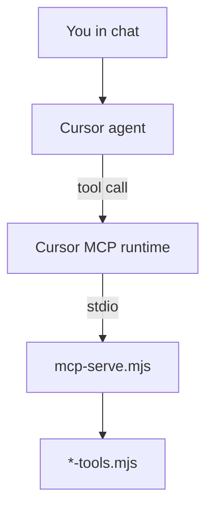
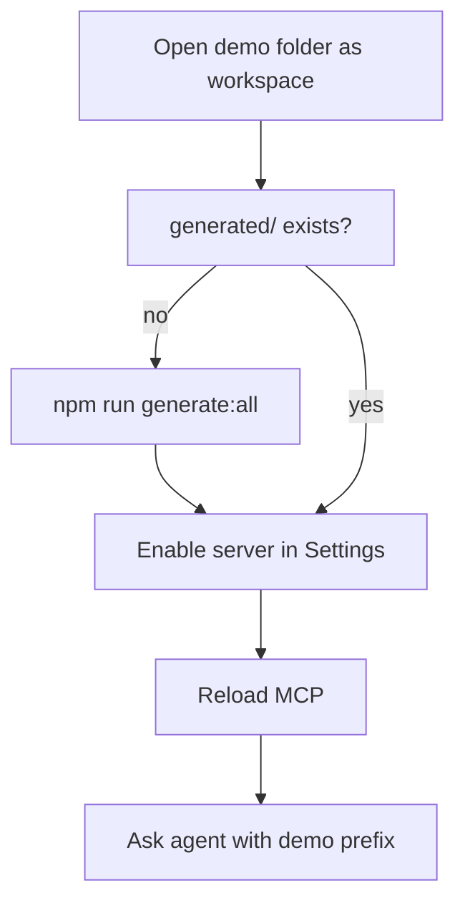

# Layer 3 — Cursor and the agent

Layer 3 is the **carpenter’s workbench**: you connect Cursor to the tools forged in Layer 2 and ask the **AI agent** (the carpenter) to build something from your question — the blueprint on the wall.

You do not need to understand the generator here — only **where files live**, **how to enable MCP**, and **how to test in chat**.

_Map: [overview — Carpenter panel](./01-three-layers-overview.md#tool-factory-analogy) · [Layer 1](./02-layer1-dsl-extension-core2ai.md) · [Layer 2](./03-layer2-mcp-server-and-tools.md)_


---

## What Layer 3 adds



Cursor:

1. Reads **`.cursor/mcp.json`** in your workspace.
2. **Starts** each configured server (`node …/mcp-serve.mjs …/tools.mjs`).
3. Exposes **tools** to the agent.
4. The agent picks a tool when your question needs external data.

---

## The wiring file: `.cursor/mcp.json`

Each server entry tells Cursor **how to put one set of tools on the bench** for the agent:

```json
"api2ai-open-meteo": {
    "command": "node",
    "args": [
        "./generated/cli/mcp-serve.mjs",
        "./generated/tools/open-meteo-tools.mjs",
        "--base-url-env",
        "OPEN_METEO_BASE_URL"
    ],
    "env": {
        "OPEN_METEO_BASE_URL": "https://api.open-meteo.com"
    }
}
```

| Part                 | Meaning                                                  |
| -------------------- | -------------------------------------------------------- |
| **Server name**      | Label in Cursor Settings → Tools & MCP                   |
| **`mcp-serve.mjs`**  | Shared host (same file for all demos)                    |
| **Second arg**       | Which tool module this server loads                      |
| **`--base-url-env`** | Env var name for API base URL                            |
| **`--auth-env`**     | (Optional) Env var for API token                         |
| **`env`**            | Default values; secrets often go in `.env.local` instead |

Paths are relative to the **workspace folder** (open the demo folder as root, not the monorepo root).

Full example: api2ai [`packages/extension/demos/.cursor/mcp.json`](https://github.com/annettedorothea/api2ai/blob/main/packages/extension/demos/.cursor/mcp.json).

---

## Setup checklist (first time)

### Option A — VSIX, no clone

1. Install **vscode-api2ai** or **vscode-db2ai** VSIX.
2. Command Palette → **Create demo workspace (MCP examples)** → pick an empty folder.
3. In that folder: `npm install`, copy `.env.example` → `.env.local` if needed.
4. `npm run generate:all`
5. Open the folder as Cursor workspace.
6. Settings → **Tools & MCP** → enable servers (e.g. `api2ai-open-meteo`).
7. Reload MCP after changing tokens in `.env.local`.

### Option B — Monorepo contributor

1. Clone api2ai or db2ai, `npm run install:github-https`, build.
2. Launch **Run api2ai Extension** / **Run db2ai Extension** (opens `demos/` workspace).
3. Enable MCP servers as above.

db2ai database demos: start Docker with `npm run db:up:all` in the demos folder first.

---

## Enable and troubleshoot MCP



| Symptom                    | Likely fix                                                           |
| -------------------------- | -------------------------------------------------------------------- |
| No tools in agent          | Server disabled in Settings, or wrong workspace root                 |
| Auth errors                | Set token in `.env.local`, **reload MCP** (env read at server start) |
| Stale tools after DSL edit | Save DSL again or `generate:all`, reload MCP                         |
| Server fails to start      | Run smoke test; check Node 20+, paths in `mcp.json`                  |

MCP servers read environment variables when they **start**, not on every tool call. After changing `.env.local`, reload the server.

---

## Testing with the agent

Demo workspaces include Cursor rules that steer the agent toward MCP tools (prefix **`api2ai`** or **`db2ai`** in prompts).

Examples (api2ai demos):

| Server      | Example prompt                                     |
| ----------- | -------------------------------------------------- |
| Open-Meteo  | `api2ai what is the weather in Berlin`             |
| Spaceflight | `api2ai what is the next SpaceX launch`            |
| GitHub      | `api2ai who am I on GitHub` (needs `GITHUB_TOKEN`) |

db2ai: prompts like `db2ai list films from Pagila` with the matching server enabled.

If the agent answers from memory instead of calling tools, check that MCP is enabled and the rule file is active in `.cursor/rules/`.

---

## Automated tests (without chat)

Use these to confirm Layer 2 + 3 wiring before blaming the agent:

| Command                   | What it proves                                      |
| ------------------------- | --------------------------------------------------- |
| `npm run test:smoke`      | Each tool module runs `invokeTool` directly         |
| `npm run test:e2e`        | Full MCP stdio conversation (mock API or Docker DB) |
| `npm run check:generated` | Generated TypeScript lint + typecheck               |

From consumer repository root. Per-demo variants exist — see `scripts/dev-smoke.config.json`.

---

## What the agent sees vs what you edit

| You edit (Layer 1)                            | Agent sees (Layer 3) |
| --------------------------------------------- | -------------------- |
| `.api2ai` / `.db2ai`                          | Nothing directly     |
| Generated tool **descriptions** and **names** | Tool list in MCP     |
| OpenAPI / SQL (validation only)               | Not visible          |

Good DSL metadata (`intent`, `example`) flows into generated tool descriptions — that is why Layer 2 quality matters for Layer 3 behaviour.

---

## Security habits

- Do **not** commit API keys in `mcp.json` or DSL files.
- Use `.env.local` (gitignored) for tokens.
- Reload MCP after secret changes.

---

## Layer 3 checklist

- [ ] Workspace root = demo folder with `.cursor/mcp.json`
- [ ] `generated/cli/mcp-serve.mjs` and tool modules exist
- [ ] Required env vars set; MCP reloaded
- [ ] Target servers **enabled** in Cursor Settings
- [ ] Prompt uses demo prefix; smoke/e2e tests pass if chat fails

**Back to map:** [Three layers overview](./01-three-layers-overview.md) · **Commands:** [Cheatsheet](./consumer-build-cheatsheet.md)

---

#Col3:23
