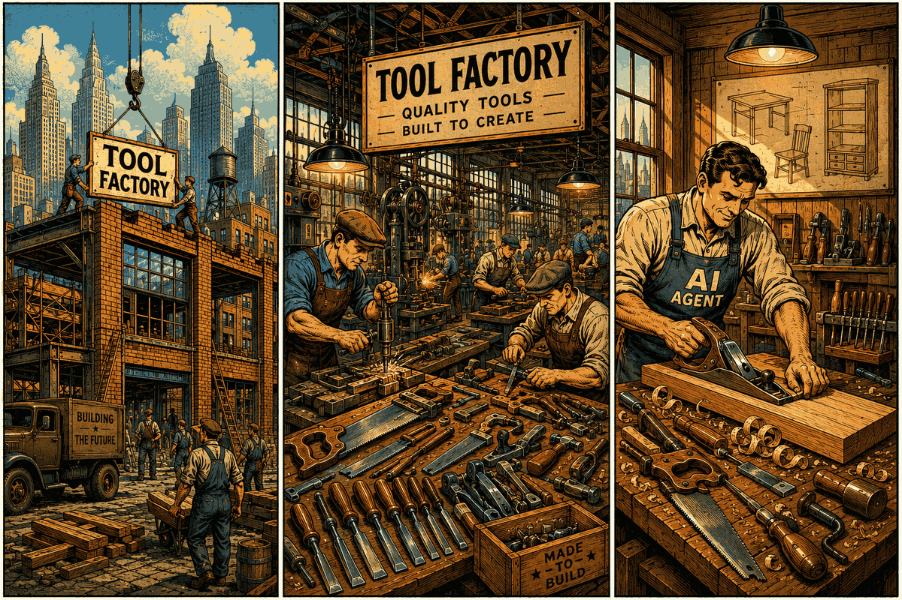

# Mental Model: Tool Factory for AI Systems

The architecture can be understood through a simple analogy.

The first group of engineers builds the factory itself. The factory represents the platform infrastructure: Langium grammars, DSL definitions, validation logic, code generators, VSIX extensions, and shared runtime components.

Once the factory exists, Tool Authors use it to produce tools. They describe APIs and database queries using the provided DSLs, and the Tool Factory generates executable MCP tools.

Finally, an AI Agent uses those generated tools to solve user problems. In the analogy, the AI Agent is the carpenter. The generated MCP tools are the carpenter's tools, and the resulting furniture represents the value delivered to the end user.

## Architectural Layers

The Tool Factory analogy maps directly to the system architecture.

### Layer 1: Tool Factory (Build-Time Infrastructure)

This layer is responsible for building the factory itself.

It includes:

- Langium-based DSL definitions
- grammar and validation rules
- autocomplete and language services
- code generators
- VSIX extensions
- shared runtime components

The output of this layer is the infrastructure that enables tool creation.

See: [Layer 1 – Tool Factory](01-layer-1-tool-factory.md)

---

### Layer 2: Tool Authoring (Design-Time)

This layer is where Tool Authors create actual tools using the factory.

Developers define:

- API-based tools using `.api2ai`
- Database-based tools using `.db2ai`

The Tool Factory validates these definitions and generates executable MCP tools.

The output of this layer is a set of AI-ready tools.

See: [Layer 2 – Tool Authoring](02-layer-2-tool-authoring.md)

---

### Layer 3: AI Runtime (Execution-Time)

This layer is where AI Agents use the generated tools.

The agent:

1. receives a user request
2. selects the appropriate tool
3. executes the tool
4. returns the result to the user

The agent does not need to understand how the tool was generated. It simply uses the capabilities made available by the previous layers.

See: [Layer 3 – AI Runtime](03-layer-3-ai-runtime.md)

---

## Personas

Different roles interact with different layers of the system:

| Role                               | Primary Layer |
| ---------------------------------- | ------------- |
| Platform / Tool Factory Maintainer | Layer 1       |
| Tool Author / Engineer             | Layer 2       |
| End User / Customer                | Layer 3       |

See: [Personas](04-personas.md)

---

## Testing

See: [Testing strategy](05-testing-strategy.md)

---

## Core Principle

The architecture deliberately separates three concerns:

1. Building the factory
2. Producing tools
3. Using tools

This separation allows each layer to evolve independently while keeping the overall system simple and maintainable.

---

#Col3:23
