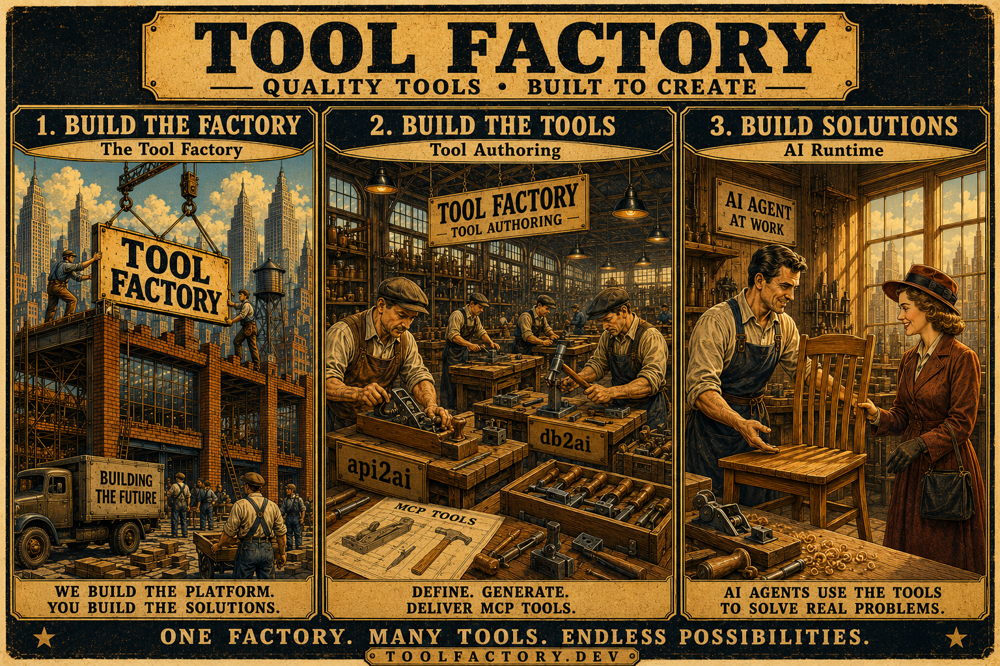

# Documentation — Tool Factory for AI Systems

[← Repository root](../README.md)

## Documentation index

### Architecture (`architecture/`)

| Document                                                              | Summary                                      |
| --------------------------------------------------------------------- | -------------------------------------------- |
| [Layer 1 – Tool Factory](architecture/01-layer-1-tool-factory.md)     | Langium DSLs, validation, codegen, VSIX      |
| [Layer 2 – Tool Authoring](architecture/02-layer-2-tool-authoring.md) | `.api2ai` / `.db2ai`, access control, output |
| [Layer 3 – AI Runtime](architecture/03-layer-3-ai-runtime.md)         | How agents execute MCP tools                 |
| [Personas](architecture/04-personas.md)                               | Maintainer, tool author, end user            |
| [Testing strategy](architecture/05-testing-strategy.md)               | `npm test`, CI, `/test-all` release gate     |

### Authoring (`authoring/`)

| Document                                                     | Product | Summary                                           |
| ------------------------------------------------------------ | ------- | ------------------------------------------------- |
| [api2ai DSL](authoring/api2ai-dsl.md)                        | api2ai  | OpenAPI operations, auth block, flat MCP args     |
| [db2ai DSL](authoring/db2ai-dsl.md)                          | db2ai   | `SQL { }`, database env, params                   |
| [Auth and hooks](authoring/auth-and-hooks.md)                | both    | MCP auth, upstream auth, verify/authorize/prepare |
| [Supported OpenAPI patterns](authoring/supported-openapi.md) | api2ai  | Dereference, Zod limits, rejected params          |
| [Supported SQL patterns](authoring/supported-sql.md)         | db2ai   | Five dialects, `:name` binds, EXPLAIN probes      |

### Runtime (`runtime/`)

| Document                          | Summary                                    |
| --------------------------------- | ------------------------------------------ |
| [MCP hosts](runtime/mcp-hosts.md) | stdio, public/passthrough/OAuth HTTP hosts |

### Integrations (`integrations/`)

| Document                                 | Summary                           |
| ---------------------------------------- | --------------------------------- |
| [Cursor](integrations/cursor.md)         | VSIX, `mcp.json`, stdio and OAuth |
| [Open WebUI](integrations/open-webui.md) | HTTP MCP, auth profiles, demos    |

### Testing (`testing/`)

| Document                                  | Summary                      |
| ----------------------------------------- | ---------------------------- |
| [MCP Inspector](testing/mcp-inspector.md) | Local MCP protocol debugging |

### Development (`development/`)

| Document                                            | Summary                            |
| --------------------------------------------------- | ---------------------------------- |
| [CHANGELOG policy](development/changelog-policy.md) | Version history rules across repos |

### Release

- [CHANGELOG](../CHANGELOG.md) — version history and upgrade notes (core2ai)
- Consumer repos: [api2ai CHANGELOG](https://github.com/annettedorothea/api2ai/blob/main/CHANGELOG.md) · [db2ai CHANGELOG](https://github.com/annettedorothea/db2ai/blob/main/CHANGELOG.md)

### Consumer repositories

- [api2ai](https://github.com/annettedorothea/api2ai) — VSIX and `.api2ai` generator
- [db2ai](https://github.com/annettedorothea/db2ai) — VSIX and `.db2ai` generator

---

## Mental model

The architecture can be understood through a simple analogy.

The first group of engineers builds the factory itself. The factory represents the platform infrastructure: Langium grammars, DSL definitions, validation logic, code generators, VSIX extensions, and shared runtime components.

Once the factory exists, Tool Authors use it to produce tools. They describe APIs and database queries using the provided DSLs, and the Tool Factory generates executable MCP tools.

Finally, an AI Agent uses those generated tools to solve user problems. In the analogy, the AI Agent is the carpenter. The generated MCP tools are the carpenter's tools, and the resulting furniture represents the value delivered to the end user.

---

## Architectural layers

### Layer 1: Tool Factory (Build-Time Infrastructure)

Langium grammars, validation, codegen, VSIX extensions, shared `@core2ai/core` templates.

See: [Layer 1 – Tool Factory](architecture/01-layer-1-tool-factory.md)

### Layer 2: Tool Authoring (Design-Time)

`.api2ai` and `.db2ai` definitions → generated MCP tool modules and hosts.

See: [Layer 2 – Tool Authoring](architecture/02-layer-2-tool-authoring.md) · [Authoring guides](#authoring-authoring)

### Layer 3: AI Runtime (Execution-Time)

Agents select and call tools over MCP; no DSL awareness at runtime.

See: [Layer 3 – AI Runtime](architecture/03-layer-3-ai-runtime.md) · [Integrations](#integrations-integrations) · [MCP hosts](runtime/mcp-hosts.md)

---

## Core principle

The architecture deliberately separates three concerns:

1. Building the factory
2. Producing tools
3. Using tools

This separation allows each layer to evolve independently while keeping the overall system simple and maintainable.

---

> _Whatever you do, work heartily, as for the Lord and not for men._
>
> **— Colossians 3:23**
>
> _Created by Annette Pohl_
